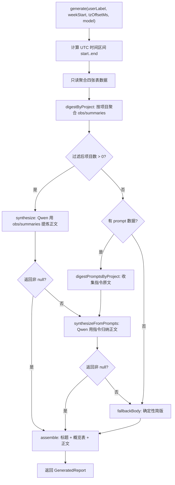
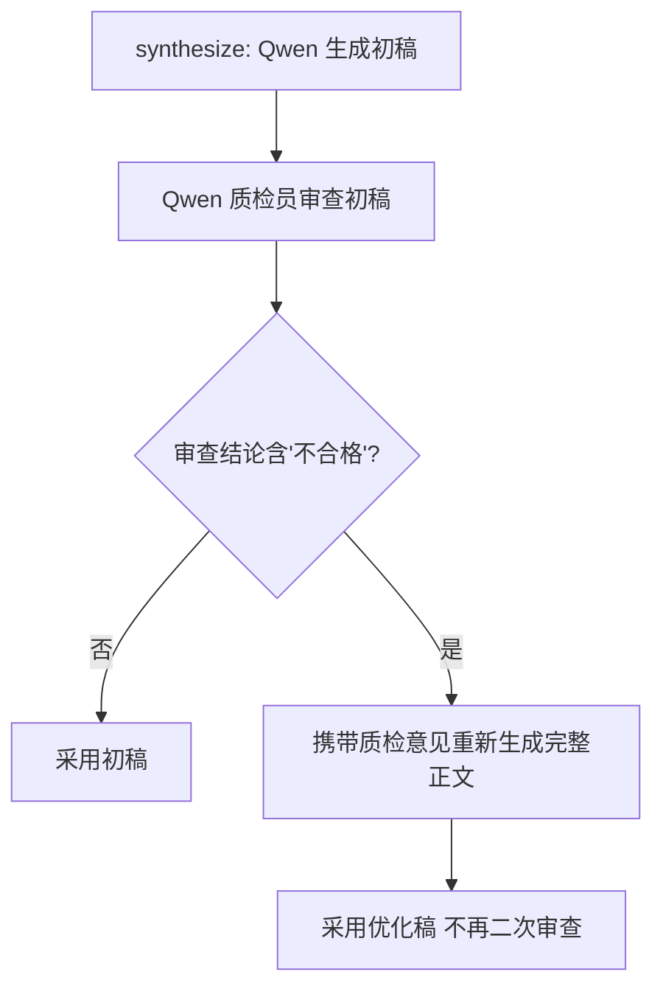

# ReportGenerator.ts 需求说明

> 源文件：src/services/worker/reports/ReportGenerator.ts ｜ 类型：源码 ｜ 行数：483 ｜ 所属模块：worker/reports ｜ 分析日期：2026-07-23

## 1. 文件定位总述

ReportGenerator 是 claude-mem 周报系统的核心生成器，负责从 SQLite 数据库中聚合指定用户、指定周的原始工作数据（用户指令、观察记录、会话总结），并通过阿里云 DashScope Qwen 模型将结构化数据提炼为面向汇报的中文周报正文。该类采用三级降级策略——优先使用 observation/summary 精炼、其次回退到 prompt 原文归纳、最终兜底确定性简版拼接——确保在 AI 服务不可用或数据不足时仍能产出有意义的周报。生成后的周报通过 `upsertWeeklyReport` 函数持久化到 `weekly_reports` 表，供前端 Viewer 展示和下载。该类处于 Worker HTTP API 下游，由报告端点调用，只读源表，不参与采集链路。

## 2. 功能需求

| 编号 | 需求描述（系统应当…） | 触发条件 / 输入 | 处理规则与输出 | 证据 |
|------|----------------------|----------------|---------------|------|
| FR-GEN-01 | 系统应当根据用户标签、周起始日期、时区偏移和模型名称生成一份完整的工作周报 | 调用 `generate(userLabel, weekStart, tzOffsetMs, model)` | 从 SQLite 聚合 user_prompts、sdk_sessions、observations、session_summaries 四张表在指定时间区间内的数据，按项目分组，生成包含标题、概览统计表、AI/降级正文、琐碎忽略说明的 Markdown 周报，返回 `GeneratedReport` 对象 | `src/services/worker/reports/ReportGenerator.ts:135-215` |
| FR-GEN-02 | 系统应当优先使用观察记录(obs)和会话总结(summaries)来提炼周报正文 | 本周存在 obs/summaries 且有超过 1 小时工时的项目 | 将各项目的已完成任务、收获、观察按模板组织为结构化文本，调用 Qwen 模型按四章结构生成中文周报正文 | `src/services/worker/reports/ReportGenerator.ts:196-199` |
| FR-GEN-03 | 系统应当在本周无 obs/summaries 但有用户指令时，降级使用 prompt 原文让 AI 归纳任务清单 | `synthesize` 返回 null 且 digests 为空但 prompts > 0 | 收集各项目用户指令原文，过滤 slash 命令/注入包裹/过短指令，去重限量后调用 Qwen 客观归纳工作内容 | `src/services/worker/reports/ReportGenerator.ts:201-207` |
| FR-GEN-04 | 系统应当在 AI 不可用或无可用数据时生成确定性简版周报正文 | AI 调用失败/无 API Key/无足够数据 | 拼装四章结构：总体概述（事实汇总）、工作任务（最多 6 个项目、各 10 条要点），不臆造下周建议和经验教训 | `src/services/worker/reports/ReportGenerator.ts:208` |
| FR-GEN-05 | 系统应当对 AI 生成的周报执行质量审查，不合格时按审查意见优化一次 | Qwen 生成初稿后 | 调用 Qwen 以质检员角色对照 REQUIREMENTS 规则审查周报；若不合格，携带质检意见重新生成完整正文；优化后不再二次审查 | `src/services/worker/reports/ReportGenerator.ts:356-379` |
| FR-GEN-06 | 系统应当将生成的周报按 user_label + week_start 唯一键持久化到数据库 | 生成周报后调用 `upsertWeeklyReport` | 执行 INSERT ... ON CONFLICT DO UPDATE，更新 markdown、stats、model、generated_at_epoch 等字段，实现幂等写入 | `src/services/worker/reports/ReportGenerator.ts:121-130` |
| FR-GEN-07 | 系统应当忽略本周工时不足 1 小时的琐碎项目，不纳入周报任务列表 | 数据聚合后过滤 | 以 `totalMs > MIN_PROJECT_MS(3600000ms)` 为标准过滤项目，并在概览中注明被忽略的总时长和占比 | `src/services/worker/reports/ReportGenerator.ts:237` |
| FR-GEN-08 | 系统应当支持跨时区周报生成 | 传入 tzOffsetMs 参数 | 将本地周一零点转换为 UTC epoch 区间 `[start, end)` 用于 SQL 查询，确保不同时区用户看到正确的周数据 | `src/services/worker/reports/ReportGenerator.ts:137-139` |
| FR-GEN-09 | 系统应当根据给定的 epoch 毫秒值计算其所在 ISO 周的周一本地日期 | 调用 `weekMondayOf(epochMs, tzOffsetMs)` | 应用时区偏移后计算星期几，回退到周一并格式化为 YYYY-MM-DD | `src/services/worker/reports/ReportGenerator.ts:77-84` |

## 3. 业务规则与约束

### 3.1 AI 服务配置规则

- **API Key 解析优先级**：环境变量 `CLAUDE_MEM_REPORT_QWEN_API_KEY` 优先，缺失时回退读取 `~/.claude-mem/settings.json` 中同名配置。两者皆空则 AI 段完全禁用。`src/services/worker/reports/ReportGenerator.ts:292-298`
- **DashScope 端点**：固定为 `https://dashscope.aliyuncs.com/compatible-mode/v1/chat/completions`。`src/services/worker/reports/ReportGenerator.ts:17`
- **调用超时**：AI 调用超时设为 90 秒，超时后返回 null 触发降级。`src/services/worker/reports/ReportGenerator.ts:18,462-463`
- **模型参数**：temperature 固定为 0.4，max_tokens 设为 65536（DashScope 限制上限）。`src/services/worker/reports/ReportGenerator.ts:469`

### 3.2 周报结构规则

- **四章结构**：本周总体概述 → 本周工作任务 → 下周工作建议 → 本周经验与教训，不得出现其他章节。`src/services/worker/reports/ReportGenerator.ts:26-34`
- **项目标题格式**：严格为 `### 项目 <完整项目路径> · 耗时X`，项目路径逐字保留作为唯一 ID。`src/services/worker/reports/ReportGenerator.ts:30`
- **日均 AI 时长**：按一周 5 个工作日计算（与 History 周表口径一致）。`src/services/worker/reports/ReportGenerator.ts:253`

### 3.3 数据聚合约束

- **项目纳入标准**：本周耗时 > 1 小时且有具体工作内容的项目才进入周报。`src/services/worker/reports/ReportGenerator.ts:20-21`
- **Prompt 降级过滤**：过滤长度 < 4 的指令、以 `/` 开头的 slash 命令、以 `<` 开头的注入包裹文本；单项目最多送入 15 条去重后的指令。`src/services/worker/reports/ReportGenerator.ts:398-406`
- **AI 提示限量**：送入 AI prompt 的项目上限 8 个（`MAX_PROJECTS_IN_PROMPT`）；单项目最多 10 条任务要点、5 条收获、6 条观察。`src/services/worker/reports/ReportGenerator.ts:19,311-316`

### 3.4 降级正文规则

- **降级路径不臆造**：prompt 降级模式下，强调"任务请求、未必全部完成"，使用客观措辞归纳，不编造指令中未出现的成果。`src/services/worker/reports/ReportGenerator.ts:439`

## 4. 对外暴露

| 能力名称 | 类型 | 签名 | 说明 |
|---------|------|------|------|
| `weekMondayOf` | 导出函数 | `(epochMs: number, tzOffsetMs: number) => string` | 根据给定 epoch 计算其所在周的周一本地日期 YYYY-MM-DD |
| `upsertWeeklyReport` | 导出函数 | `(db: Database, report: GeneratedReport) => void` | 将生成的周报按唯一键 UPSERT 到 weekly_reports 表 |
| `ReportGenerator` | 导出类 | `constructor(db: Database)` | 周报生成器主类 |
| `ReportGenerator.generate` | 公开方法 | `(userLabel, weekStart, tzOffsetMs, model) => Promise<GeneratedReport>` | 生成完整周报 |
| `GeneratedReport` | 导出接口 | `{ user_label, week_start, week_end, markdown, stats, model, generated_at_epoch }` | 周报输出数据结构 |
| `ReportStats` | 导出接口 | `{ totalMs, projects, prompts, obs, summaries, sessions }` | 周报统计数据结构 |

## 5. 依赖关系

### 上游（数据源）
- **SQLite 数据库**（`bun:sqlite`）：读取 `user_prompts`、`sdk_sessions`、`observations`、`session_summaries` 四张表。`src/services/worker/reports/ReportGenerator.ts:144-180`
- **SettingsDefaultsManager**：加载 settings.json 中的 Qwen API Key 配置。`src/services/worker/reports/ReportGenerator.ts:296`
- **paths 模块**（`USER_SETTINGS_PATH`）：获取 settings.json 文件路径。`src/services/worker/reports/ReportGenerator.ts:4`

### 下游（输出）
- **SQLite 数据库**：通过 `upsertWeeklyReport` 写入 `weekly_reports` 表。`src/services/worker/reports/ReportGenerator.ts:121-130`
- **阿里云 DashScope API**：调用 Qwen 模型进行周报正文生成和质检。`src/services/worker/reports/ReportGenerator.ts:461-482`

### 内部依赖
- **logger**：日志记录。`src/services/worker/reports/ReportGenerator.ts:2`

## 6. 数据结构

### GeneratedReport（导出接口）
```
user_label: string          // 用户标签
week_start: string          // 周一本地日期 YYYY-MM-DD
week_end: string            // 周日本地日期 YYYY-MM-DD
markdown: string            // 完整周报 Markdown 正文
stats: ReportStats          // 统计数据
model: string               // AI 段所用模型名，纯拼装为空串
generated_at_epoch: number  // 生成时间戳
```
`src/services/worker/reports/ReportGenerator.ts:45-53`

### ReportStats（导出接口）
```
totalMs: number    // 总 AI 工时（毫秒）
projects: number   // 项目数
prompts: number    // 提示词数
obs: number        // 观察记录数
summaries: number  // 会话总结数
sessions: number   // 会话数
```
`src/services/worker/reports/ReportGenerator.ts:36-43`

### ProjectDigest（内部接口）
```
project: string                                          // 项目路径
totalMs: number                                          // 本周工时
completed: string[]                                      // 已完成任务要点（去重、限12条）
learned: string[]                                         // 收获要点（限6条）
observations: Array<{ type: string; title: string }>     // 观察记录（限6条）
```
`src/services/worker/reports/ReportGenerator.ts:68-74`

### PromptDigest（内部接口）
```
project: string     // 项目路径
totalMs: number     // 本周工时
prompts: string[]   // 用户指令原文（去重、限15条、截断200字符）
```
`src/services/worker/reports/ReportGenerator.ts:61-65`

## 7. 复杂逻辑图示

下图展示周报生成的三级降级策略和数据处理流程：



下图展示 AI 质检的"生成-审查-优化"单次循环：



## 8. 逆向备注

1. **注释与代码的 `merged_into_project` 字段**：observations 和 session_summaries 两张查询均使用了 `COALESCE(NULLIF(o.merged_into_project, ''), o.project)` 来处理项目合并场景（`src/services/worker/reports/ReportGenerator.ts:164,173`），但代码注释未提及此合并逻辑的触发条件。
2. **工时计算逻辑**：`user_prompts` 表的工时计算采用 `COALESCE(NULLIF(up.active_ms, 0), up.completed_at_epoch - up.created_at_epoch) + COALESCE(up.think_time_ms, 0)`（`src/services/worker/reports/ReportGenerator.ts:147-148`），推断 `active_ms` 为手动记录的活跃时间，`think_time_ms` 为 AI 思考时间，两者均非 NULL 时叠加计入。
3. **REQUIREMENTS 常量声明但仅用于质检**：REQUIREMENTS 常量（`src/services/worker/reports/ReportGenerator.ts:26-34`）在 `synthesize` 的 prompt 中通过大段内联文本重复了类似规则，两者在措辞上有细微差异（如 REQUIREMENTS 说"标题恰好四章"但 prompt 内联文本额外增加了关于项目路径和任务要点的详细要求）。推断设计意图是 REQUIREMENTS 作为"金标准"供质检引用，而 prompt 内联文本是"指导性指令"。
4. **降级正文的三四章缺失**：`fallbackBody` 方法（`src/services/worker/reports/ReportGenerator.ts:264-285`）只生成了"一、本周总体概述"和"二、本周工作任务"两章，未包含"三、下周工作建议"和"四、本周经验与教训"。这与注释中"不臆造下周建议/经验教训"一致，但最终 `assemble` 拼接时没有对缺章做标记。
5. **Qwen 降级无质检**：`synthesizeFromPrompts`（prompt 降级路径）没有像 `synthesize`（主路径）那样执行 AI 质检和优化循环（`src/services/worker/reports/ReportGenerator.ts:421-458`）。推断原因：降级路径的数据质量本身较低（仅有 prompt 原文），质检投入产出比不高。
