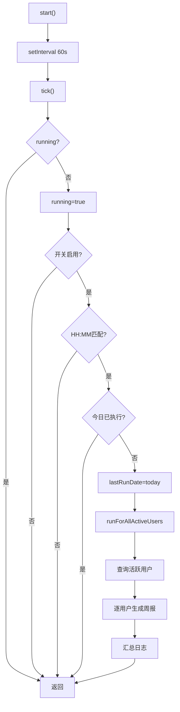

# ReportScheduler.ts 需求说明

> 源文件：src/services/worker/reports/ReportScheduler.ts ｜ 类型：源码 ｜ 行数：93 ｜ 所属模块：worker/reports ｜ 分析日期：2026-07-23

## 1. 文件定位总述

ReportScheduler 是周报自动生成的定时调度器，仿 SyncAgent 的 tick 模式每 60 秒轮询一次，当本地时间命中配置时刻（默认 13:00）且当天未执行过时，为本周有活动的所有用户各生成一份周报。timer 设 unref 不阻塞进程退出，受全局开关 CLAUDE_MEM_WEEKLY_REPORT_ENABLED 控制。依赖 ReportGenerator 执行生成与 UPSERT 持久化。

## 2. 功能需求

| 编号 | 需求描述（系统应当...） | 触发条件 / 输入 | 处理规则与输出 | 证据 |
|------|----------------------|----------------|---------------|------|
| FR-SCHED-01 | 系统应当按 60 秒间隔启动定时调度 | 调用 start() | setInterval 60s + unref；重复调用不创建多个 timer | `ReportScheduler.ts:26-31` |
| FR-SCHED-02 | 系统应当停止定时调度 | 调用 stop() | clearInterval 并置空 | `ReportScheduler.ts:33-35` |
| FR-TICK-01 | 系统应当每分钟检查是否触发生成 | 每 60 秒触发 | 检查开关、时刻匹配、当日去重 | `ReportScheduler.ts:39-58` |
| FR-TOGGLE-01 | 系统应当支持全局开关 | ENABLED 不为 true | tick 直接返回 | `ReportScheduler.ts:43` |
| FR-TIME-01 | 系统应当支持配置生成时刻 | CLAUDE_MEM_WEEKLY_REPORT_TIME | 默认 13:00 | `ReportScheduler.ts:44-48` |
| FR-DEDUP-01 | 系统应当保证每天最多执行一次 | 同日第二次 tick | lastRunDate 匹配后返回 | `ReportScheduler.ts:48` |
| FR-RUNALL-01 | 系统应当为本周所有活跃用户生成周报 | tick 或手动调用 | 查询去重 user_label，逐用户调用 ReportGenerator + upsertWeeklyReport；单用户失败不影响其余 | `ReportScheduler.ts:61-92` |
| FR-MODEL-01 | 系统应当支持配置 LLM 模型 | CLAUDE_MEM_WEEKLY_REPORT_MODEL | 默认 qwen-plus | `ReportScheduler.ts:52` |

## 3. 业务规则与约束

- **并发防护**：running 标志防 tick 重入 (`ReportScheduler.ts:41,51,56`)
- **用户隔离**：单用户失败仅记日志不中断循环 (`ReportScheduler.ts:87-89`)
- **时区**：用 getTimezoneOffset 计算偏移量 (`ReportScheduler.ts:63`)
- **无活跃用户**：记 info 日志返回 (`ReportScheduler.ts:75-78`)

## 4. 对外暴露

| 公开方法 | 签名 | 说明 |
|---------|------|------|
| start | (): void | 启动定时调度 |
| stop | (): void | 停止定时调度 |
| runForAllActiveUsers | (model: string): Promise\<void\> | 立即为本周所有活跃用户生成周报 |

## 5. 依赖关系

- **上游**：Worker 生命周期
- **下游**：DatabaseManager、ReportGenerator、upsertWeeklyReport、weekMondayOf
- **配置**：SettingsDefaultsManager + USER_SETTINGS_PATH

## 6. 数据结构

无自定义数据结构。

## 7. 复杂逻辑图示

## 8. 逆向备注

- runForAllActiveUsers 为 async 公开方法，既被定时调度调用也可外部手动触发 (`ReportScheduler.ts:61`)
- 注释引用 B-周报设计文档 S5.1 (`ReportScheduler.ts:9`)
