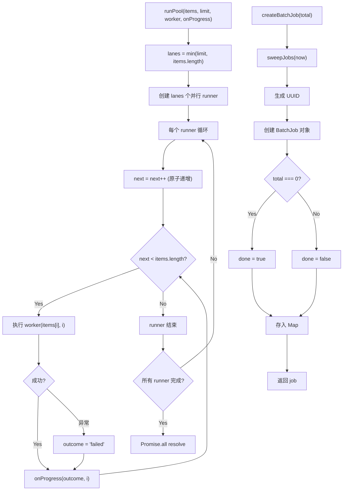
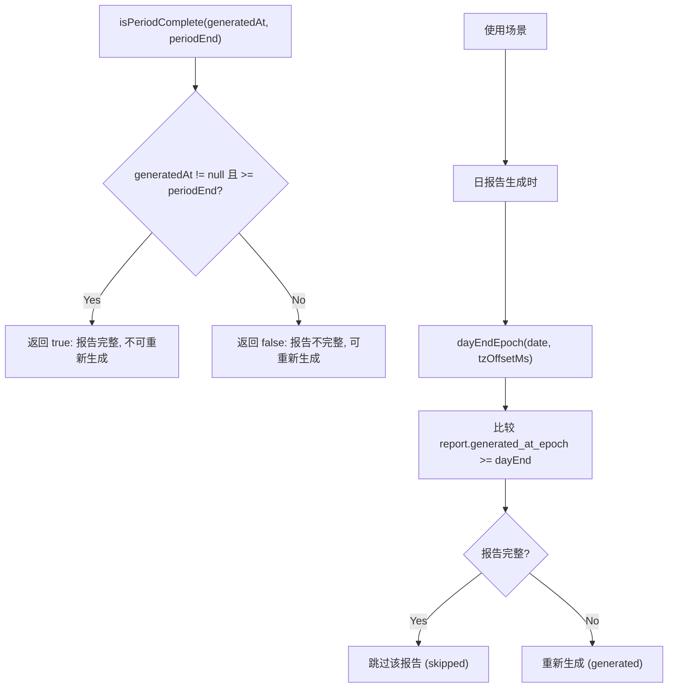

# batch.ts 需求说明

> 源文件：src/services/worker/reports/batch.ts ｜ 类型：源码 ｜ 行数：194 ｜ 所属模块：worker/reports（批量报告基础设施） ｜ 分析日期：2026-07-23

## 1. 文件定位总述

batch.ts 是 claude-mem 批量报告生成系统的共享基础设施模块，提供三大核心能力：固定大小的并发执行池（`runPool`）、内存中的任务注册表（job registry，用于 UI 轮询进度）以及时间段边界计算与完整性判断（period helpers）。该模块服务于日报告和周报告的批量生成场景，通过查询活跃用户避免对空时段消耗 AI 调用，并通过派生式完整性标志（比较生成时间与周期结束时间）判断报告是否需要重新生成。所有状态均为内存驻留，Worker 重启后丢失。

## 2. 功能需求

| 编号 | 需求描述（系统应当…） | 触发条件 / 输入 | 处理规则与输出 | 证据 |
|------|----------------------|----------------|---------------|------|
| FR-batch-01 | 系统应当查询所有曾有会话的用户列表 | 调用 `rosterAllUsers(db)` | 从 `sdk_sessions` 表查询 `DISTINCT user_label`，空值替换为 'unknown'；按 user_label 排序返回 | `src/services/worker/reports/batch.ts:24-31` |
| FR-batch-02 | 系统应当查询指定时间范围内有活跃记录的用户集合 | 调用 `activeUsersInRange(db, start, end)` | 联合查询 `user_prompts JOIN sdk_sessions`、`observations`、`session_summaries` 三张表，取 `[start, end)` 区间内有记录的用户；UNION ALL + GROUP BY 去重 | `src/services/worker/reports/batch.ts:38-53` |
| FR-batch-03 | 系统应当检查指定用户在指定时间范围内是否有活跃记录 | 调用 `userHasActivity(db, user, start, end)` | 使用 `EXISTS` 子查询分别检查三张表，任一匹配即返回 true；user_label 使用 `COLLATE NOCASE` 进行大小写不敏感匹配 | `src/services/worker/reports/batch.ts:56-66` |
| FR-batch-04 | 系统应当以固定并发数执行批量任务 | 调用 `runPool(items, limit, worker, onProgress)` | 创建 `min(limit, items.length)` 个并行 lane，每个 lane 循环取下一个任务执行；`onProgress` 在每个任务完成后（包括失败）触发；worker 异常被捕获为 'failed'，不中断池 | `src/services/worker/reports/batch.ts:81-102` |
| FR-batch-05 | 系统应当从配置中读取批量并发数 | 调用 `batchConcurrency()` | 读取 `CLAUDE_MEM_REPORT_BATCH_CONCURRENCY` 设置值；无效或缺失时默认 6 | `src/services/worker/reports/batch.ts:105-108` |
| FR-batch-06 | 系统应当创建批量任务注册 | 调用 `createBatchJob(total)` | 生成 UUID 作为 job ID；total 为 0 时标记为立即完成；创建前先清理过期任务（TTL 10 分钟） | `src/services/worker/reports/batch.ts:133-144` |
| FR-batch-07 | 系统应当记录任务执行结果 | 调用 `recordOutcome(jobId, outcome)` | 根据 outcome（generated/skipped/failed）递增对应计数器；当 `generated + skipped + failed >= total` 时自动标记 job 为完成 | `src/services/worker/reports/batch.ts:147-154` |
| FR-batch-08 | 系统应当支持强制完成任务 | 调用 `finishBatchJob(jobId)` | 直接将 job.done 设为 true，不检查计数器 | `src/services/worker/reports/batch.ts:157-160` |
| FR-batch-09 | 系统应当支持查询任务进度 | 调用 `getBatchJob(jobId)` | 返回 job 对象或 null（未知/已过期）；查询前先清理过期任务 | `src/services/worker/reports/batch.ts:163-166` |
| FR-batch-10 | 系统应当计算日结束时间戳 | 调用 `dayEndEpoch(date, tzOffsetMs)` | 将 YYYY-MM-DD 解析为 UTC，加 24 小时减时区偏移，返回独占结束 epoch | `src/services/worker/reports/batch.ts:174-177` |
| FR-batch-11 | 系统应当计算周结束时间戳 | 调用 `weekEndEpoch(monday, tzOffsetMs)` | 将周一日期解析为 UTC，加 7 天减时区偏移，返回独占结束 epoch | `src/services/worker/reports/batch.ts:180-183` |
| FR-batch-12 | 系统应当判断报告是否覆盖完整周期 | 调用 `isPeriodComplete(generatedAtEpoch, periodEndEpoch)` | 当 `generatedAtEpoch >= periodEndEpoch` 时返回 true——即报告在周期结束后生成，已看到全部数据 | `src/services/worker/reports/batch.ts:191-193` |

## 3. 业务规则与约束

1. **半开区间**：所有时间范围查询使用 `[start, end)` 半开区间（`>= start AND < end`）。`src/services/worker/reports/batch.ts:43-49`
2. **内存驻留，重启丢失**：job registry 使用内存 Map，Worker 重启后所有任务状态丢失，客户端轮询将 404。这是设计决策——批量报告为临时操作。`src/services/worker/reports/batch.ts:6-7`
3. **Job TTL 10 分钟**：已完成且超过 10 分钟的 job 会被 `sweepJobs` 清理，防止内存泄漏。`src/services/worker/reports/batch.ts:123`
4. **空批量立即完成**：total 为 0 的 batch job 创建时直接标记为 done。`src/services/worker/reports/batch.ts:139`
5. **完整性为派生计算**：报告的完整性不存储在数据库中，而是通过比较 `generated_at_epoch` 与 `periodEndEpoch` 动态判断。周期中生成的报告被视为不完整（可重新生成），周期结束后生成的报告视为完整（锁定）。`src/services/worker/reports/batch.ts:185-193`
6. **user_label 空值处理**：所有查询中 user_label 的空值通过 `COALESCE(NULLIF(user_label, ''), 'unknown')` 统一替换为 'unknown'。`src/services/worker/reports/batch.ts:26-27`
7. **并发池永不 reject**：`runPool` 中 worker 的异常被 catch 为 'failed' outcome，不会导致 Promise.all reject。`src/services/worker/reports/batch.ts:93-97`

## 4. 对外暴露

| 名称 | 类型 | 签名 | 说明 |
|------|------|------|------|
| `BatchOutcome` | type | `'generated' \| 'skipped' \| 'failed'` | 任务执行结果类型 |
| `BatchJob` | interface | `{ id, total, generated, skipped, failed, done, startedAt }` | 批量任务状态 |
| `rosterAllUsers` | function | `(db: Database) => string[]` | 查询所有用户 |
| `activeUsersInRange` | function | `(db, start, end) => Set<string>` | 查询活跃用户集合 |
| `userHasActivity` | function | `(db, user, start, end) => boolean` | 单用户活跃检查 |
| `runPool` | function | `(items, limit, worker, onProgress) => Promise<void>` | 并发执行池 |
| `batchConcurrency` | function | `() => number` | 获取配置并发数 |
| `createBatchJob` | function | `(total: number) => BatchJob` | 创建批量任务 |
| `recordOutcome` | function | `(jobId, outcome) => void` | 记录任务结果 |
| `finishBatchJob` | function | `(jobId) => void` | 强制完成任务 |
| `getBatchJob` | function | `(jobId) => BatchJob \| null` | 查询任务进度 |
| `dayEndEpoch` | function | `(date, tzOffsetMs) => number` | 日结束 epoch |
| `weekEndEpoch` | function | `(monday, tzOffsetMs) => number` | 周结束 epoch |
| `isPeriodComplete` | function | `(generatedAtEpoch, periodEndEpoch) => boolean` | 周期完整性判断 |

共 2 个类型 + 1 个接口 + 12 个导出函数。

## 5. 依赖关系

- **上游依赖**：`bun:sqlite` 的 `Database` 类型
- **上游依赖**：`SettingsDefaultsManager.getInt()`（读取并发数配置）
- **下游被调用**：日报告生成器和周报告生成器使用 runPool、job registry、activeUsersInRange 和 period helpers

## 6. 数据结构

- **BatchJob** (`src/services/worker/reports/batch.ts:112-120`)：`id`（UUID）、`total`（总任务数）、`generated`（已生成数）、`skipped`（跳过数）、`failed`（失败数）、`done`（是否完成）、`startedAt`（开始时间 epoch）
- **JOB_TTL_MS** (`src/services/worker/reports/batch.ts:123`)：10 分钟（600000ms）
- **DAY_MS** (`src/services/worker/reports/batch.ts:19`)：86400000ms（24 小时）

## 7. 复杂逻辑图示

上图左侧展示了并发池的执行模型——多个 lane 各自循环取任务，右侧展示了 job 创建流程。并发池采用"每次取 N 个"的 lane 模型而非队列模型。

上图展示了报告完整性的判断逻辑及其在批量生成中的应用场景——完整报告被跳过，不完整报告被重新生成。

## 8. 逆向备注

1. **注释明确设计意图**：模块顶部注释详细说明了三大组件的职责和设计决策，特别是"completeness flag is DERIVED, not stored"这一关键设计点。`src/services/worker/reports/batch.ts:1-14`
2. **userHasActivity 使用 COLLATE NOCASE**：单用户检查时对 user_label 使用大小写不敏感匹配，但 `activeUsersInRange` 的 UNION ALL 查询未使用 COLLATE NOCASE。推断为不一致或有意为之（批量场景不需精确匹配）。`src/services/worker/reports/batch.ts:60`
3. **runPool 的 next++ 非真正原子**：在 Node.js 单线程中，`next++` 在 async/await 间隙不会被其他 lane 修改（因为 await 前的同步代码不会被中断），因此实际是安全的。`src/services/worker/reports/batch.ts:91`
4. **finishBatchJob 与 recordOutcome 的 done 判断不同**：`recordOutcome` 在计数器达到 total 时设 done，`finishBatchJob` 无条件设 done。推断 `finishBatchJob` 用于池结束后兜底。`src/services/worker/reports/batch.ts:147-160`
5. **weekEndEpoch 基于 ISO 周一**：参数为周一日期（`YYYY-MM-DD`），计算 7 天后的结束时间。`src/services/worker/reports/batch.ts:180-183`
