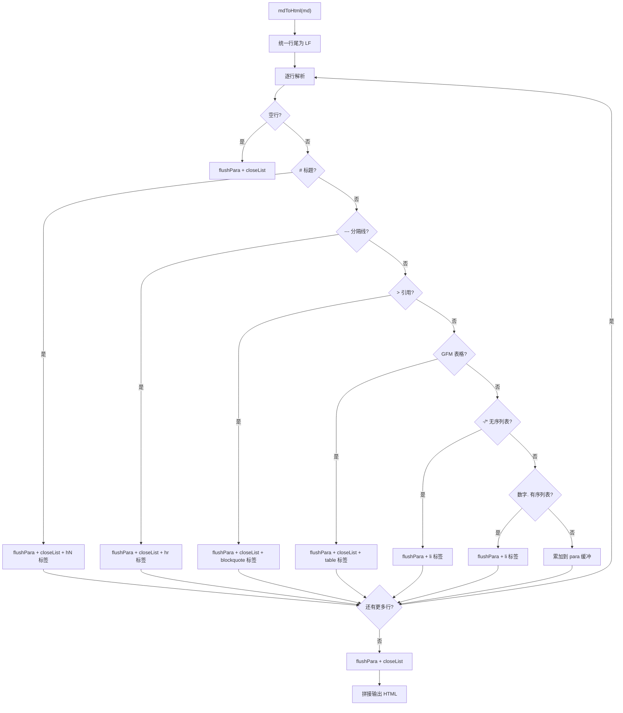

# mdToHtml.ts 需求说明

> 源文件：src/services/worker/reports/mdToHtml.ts ｜ 类型：源码 ｜ 行数：89 ｜ 所属模块：worker/reports ｜ 分析日期：2026-07-23

## 1. 文件定位总述

mdToHtml 是一个零依赖的轻量级 Markdown 到 HTML 转换器，专为周报和日报的整页 HTML 渲染而设计。它支持标题、GFM 表格、列表、引用、分隔线、段落及行内格式（代码、加粗、链接），不依赖任何外部 Markdown 解析库。安全性方面，它实现了 HTML 转义和链接协议白名单，防止报告内容中的恶意 Markdown 成为 XSS 攻击向量。

## 2. 功能需求

| 编号 | 需求描述（系统应当…） | 触发条件 / 输入 | 处理规则与输出 | 证据 |
|------|----------------------|----------------|---------------|------|
| FR-ESCAPE-01 | 系统应当对文本进行 HTML 特殊字符转义 | 调用 `htmlEscape(s)` | 将 `&`、`<`、`>`、`"` 转换为对应 HTML 实体 | `mdToHtml.ts:9-11` |
| FR-INLINE-01 | 系统应当渲染行内 Markdown 格式 | 调用 `mdInline(s)` | 依次处理：HTML 转义 → 行内代码 → 加粗 → 链接；不安全协议链接退化为纯文本标签 | `mdToHtml.ts:25-33` |
| FR-CONVERT-01 | 系统应当将完整 Markdown 文档转换为 HTML | 调用 `mdToHtml(md)` | 按行解析，依次处理标题(1-6级)、分隔线、引用、GFM 表格、无序列表、有序列表、段落，生成对应 HTML 标签 | `mdToHtml.ts:40-89` |
| FR-TABLE-01 | 系统应当支持 GFM 表格渲染 | 行以 `|` 开头且下一行为分隔行 `|---|---|` | 解析表头和表体行，生成 `<table><thead><tbody>` 结构 | `mdToHtml.ts:62-76` |
| FR-LINKSAFE-01 | 系统应当仅允许安全协议的链接 | Markdown 中的链接 URL | 仅 http(s)、mailto 和相对路径允许渲染为 `<a>` 标签；其他协议（javascript:、data: 等）退化为纯文本 | `mdToHtml.ts:20-22,30-31` |
| FR-HEADING-01 | 系统应当支持 1-6 级标题 | 行以 `#` 开头 | 生成对应级别的 `<h1>` 到 `<h6>` 标签 | `mdToHtml.ts:55-56` |

## 3. 业务规则与约束

- **零依赖设计**：不引入 marked、markdown-it 等外部库，仅用原生字符串操作实现 (`mdToHtml.ts:1`)
- **XSS 防御**：(1) 所有文本先经 HTML 转义再处理格式；(2) 链接 URL 经白名单校验，非安全协议不生成 `<a>` 标签 (`mdToHtml.ts:20-22`)
- **行尾统一**：`\r\n` 先统一为 `\n` (`mdToHtml.ts:41`)
- **列表类型切换**：遇到非列表行时自动关闭当前列表标签 (`mdToHtml.ts:46,84`)
- **段落合并**：连续非结构化行合并为一个 `<p>` 段落 (`mdToHtml.ts:84-86`)
- **链接目标**：所有允许的链接添加 `target="_blank" rel="noreferrer"` 属性 (`mdToHtml.ts:31`)

## 4. 对外暴露

| 导出函数 | 签名 | 说明 |
|---------|------|------|
| `htmlEscape` | `(s: string): string` | HTML 特殊字符转义 |
| `mdInline` | `(s: string): string` | 行内 Markdown 渲染 |
| `mdToHtml` | `(md: string): string` | 完整 Markdown 文档转 HTML |

## 5. 依赖关系

- **无运行时依赖**：纯函数，不依赖任何外部模块
- **下游**：被周报/日报的整页 HTML 渲染逻辑调用

## 6. 数据结构

无自定义数据结构。

## 7. 复杂逻辑图示



## 8. 逆向备注

- `htmlEscape` 函数被单独导出，表明其他模块可能也需要独立的 HTML 转义能力 (`mdToHtml.ts:9`)。
- `isSafeHref` 的注释特别提到"entity-encoded scheme tricks（如 `&#106;avascript:`）"也会被拒绝，说明开发者考虑了编码绕过攻击 (`mdToHtml.ts:17-18`)。
- 该转换器不支持嵌套列表、代码块（围栏式 ```）、图片、脚注等高级 Markdown 特性，设计目标明确为"覆盖本项目生成的报告正文"。
