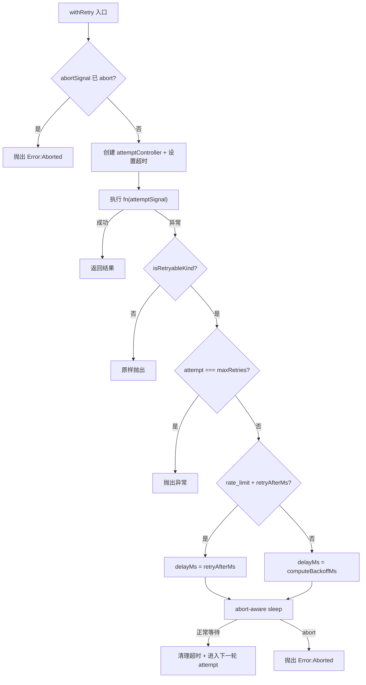

# retry.ts 需求说明

> 源文件：src/services/worker/retry.ts ｜ 类型：源码 ｜ 行数：131 ｜ 所属模块：worker ｜ 分析日期：2026-07-23

## 1. 文件定位总述

retry.ts 是 worker 层的通用重试工具模块，为外部 LLM 提供商（如 GeminiProvider、OpenRouterProvider）的 HTTP fetch 请求提供分类错误驱动的自动重试机制。该模块采用指数退避+随机抖动策略，默认最多重试 2 次（因 POST 请求非严格幂等），并支持外部 AbortSignal 中断。它不直接发起 HTTP 请求，而是接收一个返回 Promise 的函数作为重试单元，由调用方负责构造具体的 fetch 逻辑。

## 2. 功能需求

| 编号 | 需求描述（系统应当…） | 触发条件 / 输入 | 处理规则与输出 | 证据 |
|------|----------------------|----------------|---------------|------|
| FR-retry-01 | 系统应当根据错误的分类种类决定是否值得重试 | 捕获到异常时 | 对 `ClassifiedProviderError` 仅当 `kind` 为 `transient` 或 `rate_limit` 时重试；未分类错误一律视为可重试 | `retry.ts:38-44` |
| FR-retry-02 | 系统应当以指数退避+抖动方式计算重试等待时间 | 需要重试时 | 公式：`baseDelayMs * 2^attempt + random(50)`，上限为 `maxDelayMs` | `retry.ts:47-51` |
| FR-retry-03 | 系统应当在 rate_limit 类型错误时优先使用服务端返回的 `retryAfterMs` 值 | 错误为 rate_limit 且含 `retryAfterMs` 字段 | 直接使用该值作为等待时间，否则走指数退避逻辑 | `retry.ts:91-95` |
| FR-retry-04 | 系统应当在每次尝试中设置独立的超时控制器 | 每次重试尝试 | 创建独立 `AbortController`，在 `perAttemptTimeoutMs` 到期后 abort；同时转发外部 abort 信号 | `retry.ts:71-74` |
| FR-retry-05 | 系统应当支持外部 AbortSignal 在任意时刻中断重试循环 | 传入 `abortSignal` 且外部触发 abort | 循环入口检查 abort 状态；退避等待期间监听 abort 事件立即退出；清理已注册的 abort 监听器 | `retry.ts:66-68, 104-119, 122` |
| FR-retry-06 | 系统应当在退避等待期间也响应外部中断 | 进入 sleep 等待 | 注册 abort 监听器，一旦 abort 则 `clearTimeout` 并 reject 抛出 `Error('Aborted')` | `retry.ts:104-119` |
| FR-retry-07 | 系统应当在每次重试时记录警告日志 | 重试发生时 | 日志包含：标签（label）、延迟毫秒数、当前尝试序号/最大次数、错误种类、截断后的错误消息（≤200字符） | `retry.ts:98-101` |
| FR-retry-08 | 系统应当在不可重试错误或达到最大重试次数时立即抛出 | 错误不可重试，或 `attempt === maxRetries` | 原样抛出异常，不再进入退避等待 | `retry.ts:81-87` |

## 3. 业务规则与约束

- **默认参数**：最大重试 2 次，单次超时 30s，基础延迟 100ms，最大延迟 30s。`src/services/worker/retry.ts:30-35`
- **幂等性约束**：注释说明 POST 请求非严格幂等，因此上限设为 2。`src/services/worker/retry.ts:8-9`
- **推断（依据）**：注释提到"provider-supplied request-id"用于去重，但代码中未体现 request-id 传递逻辑，推断由调用方在 fetch 函数中处理。`src/services/worker/retry.ts:9`
- **边界防御**：当 `maxRetries < 0` 时循环不执行，抛出 lastError 或兜底错误，防止 TypeScript 返回类型不可达断言。`src/services/worker/retry.ts:126-130`

## 4. 对外暴露

| 名称 | 类型 | 说明 |
|------|------|------|
| `RetryOptions` | interface | 重试配置项：maxRetries, perAttemptTimeoutMs, baseDelayMs, maxDelayMs, label, abortSignal |
| `isRetryableKind(err)` | function | 判断错误是否值得重试 |
| `computeBackoffMs(attempt, opts)` | function | 计算指数退避延迟（毫秒） |
| `withRetry<T>(fn, options)` | function | 核心重试执行器，接收返回 Promise 的函数，返回最终结果或抛出异常 |

## 5. 依赖关系

- **内部依赖**：`./provider-errors.js`（`ClassifiedProviderError`, `isClassified`）、`../../utils/logger.js`
- **被依赖**：GeminiProvider、OpenRouterProvider 等 LLM 提供商的 fetch 重试

## 6. 数据结构

**RetryOptions 接口**：`src/services/worker/retry.ts:15-28`

| 字段 | 类型 | 默认值 | 说明 |
|------|------|--------|------|
| maxRetries | number | 2 | 最大重试次数（不含首次尝试） |
| perAttemptTimeoutMs | number | 30000 | 单次尝试超时毫秒 |
| baseDelayMs | number | 100 | 指数退避基础延迟 |
| maxDelayMs | number | 30000 | 延迟上限 |
| label | string? | — | 日志标签 |
| abortSignal | AbortSignal? | — | 外部中断信号 |

## 7. 复杂逻辑图示

重试主循环：从 attempt=0 到 maxRetries，每次创建独立 AbortController 处理超时与外部中断，仅对 transient/rate_limit 类错误重试，rate_limit 优先使用服务端建议等待时间。

## 8. 逆向备注

- 注释提及"provider-supplied request-id"用于去重，但本文件未包含任何 request-id 处理逻辑，推断由调用方在 fn 内部实现。
- `isRetryableKind` 对未分类错误返回 true（视为可重试），这是有意保留旧行为，但在 strict 错误分类下可能导致非瞬态错误被错误重试。
