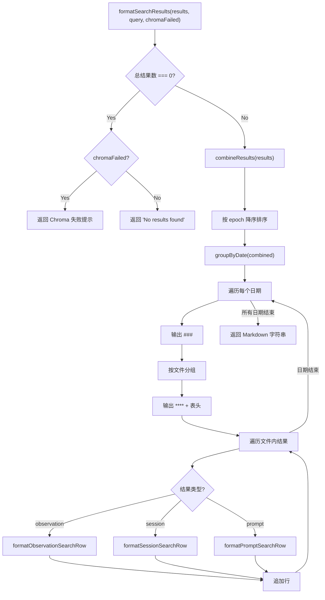

# ResultFormatter.ts 需求说明

> 源文件：src/services/worker/search/ResultFormatter.ts ｜ 类型：源码 ｜ 行数：251 ｜ 所属模块：worker/search（搜索结果格式化） ｜ 分析日期：2026-07-23

## 1. 文件定位总述

ResultFormatter 是 claude-mem 搜索模块的结果格式化器，负责将混合搜索结果（观测、会话摘要、用户提示词）格式化为 Markdown 表格形式的文本输出。它是搜索 API 返回给调用方的最终呈现层，支持两种使用场景：搜索结果格式化（`formatSearchResults`，按日期和文件分组、按 epoch 降序排列）和索引格式化（`formatObservationIndex`/`formatSessionIndex`/`formatPromptIndex`，单行表格格式）。模块还处理 Chroma 语义搜索失败时的降级提示消息，并提供搜索策略建议。文件路径提取、日期分组、时间格式化等公共逻辑委托给 `shared/timeline-formatting.js`。

## 2. 功能需求

| 编号 | 需求描述（系统应当…） | 触发条件 / 输入 | 处理规则与输出 | 证据 |
|------|----------------------|----------------|---------------|------|
| FR-rf-01 | 系统应当将混合搜索结果格式化为 Markdown 文本 | 调用 `formatSearchResults(results, query, chromaFailed?)` | 合并三类结果 → 按 epoch 降序排序 → 按日期分组 → 日期内按文件分组 → 输出标题行 + 统计信息 + 表格；无结果时返回提示或 Chroma 失败消息 | `src/services/worker/search/ResultFormatter.ts:16-98` |
| FR-rf-02 | 系统应当按文件路径分组观测结果 | formatSearchResults 渲染时 | 观测通过 `extractFirstFile(obs.files_modified, cwd, obs.files_read)` 提取文件路径；非观测类型归入 "General" 分组 | `src/services/worker/search/ResultFormatter.ts:53-55` |
| FR-rf-03 | 系统应当将三类结果合并为统一列表 | 调用 `combineResults(results)` | 将 observations、sessions、prompts 映射为包含 type/data/epoch/created_at 的统一结构 | `src/services/worker/search/ResultFormatter.ts:100-121` |
| FR-rf-04 | 系统应当格式化观测搜索行（表格行） | 调用 `formatObservationSearchRow(obs, lastTime)` | 格式：`| #<id> | <time> | <icon> | <title> | ~<readTokens> |`；时间相同用 `"` 替代 | `src/services/worker/search/ResultFormatter.ts:133-149` |
| FR-rf-05 | 系统应当格式化会话搜索行 | 调用 `formatSessionSearchRow(session, lastTime)` | 格式：`| #S<id> | <time> | 🎯 | <title> | - |`；标题为 request 或 session_id 前 8 位 | `src/services/worker/search/ResultFormatter.ts:151-167` |
| FR-rf-06 | 系统应当格式化提示词搜索行 | 调用 `formatPromptSearchRow(prompt, lastTime)` | 格式：`| #P<id> | <time> | 💬 | <truncatedText> | - |`；超过 60 字符截断 | `src/services/worker/search/ResultFormatter.ts:169-186` |
| FR-rf-07 | 系统应当格式化观测索引行（含工作 Token） | 调用 `formatObservationIndex(obs, index)` | 在搜索行基础上增加 Work 列，显示工作类型 emoji 和 discovery_tokens | `src/services/worker/search/ResultFormatter.ts:188-199` |
| FR-rf-08 | 系统应当格式化会话索引行 | 调用 `formatSessionIndex(session, index)` | 6 列格式，Read 和 Work 列均为 `-` | `src/services/worker/search/ResultFormatter.ts:201-209` |
| FR-rf-09 | 系统应当格式化提示词索引行 | 调用 `formatPromptIndex(prompt, index)` | 6 列格式，Read 和 Work 列均为 `-` | `src/services/worker/search/ResultFormatter.ts:211-220` |
| FR-rf-10 | 系统应当生成 Chroma 语义搜索失败的降级提示 | `formatChromaFailureMessage(reason)` 静态方法 | 连接错误提示连接诊断建议，非连接错误提示日志路径 | `src/services/worker/search/ResultFormatter.ts:230-235` |
| FR-rf-11 | 系统应当输出搜索策略建议 | 调用 `formatSearchTips()` | 输出搜索操作建议（先索引再详情再批量获取）和过滤/排序参数提示 | `src/services/worker/search/ResultFormatter.ts:237-249` |

## 3. 业务规则与约束

1. **降序排列**：搜索结果按 epoch 降序（最新在前），与时间线的升序排列相反。`src/services/worker/search/ResultFormatter.ts:37`
2. **Token 估算方式**：使用 `(title + subtitle + narrative + facts).length / 4`，常量 `CHARS_PER_TOKEN_ESTIMATE = 4`。`src/services/worker/search/ResultFormatter.ts:222-228`
3. **时间压缩**：相邻行时间相同时用 `"` 替代完整时间，与 TimelineBuilder 逻辑一致。`src/services/worker/search/ResultFormatter.ts:143`
4. **搜索行 vs 索引行差异**：搜索行使用 5 列（ID/Time/Type/Title/Read），索引行使用 6 列（增加 Work 列）。`src/services/worker/search/ResultFormatter.ts:123-131`
5. **会话标题回退**：当 `session.request` 为空时，使用 `session.memory_session_id` 的前 8 位作为标识。`src/services/worker/search/ResultFormatter.ts:158-159`
6. **提示词截断长度差异**：搜索行中提示词截断为 100 字符（`src/services/worker/search/ResultFormatter.ts:177-179`——此处为 60 字符），索引行为 60 字符（`src/services/worker/search/ResultFormatter.ts:216`）。

## 4. 对外暴露

| 名称 | 类型 | 签名 | 说明 |
|------|------|------|------|
| `ResultFormatter` | class | — | 搜索结果格式化器 |
| `formatSearchResults` | method | `(results: SearchResults, query: string, chromaFailed?: boolean) => string` | 格式化完整搜索结果 |
| `combineResults` | method | `(results: SearchResults) => CombinedResult[]` | 合并三类结果 |
| `formatSearchTableHeader` | method | `() => string` | 5 列搜索表头 |
| `formatTableHeader` | method | `() => string` | 6 列索引表头 |
| `formatObservationSearchRow` | method | `(obs, lastTime) => { row, time }` | 观测搜索行 |
| `formatSessionSearchRow` | method | `(session, lastTime) => { row, time }` | 会话搜索行 |
| `formatPromptSearchRow` | method | `(prompt, lastTime) => { row, time }` | 提示词搜索行 |
| `formatObservationIndex` | method | `(obs, index) => string` | 观测索引行 |
| `formatSessionIndex` | method | `(session, index) => string` | 会话索引行 |
| `formatPromptIndex` | method | `(prompt, index) => string` | 提示词索引行 |
| `formatChromaFailureMessage` | static method | `(reason) => string` | Chroma 失败提示 |
| `formatSearchTips` | method | `() => string` | 搜索策略建议 |

共 1 个类（含 11 个公共方法 + 1 个静态方法）。

## 5. 依赖关系

- **上游依赖**：`ObservationSearchResult`、`SessionSummarySearchResult`、`UserPromptSearchResult`、`CombinedResult`、`SearchResults` 类型（来自 `./types.js`）
- **上游依赖**：`ModeManager`（获取类型图标 `getTypeIcon` 和工作 emoji `getWorkEmoji`）
- **上游依赖**：`formatTime`、`extractFirstFile`、`groupByDate`、`estimateTokens`（来自 `../../../shared/timeline-formatting.js`）
- **上游依赖**：`logger`

## 6. 数据结构

- **CHARS_PER_TOKEN_ESTIMATE** (`src/services/worker/search/ResultFormatter.ts:13`)：每 Token 约 4 个字符的估算常数
- **SearchResults**（类型来源：`./types.js`）：包含 `observations`、`sessions`、`prompts` 三个数组
- **CombinedResult**（类型来源：`./types.js`）：包含 `type`、`data`、`epoch`、`created_at` 的统一结构

## 7. 复杂逻辑图示

上图展示了搜索结果格式化的核心流程。三类结果在同一日期内按文件分组，混合排列在同一表格中。

## 8. 逆向备注

1. **降序 vs 升序**：搜索结果降序（最新在前）与时间线升序（最旧在前）的设计差异反映了不同使用场景——搜索关注最近结果，时间线关注上下文连贯性。`src/services/worker/search/ResultFormatter.ts:37`
2. **formatChromaFailureMessage 为静态方法**：这是 ResultFormatter 中唯一使用 `static` 的方法，推断是因为不需要实例状态且可能被其他模块直接调用。`src/services/worker/search/ResultFormatter.ts:230`
3. **提示词截断长度不一致**：`formatPromptSearchRow`（搜索行）和 `formatPromptIndex`（索引行）的截断阈值分别为 100 和 60 字符，可能是有意区分但缺乏文档说明。`src/services/worker/search/ResultFormatter.ts:177 vs 216`
4. **logger 已导入**：在 `import` 声明中出现但类方法中未直接使用（可能被子类或测试使用）。`src/services/worker/search/ResultFormatter.ts:1`
