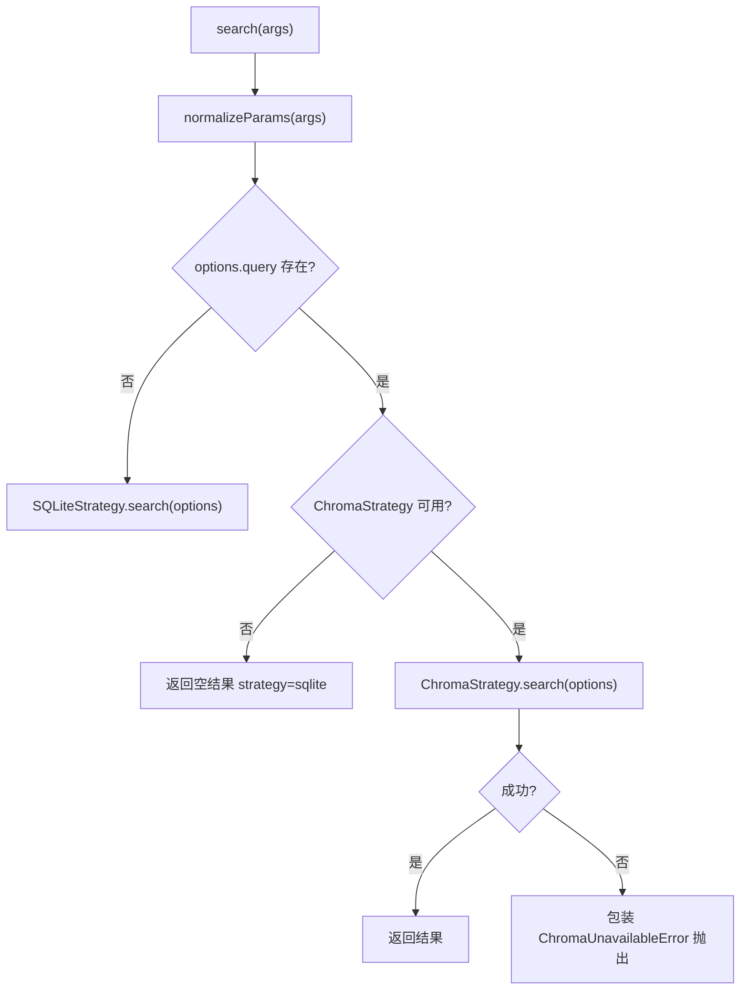
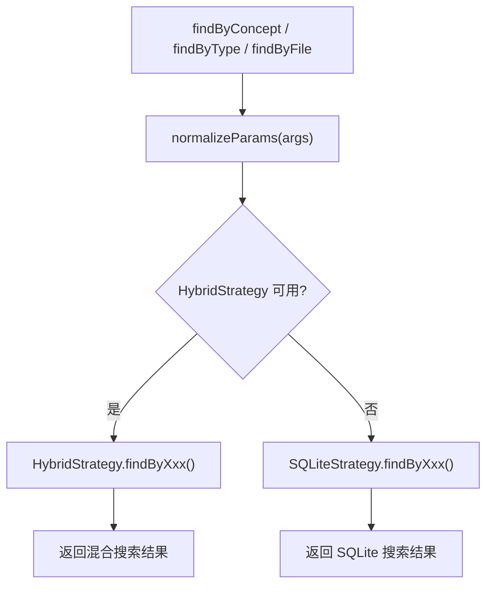

# SearchOrchestrator.ts 需求说明

> 源文件：src/services/worker/search/SearchOrchestrator.ts ｜ 类型：源码 ｜ 行数：217 ｜ 所属模块：worker/search ｜ 分析日期：2026-07-23

## 1. 文件定位总述

SearchOrchestrator.ts 是搜索子系统的统一调度器，负责根据查询条件选择合适的搜索策略（Chroma 向量搜索、SQLite 元数据搜索、混合搜索），并提供搜索结果的格式化和时间线构建能力。它将原始请求参数标准化后路由到对应策略，在 Chroma 不可用时自动降级到 SQLite，并在策略层面提供概念搜索、类型搜索、文件搜索等专项接口。该类是所有搜索 API 路由的核心依赖。

## 2. 功能需求

| 编号 | 需求描述（系统应当…） | 触发条件 / 输入 | 处理规则与输出 | 证据 |
|------|----------------------|----------------|---------------|------|
| FR-so-01 | 系统应当调度通用搜索请求 | 调用 `search(args)` | 标准化参数 → 无 query 时用 SQLite 策略 → 有 query 且 Chroma 可用时用 Chroma 策略 → Chroma 查询失败抛 ChromaUnavailableError | `SearchOrchestrator.ts:55-88` |
| FR-so-02 | 系统应当调度概念搜索 | 调用 `findByConcept(concept, args)` | 有 hybrid 策略时走混合搜索 → 否则走 SQLite findByConcept | `SearchOrchestrator.ts:90-103` |
| FR-so-03 | 系统应当调度类型搜索 | 调用 `findByType(type, args)` | 有 hybrid 策略时走混合搜索 → 否则走 SQLite findByType | `SearchOrchestrator.ts:105-118` |
| FR-so-04 | 系统应当调度文件搜索 | 调用 `findByFile(filePath, args)` | 有 hybrid 策略时走混合搜索 → 否则走 SQLite findByFile | `SearchOrchestrator.ts:120-133` |
| FR-so-05 | 系统应当标准化搜索参数 | 任何搜索入口 | 逗号分隔的 concepts/files/obs_type/type → 数组；dateStart/dateEnd → dateRange 对象；type=observations/sessions/prompts → searchType | `SearchOrchestrator.ts:174-211` |
| FR-so-06 | 系统应当构建时间线 | 调用 `getTimeline(timelineData, anchorId, anchorEpoch, depthBefore, depthAfter)` | 委托 TimelineBuilder 构建并按深度过滤 | `SearchOrchestrator.ts:135-144` |
| FR-so-07 | 系统应当格式化时间线文本 | 调用 `formatTimeline(items, anchorId, options)` | 委托 TimelineBuilder 格式化 | `SearchOrchestrator.ts:146-156` |
| FR-so-08 | 系统应当格式化搜索结果文本 | 调用 `formatSearchResults(results, query, chromaFailed?)` | 委托 ResultFormatter 格式化 | `SearchOrchestrator.ts:158-164` |
| FR-so-09 | 系统应当检测 Chroma 是否可用 | 调用 `isChromaAvailable()` | 返回 chromaSync 实例是否存在 | `SearchOrchestrator.ts:213-215` |

## 3. 业务规则与约束

- **策略优先级**：通用搜索优先 Chroma（有 query 时），专项搜索（概念/类型/文件）优先 Hybrid。`SearchOrchestrator.ts:61-88, 90-133`
- **降级策略**：Chroma 不可用时，专项搜索降级到 SQLite；通用搜索在 Chroma 不可用时返回空结果而非降级到 SQLite。`SearchOrchestrator.ts:82-87`
- **Chroma 失败处理**：Chroma 查询失败时包装为 `ChromaUnavailableError` 抛出，不降级。`SearchOrchestrator.ts:73-78`
- **参数标准化规则**：`concepts`、`files`、`obs_type`、`type`（含逗号）字段从逗号分隔字符串转为数组；`dateStart`/`dateEnd` 转为 `dateRange` 对象。`SearchOrchestrator.ts:177-208`
- **searchType 隐式转换**：当 `type` 为 `'observations'`/`'sessions'`/`'prompts'` 时自动转为 `searchType`。`SearchOrchestrator.ts:194-199`

## 4. 对外暴露

| 名称 | 类型 | 说明 |
|------|------|------|
| `SearchOrchestrator` | class | 搜索调度器 |
| `search(args)` | async method | 通用搜索 |
| `findByConcept(concept, args)` | async method | 概念搜索 |
| `findByType(type, args)` | async method | 类型搜索 |
| `findByFile(filePath, args)` | async method | 文件搜索 |
| `getTimeline(...)` | method | 构建时间线 |
| `formatTimeline(items, anchorId, options)` | method | 格式化时间线 |
| `formatSearchResults(results, query, chromaFailed?)` | method | 格式化搜索结果 |
| `isChromaAvailable()` | method | 检测 Chroma 可用性 |
| `getFormatter()` | method | 获取 ResultFormatter 实例 |
| `getTimelineBuilder()` | method | 获取 TimelineBuilder 实例 |

## 5. 依赖关系

- **内部依赖**：`../../sqlite/SessionSearch.js`、`../../sqlite/SessionStore.js`、`../../sync/ChromaSync.js`、`./strategies/ChromaSearchStrategy.js`、`./strategies/SQLiteSearchStrategy.js`、`./strategies/HybridSearchStrategy.js`、`./ResultFormatter.js`、`./TimelineBuilder.js`、`./errors.js`
- **被依赖**：所有搜索 API 路由、CorpusBuilder、知识库构建模块

## 6. 数据结构

**NormalizedParams 接口**：`src/services/worker/search/SearchOrchestrator.ts:26-30`

| 字段 | 类型 | 说明 |
|------|------|------|
| concepts | string[]? | 标准化后的概念列表 |
| files | string[]? | 标准化后的文件列表 |
| obsType | string[]? | 标准化后的观察类型列表 |
| (继承 StrategySearchOptions) | — | query, searchType, limit, project, dateRange 等 |

## 7. 复杂逻辑图示

通用搜索 vs 专项搜索的策略路由差异：通用搜索优先 Chroma 并在失败时抛异常；专项搜索优先 Hybrid 并在不可用时降级到 SQLite。

## 8. 逆向备注

- 通用搜索（`search`）在 Chroma 不可用时返回空结果而非降级到 SQLite，但专项搜索会降级，推断通用搜索的无结果语义明确表示"无法搜索"，而专项搜索有纯 SQLite 保障基础功能。
- `normalizeParams` 中 `obs_type` 会被重命名为 `obsType`（驼峰），但 StrategySearchOptions 中该字段定义为 `obsType?`，确认了命名约定转换。`SearchOrchestrator.ts:186-188`
- `getFormatter()` 和 `getTimelineBuilder()` 暴露内部组件实例，推断有外部需要直接调用格式化能力。
