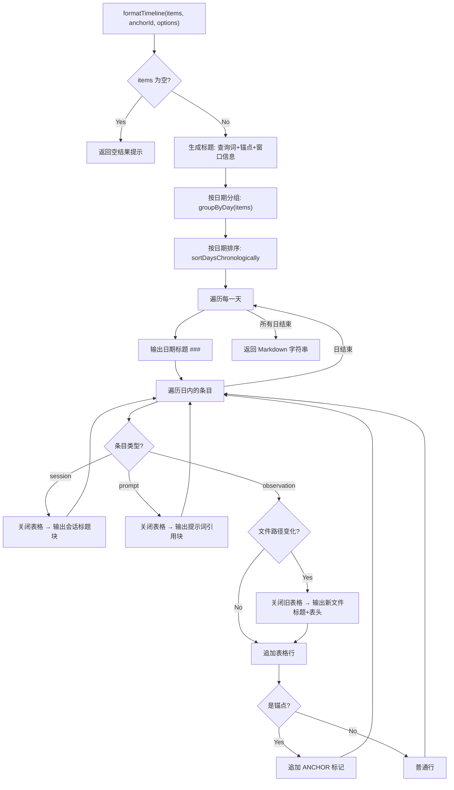

# TimelineBuilder.ts 需求说明

> 源文件：src/services/worker/search/TimelineBuilder.ts ｜ 类型：源码 ｜ 行数：263 ｜ 所属模块：worker/search（时间线构建与格式化） ｜ 分析日期：2026-07-23

## 1. 文件定位总述

TimelineBuilder 是 claude-mem 搜索模块的时间线构建器，负责将观测记录、会话摘要和用户提示词三类搜索结果合并为按时间排序的时间线视图，并格式化为 Markdown 文本。它是 `TimelineService.ts` 的重构版本，将日期/时间格式化、文件路径提取、按日分组等公共逻辑提取到 `shared/timeline-formatting.js`，并通过 `extractFirstFile` 实现按文件路径分组观测（而非旧版的固定 "General" 分组）。该类被搜索 API 路由调用，用于展示某个观测周围的上下文时间线。

## 2. 功能需求

| 编号 | 需求描述（系统应当…） | 触发条件 / 输入 | 处理规则与输出 | 证据 |
|------|----------------------|----------------|---------------|------|
| FR-tb-01 | 系统应当将三类搜索结果合并为按时间排序的时间线 | 调用 `buildTimeline(data: TimelineData)` | 将 observations、sessions、prompts 映射为统一 `TimelineItem`（含 epoch），按 epoch 升序排序返回 | `src/services/worker/search/TimelineBuilder.ts:31-52` |
| FR-tb-02 | 系统应当支持基于锚点的深度裁剪 | 调用 `filterByDepth(items, anchorId, anchorEpoch, depthBefore, depthAfter)` | 支持三种锚点定位方式：数字 ID（观测 ID）、"S"+数字（会话 ID）、epoch 时间定位；返回锚点前 N 条 + 锚点后 N 条的子集；锚点解析提取为私有方法 `findAnchorIndex` | `src/services/worker/search/TimelineBuilder.ts:54-70` |
| FR-tb-03 | 系统应当将时间线格式化为 Markdown 文本，按文件路径分组观测 | 调用 `formatTimeline(items, anchorId?, options?)` | options 支持 query、depthBefore、depthAfter、cwd；按日期分组，日期内按文件路径分组观测；文件路径通过 `extractFirstFile(obs.files_modified, cwd, obs.files_read)` 提取；锚点项目标记 `**ANCHOR**` | `src/services/worker/search/TimelineBuilder.ts:96-223` |
| FR-tb-04 | 系统应当在时间线标题中展示查询信息、锚点、窗口大小和条目总数 | formatTimeline 渲染标题区域 | 有查询词+锚点时显示 `# Timeline for query: "xxx"` + 锚点信息；有锚点无查询时显示 `# Timeline around anchor: xxx`；无锚点时仅显示 `# Timeline`；窗口信息以 `depthBefore → depthAfter` 格式展示 | `src/services/worker/search/TimelineBuilder.ts:116-137` |
| FR-tb-05 | 系统应当使用共享格式化工具进行日期/时间处理 | formatTimeline 内部 | 日期格式化使用 `formatDate`，时间格式化使用 `formatTime`，日期时间组合使用 `formatDateTime`，Token 估算使用 `estimateTokens`——均来自 `shared/timeline-formatting.js` | `src/services/worker/search/TimelineBuilder.ts:165,204,206` |

## 3. 业务规则与约束

1. **文件路径分组优先级**：先尝试从 `files_modified` 提取文件路径，再用 `files_read`，最后使用 cwd 目录名。这是通过 `extractFirstFile` 实现的。`src/services/worker/search/TimelineBuilder.ts:187`
2. **时间压缩显示**：相邻同一文件组的观测，时间列若与上一行相同则用 `"`（双引号）代替。`src/services/worker/search/TimelineBuilder.ts:209`
3. **提示词截断**：超过 100 字符的用户提示词截断并追加 `...`。`src/services/worker/search/TimelineBuilder.ts:177-179`
4. **锚点索引回退**：当按 epoch 定位找不到匹配项时，回退到最后一个条目作为锚点。`src/services/worker/search/TimelineBuilder.ts:93`
5. **空结果处理**：无条目时，根据是否有查询词返回不同提示文本。`src/services/worker/search/TimelineBuilder.ts:108-112`
6. **cwd 默认值**：formatTimeline 的 options.cwd 默认为 `process.cwd()`。`src/services/worker/search/TimelineBuilder.ts:106`

## 4. 对外暴露

| 名称 | 类型 | 签名 | 说明 |
|------|------|------|------|
| `TimelineItem` | interface | `{ type: 'observation' \| 'session' \| 'prompt', data, epoch: number }` | 时间线条目 |
| `TimelineData` | interface | `{ observations, sessions, prompts }` | 时间线输入数据 |
| `TimelineBuilder` | class | — | 时间线构建器 |
| `buildTimeline` | method | `(data: TimelineData) => TimelineItem[]` | 构建排序时间线 |
| `filterByDepth` | method | `(items, anchorId, anchorEpoch, depthBefore, depthAfter) => TimelineItem[]` | 锚点深度裁剪 |
| `formatTimeline` | method | `(items, anchorId?, options?) => string` | 格式化为 Markdown |

共 2 个接口 + 1 个类（含 3 个公共方法）。

## 5. 依赖关系

- **上游依赖**：`ObservationSearchResult`、`SessionSummarySearchResult`、`UserPromptSearchResult`、`CombinedResult` 类型（来自 `./types.js`）
- **上游依赖**：`ModeManager`（获取类型图标）
- **上游依赖**：`formatDate`、`formatTime`、`formatDateTime`、`extractFirstFile`、`estimateTokens`（来自 `../../../shared/timeline-formatting.js`）
- **上游依赖**：`logger`

## 6. 数据结构

- **TimelineItem** (`src/services/worker/search/TimelineBuilder.ts:18-22`)：与旧版 TimelineService 的定义结构相同——`type`、`data`（联合类型）、`epoch`
- **TimelineData** (`src/services/worker/search/TimelineBuilder.ts:24-28`)：与旧版结构相同——`observations`、`sessions`、`prompts`
- **formatTimeline options** (`src/services/worker/search/TimelineBuilder.ts:99-104`)：`query?`、`depthBefore?`、`depthAfter?`、`cwd?`

## 7. 复杂逻辑图示

上图展示了时间线格式化的核心流程。三类条目在日期分组内混合排序，观测按文件路径分组为表格，会话和提示词以独立块展示。

## 8. 逆向备注

1. **与 TimelineService 的关系**：本文件是 `src/services/worker/TimelineService.ts` 的重构版本，主要改进包括：提取公共格式化到 `shared/timeline-formatting.js`、引入 `extractFirstFile` 实现按文件分组、锚点索引提取为独立方法、参数命名采用 camelCase（旧版为 snake_case）。两个文件目前并存于代码库中。
2. **不输出 Legend 行**：与旧版 TimelineService 不同，此版本的 `formatTimeline` 不输出固定的 emoji Legend 行。`src/services/worker/search/TimelineBuilder.ts:96-223`（全文无 Legend 输出）
3. **ANCHOR 标记用 ASCII**：使用 `<- **ANCHOR**`（纯 ASCII 箭头），而旧版使用 `← **ANCHOR**`（Unicode 箭头）。`src/services/worker/search/TimelineBuilder.ts:165`
4. **时间压缩符号差异**：旧版用 `″`（双撇号），此版用 `"`（双引号）。`src/services/worker/search/TimelineBuilder.ts:209`
5. **import 了 `CombinedResult` 类型但未在方法签名中使用**：该类型推断为中间类型，可能被其他调用方使用。`src/services/worker/search/TimelineBuilder.ts:6`
