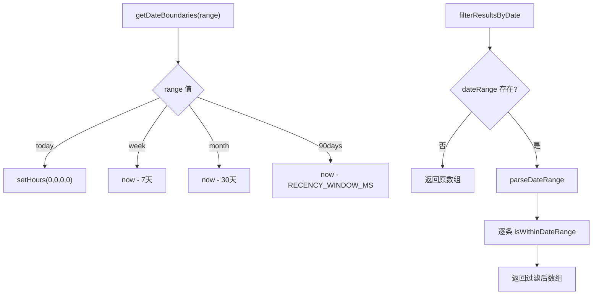

# DateFilter.ts 需求说明

> 源文件：src/services/worker/search/filters/DateFilter.ts | 类型：源码 | 行数：84 | 所属模块：worker/search/filters | 分析日期：2026-07-23

## 1. 文件定位总述

DateFilter 是搜索子系统的日期过滤工具模块，提供时间范围解析、单条记录时间校验、近期判断和批量结果过滤四项核心能力。它同时支持数字时间戳和日期字符串两种输入格式，并为常见时间范围（今天/本周/本月/90天）提供预置边界生成器。搜索管线的多个阶段都依赖此模块进行时间维度的结果筛选。

## 2. 功能需求

| 编号 | 需求描述（系统应当…） | 触发条件 / 输入 | 处理规则与输出 | 证据 |
|------|----------------------|----------------|---------------|------|
| FR-DateFilter-01 | 系统应当将日期范围参数解析为时间戳边界 | 调用 `parseDateRange(dateRange?)` | 输入为空时返回空对象；`start` 和 `end` 支持数字（直接使用）和字符串（通过 `new Date()` 转换）；返回 `{ startEpoch?, endEpoch? }` | `src/services/worker/search/filters/DateFilter.ts:6-29` |
| FR-DateFilter-02 | 系统应当判断给定时间戳是否在指定范围内 | 调用 `isWithinDateRange(epoch, dateRange?)` | 无 dateRange 时返回 true；有 startEpoch 时 epoch 不得小于 start；有 endEpoch 时 epoch 不得大于 end | `src/services/worker/search/filters/DateFilter.ts:31-50` |
| FR-DateFilter-03 | 系统应当判断给定时间戳是否在最近 90 天内 | 调用 `isRecent(epoch)` | 以 `Date.now() - RECENCY_WINDOW_MS`（90天）为截止点，epoch 大于截止点返回 true | `src/services/worker/search/filters/DateFilter.ts:52-55` |
| FR-DateFilter-04 | 系统应当对结果集按日期范围进行过滤 | 调用 `filterResultsByDate(results, dateRange?)` | 无 dateRange 直接返回原数组；否则调用 `isWithinDateRange` 逐条过滤 | `src/services/worker/search/filters/DateFilter.ts:57-66` |
| FR-DateFilter-05 | 系统应当为常见时间范围生成预置日期边界 | 调用 `getDateBoundaries(range)` | 支持 'today'（当天 0 点起）、'week'（7 天）、'month'（30 天）、'90days'（与 RECENCY_WINDOW 一致）；返回 `{ start: number }` | `src/services/worker/search/filters/DateFilter.ts:68-83` |

## 3. 业务规则与约束

- **近期窗口常量**：`RECENCY_WINDOW_MS` 来自 `SEARCH_CONSTANTS`，固定为 90 天。`src/services/worker/search/filters/DateFilter.ts:4,53`
- **"today" 边界计算**：使用 `setHours(0,0,0,0)` 获取当天零点，而非 `setHours(0,0,0)`。`src/services/worker/search/filters/DateFilter.ts:71`
- **"month" 实际为 30 天**：`getDateBoundaries('month')` 使用 `now - 30 * 24 * 60 * 60 * 1000`，而非自然月。`src/services/worker/search/filters/DateFilter.ts:79`
- **日期解析灵活性**：`parseDateRange` 对 start/end 支持数字和字符串，但不处理无效日期（`new Date(invalid)` 结果为 NaN，后续比较会自然失败）。`src/services/worker/search/filters/DateFilter.ts:17-19`

## 4. 对外暴露

| 名称 | 类型 | 说明 |
|------|------|------|
| `parseDateRange(dateRange?)` | 函数 | 解析日期范围为时间戳边界 |
| `isWithinDateRange(epoch, dateRange?)` | 函数 | 判断时间戳是否在范围内 |
| `isRecent(epoch)` | 函数 | 判断是否在 90 天窗口内 |
| `filterResultsByDate(results, dateRange?)` | 函数 | 批量过滤结果集 |
| `getDateBoundaries(range)` | 函数 | 生成预置时间范围边界 |

## 5. 依赖关系

- **search/types.ts**：提供 DateRange 类型定义和 SEARCH_CONSTANTS 常量
- **logger**（`../../../../utils/logger.js`）：已导入但未在本文件中使用

## 6. 数据结构

**DateRange**（输入类型，来自 search/types.ts）：
```typescript
{
  start?: number | string;
  end?: number | string;
}
```

## 7. 复杂逻辑图示



预置边界生成器根据 range 参数直接计算起始时间戳。批量过滤器在无范围约束时直接透传，否则先解析边界再逐条过滤。

## 8. 逆向备注

- `logger` 已导入但未使用。推断：（预留用于调试，或从其他过滤器模块模板复制）。
