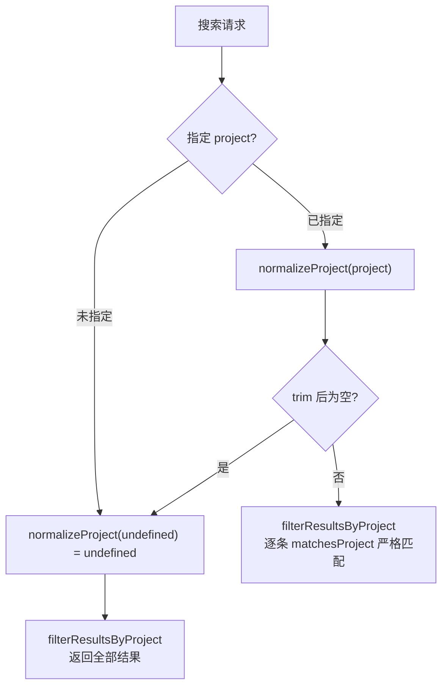

# ProjectFilter.ts 需求说明

> 源文件：src/services/worker/search/filters/ProjectFilter.ts ｜ 类型：源码（过滤器） ｜ 行数：42 ｜ 所属模块：worker/search/filters ｜ 分析日期：2026-07-23

## 1. 文件定位总述

本文件提供项目维度的搜索结果过滤能力，包含获取当前项目名、规范化项目名、匹配项目和批量过滤结果四个函数。它使搜索系统能够按项目名称筛选观察记录，支持默认使用当前工作目录对应的项目名。

## 2. 功能需求

| 编号 | 需求描述（系统应当…） | 触发条件 / 输入 | 处理规则与输出 | 证据 |
|------|----------------------|----------------|---------------|------|
| FR-ProjFilter-01 | 系统应当基于当前工作目录获取项目名称 | getCurrentProject 被调用 | 调用 getProjectContext(process.cwd()).primary | `src/services/worker/search/filters/ProjectFilter.ts:4-6` |
| FR-ProjFilter-02 | 系统应当规范化项目名称，空白或未传入时返回 undefined | normalizeProject 被调用 | trim 后检查是否为空，空则返回 undefined | `src/services/worker/search/filters/ProjectFilter.ts:8-19` |
| FR-ProjFilter-03 | 系统应当判断单个结果的项目是否匹配过滤器项目 | matchesProject 被调用 | filterProject 未传时返回 true（全匹配），否则严格相等比较 | `src/services/worker/search/filters/ProjectFilter.ts:21-30` |
| FR-ProjFilter-04 | 系统应当按项目名批量过滤搜索结果 | filterResultsByProject 被调用 | project 未传时返回原数组，否则用 matchesProject 过滤 | `src/services/worker/search/filters/ProjectFilter.ts:32-41` |

## 3. 业务规则与约束

- **严格匹配**：项目名匹配使用 `===` 严格相等，不做模糊匹配或大小写忽略（`src/services/worker/search/filters/ProjectFilter.ts:29`）
- **默认全匹配**：filterProject 参数为空或 undefined 时不过滤，返回全部结果（`src/services/worker/search/filters/ProjectFilter.ts:25-26`）
- **泛型约束**：filterResultsByProject 要求结果对象包含 `project: string` 字段（`src/services/worker/search/filters/ProjectFilter.ts:32`）

## 4. 对外暴露

| 类别 | 名称 | 类型 | 说明 |
|------|------|------|------|
| 函数 | getCurrentProject | `() => string` | 获取当前工作目录对应的项目名 |
| 函数 | normalizeProject | `(project?: string) => string \| undefined` | 规范化项目名 |
| 函数 | matchesProject | `(resultProject: string, filterProject?: string) => boolean` | 单个结果项目匹配检查 |
| 函数 | filterResultsByProject | `<T extends { project: string }>(results: T[], project?: string) => T[]` | 批量按项目过滤结果 |

## 5. 依赖关系

- **上游**：`../../../../utils/project-name.js`（getProjectContext）
- **下游**：SearchOrchestrator 在搜索完成后对结果集应用项目过滤

## 6. 数据结构

```typescript
// 泛型约束
interface ProjectFilterable {
  project: string;
}
```

## 7. 复杂逻辑图示



上图展示了项目过滤的决策流程：未指定项目或规范化后为空时不过滤，指定项目时进行严格相等匹配。

## 8. 逆向备注

推断：`getCurrentProject()` 默认基于 `process.cwd()` 获取项目上下文，这在 Worker 进程中始终返回 Worker 启动时的工作目录，而非用户当前正在操作的项目。搜索 API 的 `project` 参数允许 MCP 客户端覆盖此默认值。
