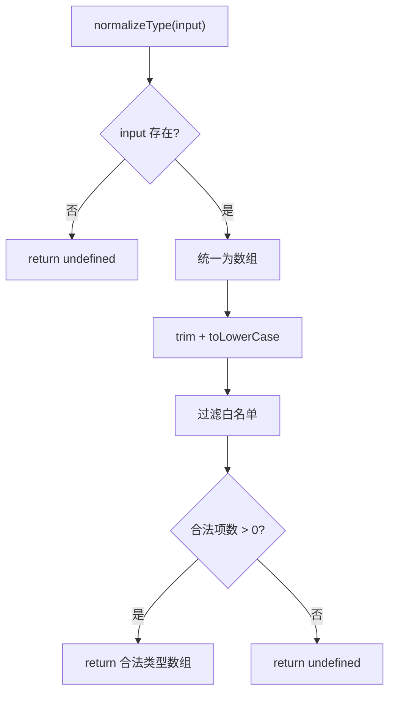

# TypeFilter.ts 需求说明

> 源文件：src/services/worker/search/filters/TypeFilter.ts ｜ 类型：源码 ｜ 行数：59 ｜ 所属模块：worker/search/filters ｜ 分析日期：2026-07-23

## 1. 文件定位总述

本文件是 Worker 搜索模块的观测类型过滤组件，提供类型归一化、匹配判断、列表过滤和字符串解析四类工具函数。它维护一个合法观测类型白名单（8 种类型），所有过滤操作基于此白名单进行校验和匹配。服务于搜索 API 的类型过滤参数处理，确保只返回合法类型的观测记录。

## 2. 功能需求

| 编号 | 需求描述（系统应当…） | 触发条件 / 输入 | 处理规则与输出 | 证据 |
|------|----------------------|----------------|---------------|------|
| FR-TF-01 | 系统应当支持将输入的类型参数归一化为合法类型数组 | 调用 `normalizeType(type)`，type 为字符串或字符串数组 | 单值/多值统一转数组，trim+toLowerCase 后过滤白名单，无合法项返回 undefined | `src/services/worker/search/filters/TypeFilter.ts:16-29` |
| FR-TF-02 | 系统应当能判断单条记录是否匹配类型过滤条件 | 调用 `matchesType(resultType, filterTypes)` | 无过滤条件返回 true；检查 resultType 是否在 filterTypes 中 | `src/services/worker/search/filters/TypeFilter.ts:31-39` |
| FR-TF-03 | 系统应当能按类型过滤观测记录列表 | 调用 `filterObservationsByType(observations, types)` | 无过滤条件返回原列表；用 `matchesType` 逐项过滤 | `src/services/worker/search/filters/TypeFilter.ts:42-51` |
| FR-TF-04 | 系统应当能将逗号分隔的类型字符串解析为合法类型数组 | 调用 `parseTypeString(typeString)` | 按逗号分割，trim+toLowerCase 后过滤白名单 | `src/services/worker/search/filters/TypeFilter.ts:53-58` |

## 3. 业务规则与约束

| 编号 | 规则描述 | 证据 |
|------|---------|------|
| BR-TF-01 | 合法观测类型白名单包含 8 种：`decision`, `bugfix`, `feature`, `refactor`, `discovery`, `change`, `security_alert`, `security_note` | `src/services/worker/search/filters/TypeFilter.ts:3-14` |
| BR-TF-02 | 类型匹配使用白名单包含判断（非宽松匹配），非法类型被静默丢弃 | `src/services/worker/search/filters/TypeFilter.ts:26` |
| BR-TF-03 | `matchesType` 使用类型断言（`as ObservationType`），不校验 `filterTypes` 中的值合法性 | `src/services/worker/search/filters/TypeFilter.ts:39` |

## 4. 对外暴露

| 导出项 | 类型 | 用途 |
|--------|------|------|
| `OBSERVATION_TYPES` | 常量数组 | 合法观测类型白名单 |
| `normalizeType` | 函数 | 归一化类型参数为合法类型数组 |
| `matchesType` | 函数 | 判断单条记录是否匹配过滤条件 |
| `filterObservationsByType` | 泛型函数 | 按类型过滤观测记录列表 |
| `parseTypeString` | 函数 | 解析逗号分隔的类型字符串 |

## 5. 依赖关系

- **上游依赖**：无
- **下游消费者**：推断被搜索 API 路由引用，处理类型过滤查询参数

## 6. 数据结构

```typescript
type ObservationType = 'decision' | 'bugfix' | 'feature' | 'refactor' | 'discovery' | 'change' | 'security_alert' | 'security_note';

const OBSERVATION_TYPES: ObservationType[] = [...]; // 白名单数组
```

## 7. 复杂逻辑图示



图示说明：归一化流程统一输入格式后严格按白名单过滤。

## 8. 逆向备注

- `ObservationType` 类型定义为局部类型别名（非导出），推断为文件内部约束，外部通过 `OBSERVATION_TYPES` 常量使用。
- `filterObservationsByType` 使用泛型约束 `T extends { type: string }`，使其可用于任何含 `type` 字段的对象列表，不限于观测记录。
