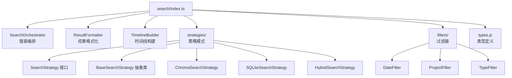

# index.ts 需求说明

> 源文件：src/services/worker/search/index.ts ｜ 类型：源码（桶文件） ｜ 行数：19 ｜ 所属模块：worker/search ｜ 分析日期：2026-07-23

## 1. 文件定位总述

本文件是搜索子模块的桶导出文件，统一导出搜索编排器、结果格式化器、时间线构建器、三种搜索策略（Chroma、SQLite、Hybrid）及全部过滤器（日期、项目、类型）。搜索模块是 Worker 服务层的核心能力之一，支持多后端、多过滤条件的灵活记忆检索。

## 2. 功能需求

| 编号 | 需求描述（系统应当…） | 触发条件 / 输入 | 处理规则与输出 | 证据 |
|------|----------------------|----------------|---------------|------|
| FR-SearchIdx-01 | 系统应当导出搜索编排器 SearchOrchestrator | 外部模块导入 | 导出自 SearchOrchestrator.js | `src/services/worker/search/index.ts:2` |
| FR-SearchIdx-02 | 系统应当导出结果格式化器 ResultFormatter | 外部模块导入 | 导出自 ResultFormatter.js | `src/services/worker/search/index.ts:4` |
| FR-SearchIdx-03 | 系统应当导出时间线构建器 TimelineBuilder 及其类型 | 外部模块导入 | 导出自 TimelineBuilder.js | `src/services/worker/search/index.ts:5-6` |
| FR-SearchIdx-04 | 系统应当导出搜索策略接口、基类和三种实现（Chroma、SQLite、Hybrid） | 外部模块导入 | 导出自 strategies 子目录 | `src/services/worker/search/index.ts:8-12` |
| FR-SearchIdx-05 | 系统应当导出三种搜索过滤器（DateFilter、ProjectFilter、TypeFilter） | 外部模块导入 | 导出自 filters 子目录 | `src/services/worker/search/index.ts:14-16` |
| FR-SearchIdx-06 | 系统应当导出搜索类型定义 | 外部模块导入 | 重导出自 types.js | `src/services/worker/search/index.ts:18` |

## 3. 业务规则与约束

无。本文件是纯桶导出。

## 4. 对外暴露

| 类别 | 名称 | 类型 | 来源 |
|------|------|------|------|
| 导出 | SearchOrchestrator | 类 | `./SearchOrchestrator.js` |
| 导出 | ResultFormatter | 类 | `./ResultFormatter.js` |
| 导出 | TimelineBuilder | 类 | `./TimelineBuilder.js` |
| 导出 | TimelineItem, TimelineData | 类型 | `./TimelineBuilder.js` |
| 导出 | SearchStrategy | 接口 | `./strategies/SearchStrategy.js` |
| 导出 | BaseSearchStrategy | 抽象类 | `./strategies/SearchStrategy.js` |
| 导出 | ChromaSearchStrategy | 类 | `./strategies/ChromaSearchStrategy.js` |
| 导出 | SQLiteSearchStrategy | 类 | `./strategies/SQLiteSearchStrategy.js` |
| 导出 | HybridSearchStrategy | 类 | `./strategies/HybridSearchStrategy.js` |
| 重导出 | DateFilter | 模块 | `./filters/DateFilter.js` |
| 重导出 | ProjectFilter | 模块 | `./filters/ProjectFilter.js` |
| 重导出 | TypeFilter | 模块 | `./filters/TypeFilter.js` |
| 重导出 | 搜索类型定义 | 类型 | `./types.js` |

## 5. 依赖关系

- **上游**：`./SearchOrchestrator.js`、`./ResultFormatter.js`、`./TimelineBuilder.js`、`./strategies/*`、`./filters/*`、`./types.js`
- **下游**：Worker HTTP API 路由中处理 `/api/search`、`/api/timeline` 的模块

## 6. 数据结构

不适用。

## 7. 复杂逻辑图示

上图展示了搜索模块的策略模式架构：SearchOrchestrator 选择策略后执行搜索，过滤器在结果上做后处理，ResultFormatter 格式化最终输出。

## 8. 逆向备注

推断：三种搜索策略体现了搜索能力的分层：
- **ChromaSearchStrategy**：基于向量嵌入的语义搜索，需要 Chroma 服务可用
- **SQLiteSearchStrategy**：基于关键词/全文索引的本地搜索，作为基础保底
- **HybridSearchStrategy**：结合两者优势，Chroma 不可用时降级到 SQLite

这解释了 `errors.ts` 中 `ChromaUnavailableError` 的存在——HybridSearchStrategy 在 Chroma 不可用时需要优雅降级。
