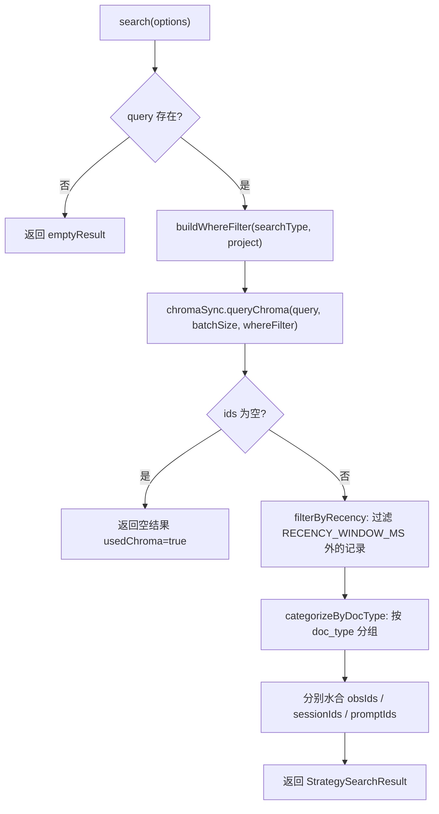

# ChromaSearchStrategy.ts 需求说明

> 源文件：src/services/worker/search/strategies/ChromaSearchStrategy.ts ｜ 类型：源码 ｜ 行数：196 ｜ 所属模块：worker/search/strategies ｜ 分析日期：2026-07-23

## 1. 文件定位总述

ChromaSearchStrategy.ts 是搜索策略层中的向量语义搜索实现，利用 Chroma 向量数据库进行语义相似度匹配。当用户输入查询文本时，该策略将查询向量与 Chroma 中的 embedding 进行相似度检索，按时间窗口过滤近期结果，再按文档类型（observation/session_summary/user_prompt）分类水合为完整记录。它是 SearchOrchestrator 默认的首选策略（当 Chroma 可用时），适用于自由文本搜索场景。

## 2. 功能需求

| 编号 | 需求描述（系统应当…） | 触发条件 / 输入 | 处理规则与输出 | 证据 |
|------|----------------------|----------------|---------------|------|
| FR-css-01 | 系统应当判断是否适用 Chroma 搜索策略 | 调用 `canHandle(options)` | 当 options 含 query 且 ChromaSync 实例可用时返回 true | `ChromaSearchStrategy.ts:26-28` |
| FR-css-02 | 系统应当通过 Chroma 向量搜索执行查询 | 调用 `search(options)` 含 query | 根据 searchType 决定搜索范围（observations/sessions/prompts/all）；构建 where 过滤器（doc_type + project）→ 查询 Chroma → 按时间窗口过滤 → 按文档类型分类 → 水合完整记录 | `ChromaSearchStrategy.ts:30-58` |
| FR-css-03 | 系统应当按时间窗口过滤 Chroma 返回的结果 | Chroma 返回原始结果后 | 仅保留 `created_at_epoch > (now - RECENCY_WINDOW_MS)` 的记录 | `ChromaSearchStrategy.ts:149-168` |
| FR-css-04 | 系统应当按文档类型对结果进行分类 | 时间过滤后 | 根据 metadata 中的 `doc_type` 将结果分为 obsIds、sessionIds、promptIds 三组 | `ChromaSearchStrategy.ts:170-194` |
| FR-css-05 | 系统应当构建 Chroma where 过滤器 | search 调用时 | 支持 doc_type 单独过滤、project 单独过滤，以及 $and 组合过滤 | `ChromaSearchStrategy.ts:122-147` |
| FR-css-06 | 系统应当对分类后的结果分别水合 | 分类完成后 | obsIds → getObservationsByIds；sessionIds → getSessionSummariesByIds；promptIds → getUserPromptsByIds | `ChromaSearchStrategy.ts:98-113` |

## 3. 业务规则与约束

- **激活条件**：仅当 ChromaSync 实例存在且 query 非空时激活。`src/services/worker/search/strategies/ChromaSearchStrategy.ts:26-28`
- **批量查询限制**：Chroma 查询使用 `CHROMA_BATCH_SIZE` 限制返回数量。`src/services/worker/search/strategies/ChromaSearchStrategy.ts:77`
- **时间窗口**：使用 `RECENCY_WINDOW_MS` 常量过滤过期记录，确保结果时效性。`src/services/worker/search/strategies/ChromaSearchStrategy.ts:153`
- **metadata 去重**：按 `sqlite_id` 去重，多个 metadata 可能对应同一 ID。`src/services/worker/search/strategies/ChromaSearchStrategy.ts:156-160`
- **空结果处理**：Chroma 返回空 ID 列表时直接返回空结果（不抛异常）。`src/services/worker/search/strategies/ChromaSearchStrategy.ts:81-87`
- **查询类型映射**：searchType 为 'observations'/'sessions'/'prompts' 时限制 doc_type 过滤，为 'all' 时不过滤。`src/services/worker/search/strategies/ChromaSearchStrategy.ts:124-136`

## 4. 对外暴露

| 名称 | 类型 | 说明 |
|------|------|------|
| `ChromaSearchStrategy` | class | 向量语义搜索策略 |
| `canHandle(options)` | method | 判断是否适用本策略 |
| `search(options)` | async method | 执行向量语义搜索 |

## 5. 依赖关系

- **内部依赖**：`./SearchStrategy.js`（基类）、`../types.js`（常量、类型）、`../../../sync/ChromaSync.js`、`../../../sqlite/SessionStore.js`
- **被依赖**：`SearchOrchestrator.ts`（作为默认搜索策略）

## 6. 数据结构

无自定义数据结构。使用基类的 `StrategySearchOptions`、`StrategySearchResult` 和 `ChromaMetadata`（from types.js）。

**ChromaMetadata 推断字段**（根据使用方式推断）：
- `sqlite_id`：对应 SQLite 表中的行 ID
- `doc_type`：文档类型（observation / session_summary / user_prompt）
- `created_at_epoch`：创建时间 epoch ms
- `project`：项目名称

## 7. 复杂逻辑图示

Chroma 搜索流程：构建过滤器→向量查询→时间窗口过滤→文档类型分类→批量水合→返回结果。

## 8. 逆向备注

- `filterByRecency` 使用 `metadataByIdMap` 先构建 Map 再做映射，说明 Chroma 返回的 metadatas 数组可能与 ids 数组长度或顺序不一致。
- `searchType` 决定搜索范围但 `obsType`/`concepts`/`files` 等过滤条件在 Chroma 查询后通过 SessionStore 水合时再次过滤，推断 Chroma 的 where 过滤器仅支持 project 和 doc_type，其他条件需在水合步骤过滤。
- Chroma 搜索结果始终标记 `usedChroma: true`，即使 Chroma 返回空结果也是如此。
