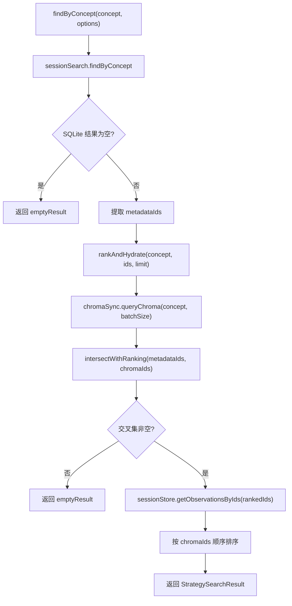

# HybridSearchStrategy.ts 需求说明

> 源文件：src/services/worker/search/strategies/HybridSearchStrategy.ts ｜ 类型：源码 ｜ 行数：173 ｜ 所属模块：worker/search/strategies ｜ 分析日期：2026-07-23

## 1. 文件定位总述

HybridSearchStrategy.ts 是搜索策略层中的混合搜索策略实现，结合 SQLite 元数据检索与 Chroma 向量相似度排序，提供"先粗筛再精排"的两阶段搜索。该策略适用于概念搜索、类型搜索和文件搜索场景，通过 SQLite 侧的条件过滤获取候选集，再通过 Chroma 向量相似度进行重排序，最终返回经交叉排序的高质量结果。

## 2. 功能需求

| 编号 | 需求描述（系统应当…） | 触发条件 / 输入 | 处理规则与输出 | 证据 |
|------|----------------------|----------------|---------------|------|
| FR-hss-01 | 系统应当判断是否适用混合搜索策略 | 调用 `canHandle(options)` | 当 ChromaSync 可用，且 options 含 concepts 或 files，或同时有 type+query，或 `strategyHint` 为 `hybrid` 时返回 true | `HybridSearchStrategy.ts:26-33` |
| FR-hss-02 | 系统应当在概念搜索时执行混合策略 | 调用 `findByConcept(concept, options)` | 先用 SessionSearch.findByConcept 在 SQLite 元数据中检索候选 ID 集合，再用 Chroma 交叉排序，最后水合完整记录 | `HybridSearchStrategy.ts:45-63` |
| FR-hss-03 | 系统应当在类型搜索时执行混合策略 | 调用 `findByType(type, options)` | 先用 SessionSearch.findByType 在 SQLite 元数据中检索候选 ID 集合，再用 Chroma 交叉排序并水合 | `HybridSearchStrategy.ts:65-84` |
| FR-hss-04 | 系统应当在文件搜索时执行混合策略 | 调用 `findByFile(filePath, options)` | 先用 SessionSearch.findByFile 检索候选 observations 和 sessions，再用 Chroma 对 observations 交叉排序并水合 | `HybridSearchStrategy.ts:86-109` |
| FR-hss-05 | 系统应当通过交叉集合进行排名合并 | rankAndHydrate / rankAndHydrateForFile | 将 SQLite 候选 ID 集合与 Chroma 返回的 ID 集合取交集，按 Chroma 返回顺序排名；交集为空则返回空结果 | `HybridSearchStrategy.ts:111-171` |
| FR-hss-06 | 系统应当在通用搜索时返回空结果 | 调用 `search(options)` 含 query 时 | 当前实现固定返回 emptyResult('hybrid')，未实现通用搜索逻辑 | `HybridSearchStrategy.ts:35-43` |

## 3. 业务规则与约束

- **交叉排序优先级**：以 Chroma 返回的 ID 顺序为排名依据，SQLite 候选集仅用于过滤，不贡献排序权重。`src/services/worker/search/strategies/HybridSearchStrategy.ts:160-171`
- **空候选处理**：SQLite 侧无结果时直接返回空，不触发 Chroma 查询。`src/services/worker/search/strategies/HybridSearchStrategy.ts:56-58`
- **Chroma 批量限制**：查询 Chroma 时取候选集与 `CHROMA_BATCH_SIZE` 的较小值。`src/services/worker/search/strategies/HybridSearchStrategy.ts:117-119`
- **结果去重**：`intersectWithRanking` 中通过 `!rankedIds.includes(chromaId)` 确保不重复。`src/services/worker/search/strategies/HybridSearchStrategy.ts:165`
- **通用搜索未实现**：`search` 方法无论是否传入 query 均返回空结果，推断概念/类型/文件搜索是主要的混合搜索入口。`src/services/worker/search/strategies/HybridSearchStrategy.ts:35-43`

## 4. 对外暴露

| 名称 | 类型 | 说明 |
|------|------|------|
| `HybridSearchStrategy` | class | 混合搜索策略 |
| `canHandle(options)` | method | 判断是否适用本策略 |
| `search(options)` | async method | 通用搜索（当前为空实现） |
| `findByConcept(concept, options)` | async method | 按概念混合搜索 |
| `findByType(type, options)` | async method | 按类型混合搜索 |
| `findByFile(filePath, options)` | async method | 按文件路径混合搜索 |

## 5. 依赖关系

- **内部依赖**：`./SearchStrategy.js`（基类）、`../types.js`（常量和类型）、`../../../sync/ChromaSync.js`、`../../../sqlite/SessionStore.js`、`../../../sqlite/SessionSearch.js`
- **被依赖**：`SearchOrchestrator.ts`（策略选择与调度）

## 6. 数据结构

无自定义数据结构，使用基类 `StrategySearchOptions` 和 `StrategySearchResult`。

## 7. 复杂逻辑图示

混合搜索的核心流程：SQLite 元数据粗筛 → Chroma 向量精排 → 交叉取交集 → 水合完整记录。

## 8. 逆向备注

- `search` 方法的 `query` 分支为空实现（直接返回 emptyResult），与 `canHandle` 中对 `query` 的判断形成矛盾——`canHandle` 不检查 query 就允许 hybrid，但 `search` 实际上不处理 query。推断 `search` 方法是预留接口，当前由 ChromaSearchStrategy 处理纯文本搜索。
- `intersectWithRanking` 使用 `includes` 做去重，在大数据量下性能较差（O(n²)），但当前场景候选集受 CHROMA_BATCH_SIZE 限制。
