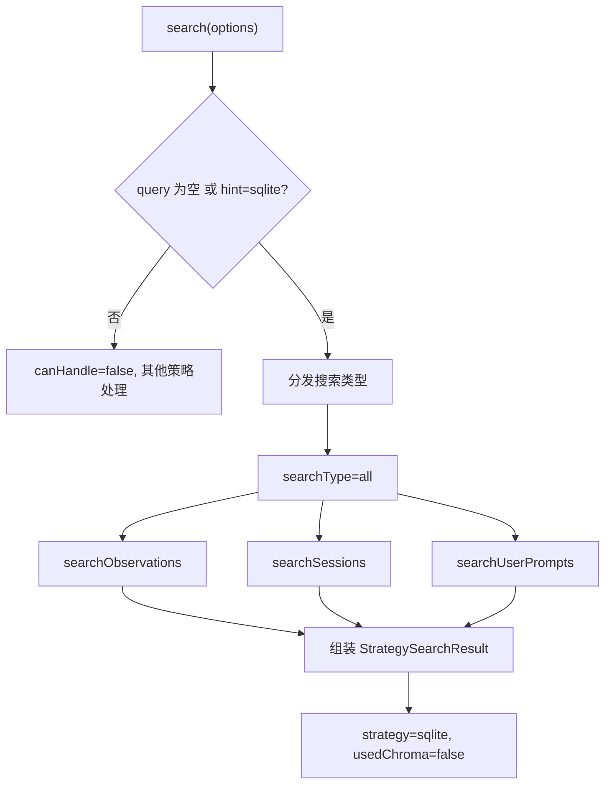

# SQLiteSearchStrategy.ts 需求说明

> 源文件：src/services/worker/search/strategies/SQLiteSearchStrategy.ts ｜ 类型：源码 ｜ 行数：109 ｜ 所属模块：worker/search/strategies ｜ 分析日期：2026-07-23

## 1. 文件定位总述

SQLiteSearchStrategy 是搜索子系统的纯过滤策略实现，基于 SQLite 数据库查询而非向量语义搜索。当搜索请求不包含文本查询词或显式指定 `strategyHint='sqlite'` 时激活，通过 `SessionSearch` 组件执行 observations、sessions、prompts 三类数据的条件过滤查询。它还提供按概念、类型、文件路径的快捷查找方法，是搜索策略链中成本最低、确定性最强的策略。

## 2. 功能需求

| 编号 | 需求描述（系统应当…） | 触发条件 / 输入 | 处理规则与输出 | 证据 |
|------|----------------------|----------------|---------------|------|
| FR-CANHANDLE-01 | 系统应当在无文本查询或指定 sqlite 策略时激活 | `options.query` 为空或 `options.strategyHint === 'sqlite'` | 返回 true | `SQLiteSearchStrategy.ts:21-23` |
| FR-SEARCH-01 | 系统应当按条件执行三类数据的联合搜索 | `search(options)` 调用 | 根据 searchType 决定搜索 observations/sessions/prompts（'all' 则全部），应用 limit/offset/project/dateRange/obsType/concepts/files 等过滤条件；失败返回空结果 | `SQLiteSearchStrategy.ts:25-63` |
| FR-CONCEPT-01 | 系统应当支持按概念查找观察记录 | 调用 `findByConcept(concept, options)` | 委托 SessionSearch.findByConcept，应用 limit/project/dateRange/orderBy | `SQLiteSearchStrategy.ts:92-95` |
| FR-TYPE-01 | 系统应当支持按类型查找观察记录 | 调用 `findByType(type, options)` | 委托 SessionSearch.findByType，type 可为字符串或数组 | `SQLiteSearchStrategy.ts:97-100` |
| FR-FILE-01 | 系统应当支持按文件路径查找相关记录 | 调用 `findByFile(filePath, options)` | 委托 SessionSearch.findByFile，返回 observations 和 sessions 两个集合 | `SQLiteSearchStrategy.ts:102-108` |
| FR-EMPTY-01 | 搜索失败时系统应当返回空结果而非抛出异常 | 搜索过程中抛出异常 | 捕获异常记 error 日志，返回 `emptyResult('sqlite')` | `SQLiteSearchStrategy.ts:58-62` |

## 3. 业务规则与约束

- **搜索类型分发**：`searchType` 支持 `'all'`、`'observations'`、`'sessions'`、`'prompts'`，`'all'` 同时搜索三类 (`SQLiteSearchStrategy.ts:38-40`)
- **策略标识**：返回结果中 `strategy` 固定为 `'sqlite'`，`usedChroma` 固定为 `false` (`SQLiteSearchStrategy.ts:86-89`)
- **默认排序**：orderBy 默认 `'date_desc'` (`SQLiteSearchStrategy.ts:35`)
- **默认限制**：limit 默认使用 `SEARCH_CONSTANTS.DEFAULT_LIMIT` (`SQLiteSearchStrategy.ts:31`)

## 4. 对外暴露

| 公开方法 | 签名 | 说明 |
|---------|------|------|
| `name` | `readonly string = 'sqlite'` | 策略标识名 |
| `canHandle` | `(options: StrategySearchOptions): boolean` | 判断是否可以处理该搜索请求 |
| `search` | `(options: StrategySearchOptions): Promise<StrategySearchResult>` | 执行过滤搜索 |
| `findByConcept` | `(concept: string, options): ObservationSearchResult[]` | 按概念查找 |
| `findByType` | `(type: string\|string[], options): ObservationSearchResult[]` | 按类型查找 |
| `findByFile` | `(filePath: string, options): {observations, sessions}` | 按文件查找 |

## 5. 依赖关系

- **继承**：`BaseSearchStrategy`（基类提供 emptyResult 等公用方法）
- **实现接口**：`SearchStrategy`（策略模式接口）
- **核心依赖**：`SessionSearch`（执行实际的 SQLite 查询）
- **类型依赖**：`StrategySearchOptions`、`StrategySearchResult`、`ObservationSearchResult`、`SessionSummarySearchResult`、`UserPromptSearchResult`

## 6. 数据结构

无自定义数据结构，消费搜索类型系统中的 StrategySearchOptions 和各类 SearchResult。

## 7. 复杂逻辑图示

## 8. 逆向备注

- `findByType` 中对 type 参数做了 `as any` 类型断言 (`SQLiteSearchStrategy.ts:99`)，说明 SessionSearch.findByType 的参数类型定义与当前 options 中的类型不完全匹配。
- `executeSqliteSearch` 为 private 方法，所有 SQLite 查询实际通过 SessionSearch 的同步方法执行（返回非 Promise），但外层 `search` 方法包装为 async (`SQLiteSearchStrategy.ts:65-90`)。
