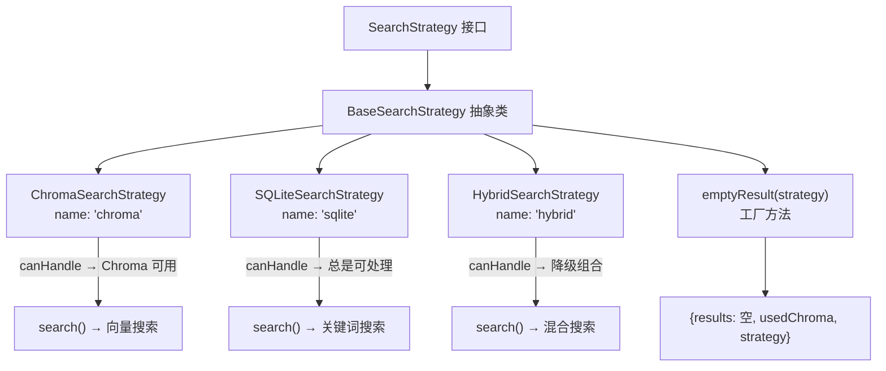

# SearchStrategy.ts 需求说明

> 源文件：src/services/worker/search/strategies/SearchStrategy.ts ｜ 类型：源码（策略接口与基类） ｜ 行数：31 ｜ 所属模块：worker/search/strategies ｜ 分析日期：2026-07-23

## 1. 文件定位总述

本文件定义了搜索策略模式的接口契约和抽象基类。`SearchStrategy` 接口规定了所有搜索策略必须实现的 `search`、`canHandle` 和 `name` 成员。`BaseSearchStrategy` 提供了 `emptyResult` 工厂方法，统一空结果的构造逻辑。三种具体策略（Chroma、SQLite、Hybrid）均继承此基类。

## 2. 功能需求

| 编号 | 需求描述（系统应当…） | 触发条件 / 输入 | 处理规则与输出 | 证据 |
|------|----------------------|----------------|---------------|------|
| FR-Strategy-01 | 系统应当定义搜索策略接口，要求实现 search、canHandle 方法和 name 属性 | 策略实现类声明 | 接口包含 search(options)、canHandle(options)、readonly name | `src/services/worker/search/strategies/SearchStrategy.ts:5-11` |
| FR-Strategy-02 | 系统应当提供抽象基类 BaseSearchStrategy，强制子类实现 search 和 canHandle | 子类继承 | abstract 声明的 search 和 canHandle | `src/services/worker/search/strategies/SearchStrategy.ts:13-18` |
| FR-Strategy-03 | 系统应当提供 emptyResult 工厂方法，统一生成空搜索结果 | 策略需要返回空结果时调用 | 返回包含空数组 observations/sessions/prompts 的 StrategySearchResult，并标记 usedChroma 和 strategy | `src/services/worker/search/strategies/SearchStrategy.ts:19-29` |

## 3. 业务规则与约束

- **策略判定**：`canHandle` 方法由 SearchOrchestrator 在选择策略时调用，决定当前搜索选项应由哪种策略处理（`src/services/worker/search/strategies/SearchStrategy.ts:8`）
- **空结果一致性**：所有策略的空结果结构必须相同（通过 emptyResult 工厂方法保证），包含空的 observations、sessions、prompts 数组（`src/services/worker/search/strategies/SearchStrategy.ts:19-28`）
- **Chroma 使用标记**：emptyResult 中 chroma 和 hybrid 策略的 `usedChroma` 标记为 true，sqlite 策略为 false（`src/services/worker/search/strategies/SearchStrategy.ts:26`）

## 4. 对外暴露

| 类别 | 名称 | 类型 | 说明 |
|------|------|------|------|
| 接口 | SearchStrategy | interface | 搜索策略契约 |
| 抽象类 | BaseSearchStrategy | abstract class | 搜索策略基类 |
| 方法 | emptyResult | protected | 生成统一的空搜索结果 |

## 5. 依赖关系

- **上游**：`../types.js`（SearchResults、StrategySearchOptions、StrategySearchResult 类型）、`../../../../utils/logger.js`
- **下游**：ChromaSearchStrategy、SQLiteSearchStrategy、HybridSearchStrategy 三个子类

## 6. 数据结构

```typescript
interface SearchStrategy {
  search(options: StrategySearchOptions): Promise<StrategySearchResult>;
  canHandle(options: StrategySearchOptions): boolean;
  readonly name: string;
}

// emptyResult 返回值结构
interface StrategySearchResult {
  results: {
    observations: [];
    sessions: [];
    prompts: [];
  };
  usedChroma: boolean;  // chroma/hybrid → true, sqlite → false
  strategy: 'chroma' | 'sqlite' | 'hybrid';
}
```

## 7. 复杂逻辑图示



上图展示了策略模式的结构：接口定义契约，基类提供公共设施，三个子类分别实现不同的搜索后端。

## 8. 逆向备注

- 推断：`canHandle` 的判定逻辑在子类中各不相同——SQLiteSearchStrategy 大概总是返回 true（作为兜底），ChromaSearchStrategy 检查 Chroma 服务是否可用，HybridSearchStrategy 检查是否同时具备两种后端。
- emptyResult 的 strategy 参数类型为字面量联合 `'chroma' | 'sqlite' | 'hybrid'`，与子类的 name 属性对应，确保策略标识的一致性。
