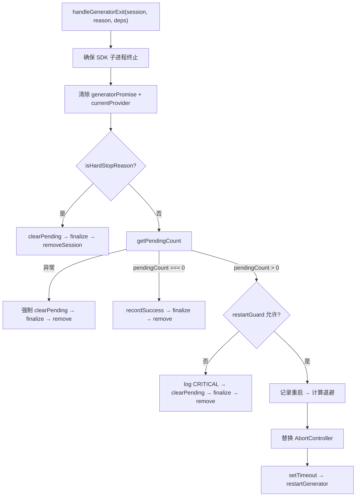

# GeneratorExitHandler.ts 需求说明

> 源文件：src/services/worker/session/GeneratorExitHandler.ts ｜ 类型：源码 ｜ 行数：152 ｜ 所属模块：worker/session ｜ 分析日期：2026-07-23

## 1. 文件定位总述

GeneratorExitHandler.ts 是 worker 会话生命周期管理中的关键处理器，负责在 AI 生成器（generator）进程退出后决定会话的后续命运。它根据退出原因（硬停止 vs 自然退出 vs 有待处理工作）执行不同策略：硬停止时清理待处理消息并终结会话；有剩余工作时在安全窗口内自动重启生成器（含指数退避和重启次数保护）；无剩余工作时正常终结。该模块是系统"可靠处理"能力的核心实现。

## 2. 功能需求

| 编号 | 需求描述（系统应当…） | 触发条件 / 输入 | 处理规则与输出 | 证据 |
|------|----------------------|----------------|---------------|------|
| FR-geh-01 | 系统应当在生成器退出后确保 SDK 子进程已终止 | 生成器退出时 | 检查进程注册表中跟踪的 SDK 进程，如未 killed 则以 5s 超时强制退出 | `GeneratorExitHandler.ts:43-46` |
| FR-geh-02 | 系统应当清除会话的生成器引用 | 生成器退出后 | 将 `session.generatorPromise` 和 `session.currentProvider` 设为 null | `GeneratorExitHandler.ts:48-49` |
| FR-geh-03 | 系统应当对硬停止原因直接终结会话并清理待处理消息 | reason 为 shutdown/restart-guard/overflow/quota（含 quota:* 前缀） | 清空 pending_messages → 调用 completionHandler.finalizeSession → 从 SessionManager 移除 | `GeneratorExitHandler.ts:14-20, 80-87` |
| FR-geh-04 | 系统应当在无待处理消息时正常终结会话 | pendingCount === 0 且非硬停止 | 记录 restartGuard 成功 + 重置连续重启计数 → 终结会话（不清空 pending，因为已空） | `GeneratorExitHandler.ts:101-106` |
| FR-geh-05 | 系统应当有待处理消息时尝试重启生成器 | pendingCount > 0 且 restartGuard 允许 | 创建新 AbortController（abort 旧的）→ 计算指数退避延迟 → setTimeout 延迟后调用 restartGenerator | `GeneratorExitHandler.ts:127-151` |
| FR-geh-06 | 系统应当对重启保护触发的情况清理并终结 | restartGuard.recordRestart() 返回 false | 清空 pending_messages → 终结会话 → 重置 consecutiveRestarts | `GeneratorExitHandler.ts:112-125` |
| FR-geh-07 | 系统应当在重启前替换 AbortController | 准备重启时 | 创建新 AbortController，abort 旧的，确保旧连接中断 | `GeneratorExitHandler.ts:135-137` |
| FR-geh-08 | 系统应当使用指数退避延迟重启 | 计算重启延迟时 | 公式：`min(1000 * 2^(consecutiveRestarts-1), 8000)`，即 1s, 2s, 4s, 8s 上限 | `GeneratorExitHandler.ts:139` |

## 3. 业务规则与约束

- **硬停止原因**：`shutdown`、`restart-guard`、`overflow`、`quota`、以及 `quota:` 前缀的字符串。`src/services/worker/session/GeneratorExitHandler.ts:14-20`
- **重启保护**：使用 `RestartGuard` 实例（懒创建），检查时间窗口内的重启次数和连续失败次数。`src/services/worker/session/GeneratorExitHandler.ts:108-110`
- **退避上限**：最大 8000ms（8秒）。`src/services/worker/session/GeneratorExitHandler.ts:139`
- **终止会话的容错**：pending 清理失败不阻止 finalization；finalization 失败强制内存中移除。`src/services/worker/session/GeneratorExitHandler.ts:53-78`
- **pending 检查失败处理**：获取 pendingCount 失败时视为紧急情况，直接终止并清理 pending，防止消息泄漏。`src/services/worker/session/GeneratorExitHandler.ts:90-99`
- **respawnTimer 管理**：重启前清除已有的 respawnTimer 防止重复重启。`src/services/worker/session/GeneratorExitHandler.ts:141-143`

## 4. 对外暴露

| 名称 | 类型 | 说明 |
|------|------|------|
| `GeneratorExitDependencies` | interface | 依赖注入：sessionManager, completionHandler, restartGenerator |
| `handleGeneratorExit(session, reason, deps)` | async function | 生成器退出后的主处理入口 |

## 5. 依赖关系

- **内部依赖**：`../../worker-types.js`（ActiveSession）、`../SessionManager.js`、`./SessionCompletionHandler.js`、`../../../supervisor/process-registry.js`、`../RestartGuard.js`
- **被依赖**：SessionManager 的会话生命周期管理逻辑

## 6. 数据结构

**GeneratorExitDependencies 接口**：`src/services/worker/session/GeneratorExitHandler.ts:8-12`

| 字段 | 类型 | 说明 |
|------|------|------|
| sessionManager | SessionManager | 会话管理器 |
| completionHandler | SessionCompletionHandler | 会话终结处理器 |
| restartGenerator | (session, source) => void \| Promise<void> | 重启生成器的回调 |

## 7. 复杂逻辑图示

生成器退出决策树：硬停止直接终结→无待处理正常终结→有待处理则尝试重启（受保护限制）。

## 8. 逆向备注

- 注释中说明"Per-message retry/drain logic is gone"，表明旧版有消息级重试/排空逻辑，新版改为整个生成器重启。`src/services/worker/session/GeneratorExitHandler.ts:24-25`
- `terminateSession` 内部函数同时处理 pending 清理和 finalization，任何一步失败都继续后续步骤，确保会话最终被移除。`src/services/worker/session/GeneratorExitHandler.ts:53-78`
- `consecutiveRestarts` 在 restartGuard 触发时重置为 0，但退避计算使用的是重置前的值，推断退避只在 restartGuard 允许重启时才有效。
