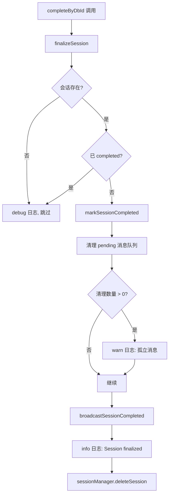

# SessionCompletionHandler.ts 需求说明

> 源文件：src/services/worker/session/SessionCompletionHandler.ts | 类型：源码 | 行数：53 | 所属模块：worker/session | 分析日期：2026-07-23

## 1. 文件定位总述

SessionCompletionHandler 是会话生命周期终结阶段的核心处理器，负责在会话结束时执行收尾工作：将数据库中的会话状态标记为 completed、清理该会话遗留的待处理消息队列、以及广播会话完成事件。它提供两个入口方法——`finalizeSession` 仅标记完成，`completeByDbId` 在标记完成后额外从 SessionManager 中删除内存会话。

## 2. 功能需求

| 编号 | 需求描述（系统应当…） | 触发条件 / 输入 | 处理规则与输出 | 证据 |
|------|----------------------|----------------|---------------|------|
| FR-SessionComplete-01 | 系统应当在收到会话终结请求时将数据库中会话状态标记为 completed | 调用 `finalizeSession(sessionDbId)` | 查询数据库获取会话记录，若不存在则跳过；若已完成（status='completed'）则跳过；否则调用 `sessionStore.markSessionCompleted(sessionDbId)` | `src/services/worker/session/SessionCompletionHandler.ts:14-46` |
| FR-SessionComplete-02 | 系统应当在会话终结时清理该会话的遗留待处理消息 | `finalizeSession` 内部步骤 | 调用 `pendingStore.clearPendingForSession(sessionDbId)` 清理待处理消息队列；若有清理的孤立消息（cleared > 0），记录 warn 日志；清理失败仅记录 debug 日志不阻断流程 | `src/services/worker/session/SessionCompletionHandler.ts:29-41` |
| FR-SessionComplete-03 | 系统应当在会话终结完成后广播 session_completed 事件 | `finalizeSession` 最后一步 | 调用 `eventBroadcaster.broadcastSessionCompleted(sessionDbId)` 通过 SSE 通知客户端 | `src/services/worker/session/SessionCompletionHandler.ts:43` |
| FR-SessionComplete-04 | 系统应当提供终结并删除内存会话的完整方法 | 调用 `completeByDbId(sessionDbId)` | 依次执行：`finalizeSession` -> `sessionManager.deleteSession(sessionDbId)` | `src/services/worker/session/SessionCompletionHandler.ts:48-52` |

## 3. 业务规则与约束

- **幂等性规则**：`finalizeSession` 对不存在的会话和已完成（status='completed'）的会话均执行 skip 而非报错，支持重复调用。`src/services/worker/session/SessionCompletionHandler.ts:18-25`
- **容错隔离**：清理待处理消息队列的异常不阻断会话终结流程（catch 后仅记录 debug 日志）。`src/services/worker/session/SessionCompletionHandler.ts:37-41`
- **双阶段终止**：`finalizeSession`（数据库标记+清理+广播）和 `deleteSession`（内存释放）分离为两个阶段，允许上层按需选择。

## 4. 对外暴露

| 名称 | 类型 | 说明 |
|------|------|------|
| `finalizeSession(sessionDbId)` | async 方法 | 标记会话完成、清理队列、广播事件 |
| `completeByDbId(sessionDbId)` | async 方法 | 完整终结：标记完成 + 删除内存会话 |

## 5. 依赖关系

- **SessionManager**（`../SessionManager.js`）：提供 pendingMessageStore 和 deleteSession 方法
- **SessionEventBroadcaster**（`../events/SessionEventBroadcaster.js`）：广播 session_completed 事件
- **DatabaseManager**（`../DatabaseManager.js`）：提供 SessionStore 访问

## 6. 数据结构

不适用（本文件为协调逻辑，不定义新数据结构）。

## 7. 复杂逻辑图示

会话终结流程遵循"查询-守卫-标记-清理-广播-删除"的顺序，每步都有独立的容错处理。

## 8. 逆向备注

- 无逆向备注。
