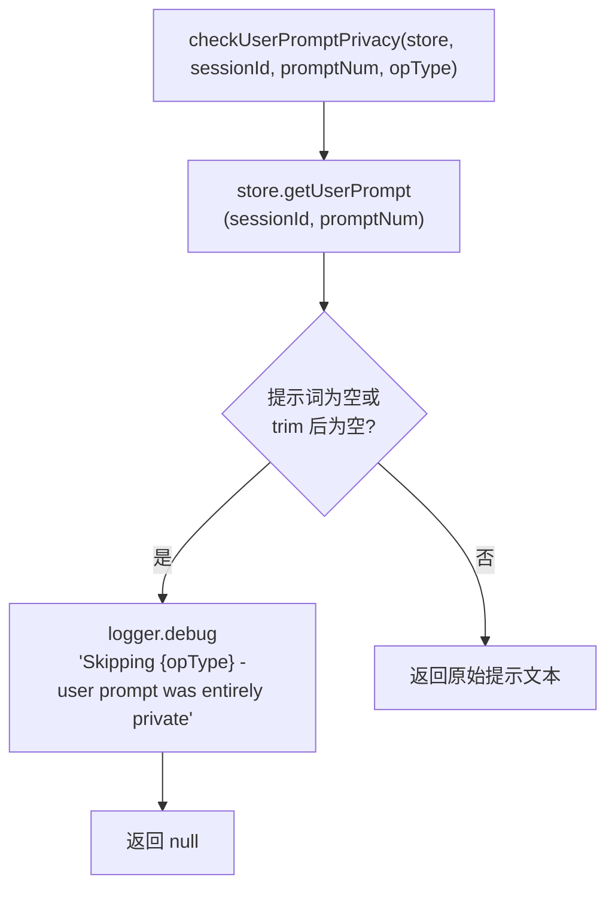

# PrivacyCheckValidator.ts 需求说明

> 源文件：src/services/worker/validation/PrivacyCheckValidator.ts ｜ 类型：源码（验证器） ｜ 行数：27 ｜ 所属模块：worker/validation ｜ 分析日期：2026-07-23

## 1. 文件定位总述

本文件提供用户提示词的隐私检查验证器，用于在执行观察或摘要操作前验证用户提示词是否为纯隐私内容（已被 `<private>` 标签完全包裹）。如果提示词为空或纯空白，则跳过后续操作，防止对隐私输入生成不必要的观察记录。

## 2. 功能需求

| 编号 | 需求描述（系统应当…） | 触发条件 / 输入 | 处理规则与输出 | 证据 |
|------|----------------------|----------------|---------------|------|
| FR-Privacy-01 | 系统应当在执行观察/摘要操作前检查用户提示词是否为隐私内容（已被剥离后为空） | checkUserPromptPrivacy 被调用，传入 contentSessionId 和 promptNumber | 从 SessionStore 获取用户提示词，检查是否为空或纯空白 | `src/services/worker/validation/PrivacyCheckValidator.ts:5-25` |
| FR-Privacy-02 | 系统应当在提示词为隐私内容时返回 null 以跳过后续操作 | 用户提示词为空或 trim 后为空 | 返回 null，不执行观察/摘要生成 | `src/services/worker/validation/PrivacyCheckValidator.ts:15-20` |
| FR-Privacy-03 | 系统应当在提示词非隐私时返回原始提示文本以继续操作 | 用户提示词非空 | 返回提示文本字符串 | `src/services/worker/validation/PrivacyCheckValidator.ts:24` |

## 3. 业务规则与约束

- **隐私判定标准**：提示词在经过 `<private>` 标签剥离后如果为空或纯空白字符串，则视为完全隐私内容（`src/services/worker/validation/PrivacyCheckValidator.ts:15`）
- **跳过操作的日志记录**：跳过时以 DEBUG 级别记录日志，包含操作类型、会话 ID、提示序号等上下文（`src/services/worker/validation/PrivacyCheckValidator.ts:16-20`）
- **推断**：`<private>` 标签的剥离发生在本验证器之前（由 tag-stripping 工具完成），验证器接收的是已剥离后的文本

## 4. 对外暴露

| 类别 | 名称 | 类型 | 说明 |
|------|------|------|------|
| 静态方法 | PrivacyCheckValidator.checkUserPromptPrivacy | `(store, contentSessionId, promptNumber, operationType, sessionDbId, additionalContext?) => string \| null` | 隐私检查，返回提示文本或 null |

## 5. 依赖关系

- **上游**：`../../sqlite/SessionStore.js`（获取用户提示词）、`../../../utils/logger.js`
- **下游**：Worker hook 处理器在 PostToolUse（observation）和 Stop（summarize）阶段调用

## 6. 数据结构

```typescript
// 返回值语义
type PrivacyCheckResult = string | null;
// string: 非隐私提示文本，可继续操作
// null: 隐私内容，应跳过后续操作
```

## 7. 复杂逻辑图示



上图展示了隐私检查的核心逻辑：获取已剥离标签的提示词，空白则跳过，非空白则返回文本继续处理。

## 8. 逆向备注

- 推断：`additionalContext` 参数用于在日志中附加诊断信息，便于排查为何某次操作被跳过。
- operationType 参数接受 `'observation' | 'summarize'` 两种值，对应两个不同的 hook 阶段，暗示观察生成和摘要生成都需要进行隐私检查。
