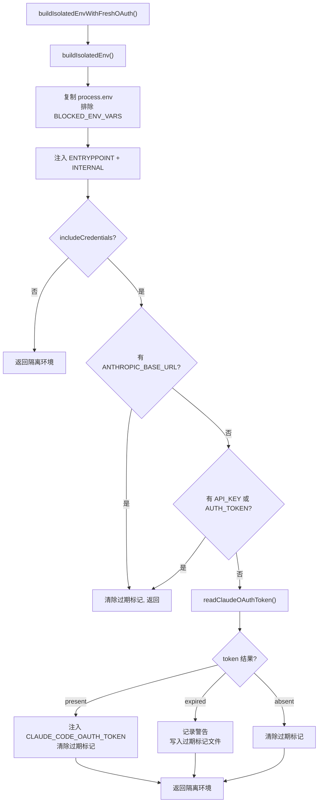

# EnvManager.ts 需求说明

> 源文件：src/shared/EnvManager.ts ｜ 类型：源码 ｜ 行数：348 ｜ 所属模块：shared ｜ 分析日期：2026-07-23

## 1. 文件定位总述

本文件是凭证管理和环境变量隔离的核心模块，负责从 `.env` 文件加载/保存 API 密钥和网关凭据，以及为 worker 子进程构建隔离的环境变量。它阻塞敏感环境变量（如 `ANTHROPIC_API_KEY`）从父进程泄漏到子进程，并支持在 spawn 时从系统密钥链注入新鲜的 OAuth token，防止过期 token 导致的 401 错误。

## 2. 功能需求

| 编号 | 需求描述（系统应当…） | 触发条件 / 输入 | 处理规则与输出 | 证据 |
|------|----------------------|----------------|---------------|------|
| FR-envmgr-01 | 系统应当从 `.env` 文件加载 API 凭证 | `.env` 文件存在 | 解析 `ANTHROPIC_API_KEY`、`ANTHROPIC_BASE_URL`、`ANTHROPIC_AUTH_TOKEN`、`GEMINI_API_KEY`、`OPENROUTER_API_KEY`、`CLAUDE_MEM_REPORT_QWEN_API_KEY`，支持旧键 `DASHSCOPE_API_KEY` 兼容 | `src/shared/EnvManager.ts:93-118` |
| FR-envmgr-02 | 系统应当安全保存 API 凭证到 `.env` 文件 | 调用 `saveClaudeMemEnv(env)` | 合并现有值，仅更新传入的键，空值删除对应键；写入时设置文件权限为 `0o600` | `src/shared/EnvManager.ts:121-191` |
| FR-envmgr-03 | 系统应当为子进程构建隔离环境变量 | 调用 `buildIsolatedEnv(includeCredentials?)` | 复制 `process.env` 但排除 `BLOCKED_ENV_VARS` 中的敏感变量，注入 `CLAUDE_CODE_ENTRYPOINT=skd-ts` 和 `CLAUDE_MEM_INTERNAL=1`，可选注入凭据 | `src/shared/EnvManager.ts:193-232` |
| FR-envmgr-04 | 系统应当在 spawn 时注入新鲜的 OAuth token | 调用 `buildIsolatedEnvWithFreshOAuth()` | 先构建隔离环境，从密钥链读取 token：present 则注入、expired 则写标记文件、absent 则跳过 | `src/shared/EnvManager.ts:249-317` |
| FR-envmgr-05 | 系统应当在配置了自定义网关时不注入 OAuth token | `isolatedEnv` 含 `ANTHROPIC_BASE_URL` | 跳过 OAuth 注入，清除过期标记 | `src/shared/EnvManager.ts:265-267` |
| FR-envmgr-06 | 系统应当阻止以下环境变量泄漏到子进程 | 构建隔离环境时 | 阻塞列表：`ANTHROPIC_API_KEY`、`ANTHROPIC_AUTH_TOKEN`、`ANTHROPIC_BASE_URL`、`CLAUDECODE`、`CLAUDE_CODE_OAUTH_TOKEN` | `src/shared/EnvManager.ts:23-37` |
| FR-envmgr-07 | 系统应当支持通过环境变量覆盖 `.env` 文件路径 | 设置 `CLAUDE_MEM_ENV_FILE` | 使用该值替代默认路径 | `src/shared/EnvManager.ts:17-18` |
| FR-envmgr-08 | 系统应当识别当前认证方式 | 调用 `getAuthMethodDescription()` | 按优先级检查 API Key → Auth Token → OAuth token，返回描述字符串 | `src/shared/EnvManager.ts:334-348` |

## 3. 业务规则与约束

- `.env` 文件权限始终为 `0o600`（仅 owner 读写），数据目录权限 `0o700`。`src/shared/EnvManager.ts:126-128,185-186`
- 阻塞列表中的敏感变量从 `process.env` 复制时被移除，但可从 `.env` 文件重新注入（如果 `includeCredentials=true`）。`src/shared/EnvManager.ts:196-217`
- `DASHSCOPE_API_KEY` 旧键仅在 `CLAUDE_MEM_REPORT_QWEN_API_KEY` 缺失时作为兼容回退（X-008 迁移）。`src/shared/EnvManager.ts:112`
- `.env` 文件序列化时对含空格、`#`、`=` 的值加引号。`src/shared/EnvManager.ts:85-86`

## 4. 对外暴露

| 导出名称 | 类型 | 说明 |
|---------|------|------|
| `envFilePath` | `() => string` | 获取 `.env` 文件路径 |
| `loadClaudeMemEnv` | `() => ClaudeMemEnv` | 从 `.env` 加载凭证 |
| `saveClaudeMemEnv` | `(env: ClaudeMemEnv) => void` | 保存凭证到 `.env` |
| `buildIsolatedEnv` | `(includeCredentials?: boolean) => Record<string, string>` | 构建隔离环境变量 |
| `buildIsolatedEnvWithFreshOAuth` | `(includeCredentials?: boolean) => Promise<Record<string, string>>` | 构建含新鲜 OAuth 的隔离环境 |
| `getCredential` | `(key: keyof ClaudeMemEnv) => string \| undefined` | 获取单个凭证 |
| `hasAnthropicApiKey` | `() => boolean` | 是否有 API Key |
| `hasAnthropicAuthToken` | `() => boolean` | 是否有 Auth Token |
| `getAuthMethodDescription` | `() => string` | 获取认证方式描述 |
| `ClaudeMemEnv` | 接口 | 凭证类型定义 |

## 5. 依赖关系

- **Node.js 内置**：`fs`、`path`、`os`
- **内部依赖**：`./paths.js`、`./oauth-token.js`、`../utils/logger.js`

## 6. 数据结构

- `ClaudeMemEnv` 接口：6 个可选的 API 密钥字段（`ANTHROPIC_API_KEY`、`ANTHROPIC_BASE_URL`、`ANTHROPIC_AUTH_TOKEN`、`GEMINI_API_KEY`、`OPENROUTER_API_KEY`、`CLAUDE_MEM_REPORT_QWEN_API_KEY`）。`src/shared/EnvManager.ts:39-46`
- `BLOCKED_ENV_VARS`: 5 个敏感环境变量名数组。`src/shared/EnvManager.ts:23-37`

## 7. 复杂逻辑图示

## 8. 逆向备注

- `ENV_FILE_PATH` 标记为 `@deprecated`，建议使用 `envFilePath()` 函数。`src/shared/EnvManager.ts:21`
- OAuth token 注入逻辑解决了 #2215（过期 token 泄漏）和 #2375（BASE_URL 泄漏绕过 OAuth）。`src/shared/EnvManager.ts:25-31,247`
- 注释中提到 `buildIsolatedEnv` 不会复制 `CLAUDE_CODE_OAUTH_TOKEN`，因为 OAuth token 有刷新语义，必须在 spawn 时从密钥链获取。`src/shared/EnvManager.ts:224-228`
