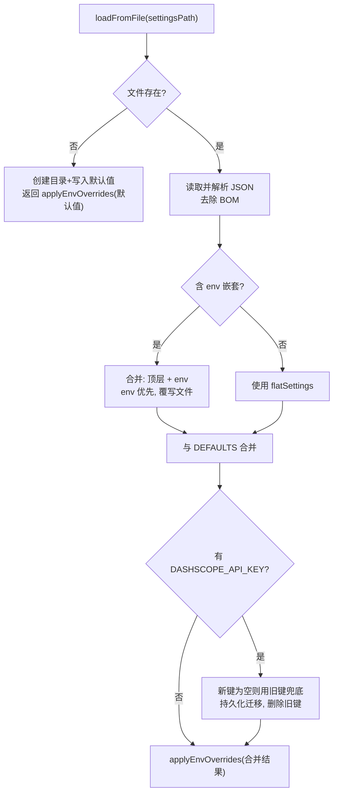

# SettingsDefaultsManager.ts 需求说明

> 源文件：src/shared/SettingsDefaultsManager.ts ｜ 类型：源码 ｜ 行数：344 ｜ 所属模块：shared ｜ 分析日期：2026-07-23

## 1. 文件定位总述

本文件是全局设置管理的中央模块，定义了所有配置项的类型接口、默认值、环境变量覆盖逻辑和文件加载/持久化机制。它处理嵌套（`env` 键）到扁平 schema 的自动迁移，以及遗留键（`DASHSCOPE_API_KEY` → `CLAUDE_MEM_REPORT_QWEN_API_KEY`）的一次性数据迁移。整个系统的配置读取链最终汇聚于此模块。

## 2. 功能需求

| 编号 | 需求描述（系统应当…） | 触发条件 / 输入 | 处理规则与输出 | 证据 |
|------|----------------------|----------------|---------------|------|
| FR-settings-01 | 系统应当获取所有默认配置的副本 | 调用 `getAllDefaults()` | 返回 `DEFAULTS` 对象的浅拷贝 | `src/shared/SettingsDefaultsManager.ts:231-233` |
| FR-settings-02 | 系统应当获取单个配置值（环境变量优先） | 调用 `get(key)` | 返回 `process.env[key] ?? DEFAULTS[key]` | `src/shared/SettingsDefaultsManager.ts:235-237` |
| FR-settings-03 | 系统应当获取配置值的整数形式 | 调用 `getInt(key)` | `parseInt(get(key), 10)` | `src/shared/SettingsDefaultsManager.ts:239-241` |
| FR-settings-04 | 系统应当获取配置值的布尔形式 | 调用 `getBool(key)` | `'true'` 或 `true` 视为 `true`，其余 `false` | `src/shared/SettingsDefaultsManager.ts:243-247` |
| FR-settings-05 | 系统应当从文件加载配置并应用环境变量覆盖 | 调用 `loadFromFile(settingsPath)` | 读取 JSON → 嵌套到扁平迁移 → 与默认值合并 → DASHSCOPE 迁移 → 环境变量覆盖 | `src/shared/SettingsDefaultsManager.ts:259-343` |
| FR-settings-06 | 系统应当在 settings.json 不存在时自动创建含默认值的文件 | 文件不存在 | 创建目录并写入默认值 JSON | `src/shared/SettingsDefaultsManager.ts:261-273` |
| FR-settings-07 | 系统应当自动将嵌套 schema 迁移为扁平 schema | settings.json 含 `env` 键 | 合并顶层键与 env 键（env 优先），覆写文件 | `src/shared/SettingsDefaultsManager.ts:283-299` |
| FR-settings-08 | 系统应当处理 UTF-8 BOM | settings.json 以 BOM 开头 | 去除 `` 后再 JSON.parse | `src/shared/SettingsDefaultsManager.ts:280` |
| FR-settings-09 | 系统应当执行 DASHSCOPE_API_KEY 到 CLAUDE_MEM_REPORT_QWEN_API_KEY 的迁移 | 旧键存在 | 新键为空时用旧键兜底，持久化后删除旧键 | `src/shared/SettingsDefaultsManager.ts:309-336` |

## 3. 业务规则与约束

- 默认端口公式：`37700 + (uid % 100)`，实现多用户端口隔离。`src/shared/SettingsDefaultsManager.ts:128`
- 环境变量优先级高于 settings.json 文件值。`src/shared/SettingsDefaultsManager.ts:251-257`
- 文件加载失败时回退到默认值，不中断系统。`src/shared/SettingsDefaultsManager.ts:339-342`
- 嵌套迁移后 env 键的值优先于顶层键（冲突时 env 胜出）。`src/shared/SettingsDefaultsManager.ts:291`
- DASHSCOPE 迁移是幂等的：迁移后旧键从磁盘删除，二次加载不触发。`src/shared/SettingsDefaultsManager.ts:311`

### 配置项分类总览

**AI 模型配置**：MODEL、PROVIDER、CLAUDE_AUTH_METHOD、GEMINI_*、OPENROUTER_*、TIER_*、QWEN_*

**Worker 配置**：WORKER_PORT、WORKER_HOST、MAX_CONCURRENT_AGENTS、RUNTIME

**上下文注入**：CONTEXT_OBSERVATIONS、CONTEXT_*、SEMANTIC_INJECT、SEMANTIC_INJECT_LIMIT

**Chroma/向量库**：CHROMA_ENABLED、CHROMA_MODE、CHROMA_HOST、CHROMA_PORT、CHROMA_SSL、CHROMA_API_KEY、CHROMA_TENANT、CHROMA_DATABASE

**同步**：SYNC_ENABLED、SYNC_UPSTREAM_URL、SYNC_AUTH_MODE、SYNC_API_KEY、SYNC_INTERVAL_MS、SYNC_BATCH_SIZE、SYNC_RETRY_MAX、SYNC_REDACT_PATTERNS、NODE_ROLE、USER_LABEL

**服务器模式**：SERVER_* 系列（BIND_HOST、AUTH_MODE、ALLOWED_USERS、ACCESS_TOKEN、LOCAL_AUTO_LOGIN、INGEST_MAX_BATCH、REQUIRE_TLS）

**周报**：WEEKLY_REPORT_ENABLED、WEEKLY_REPORT_TIME、WEEKLY_REPORT_MODEL、REPORT_QWEN_API_KEY

**Telegram**：TELEGRAM_ENABLED、TELEGRAM_BOT_TOKEN、TELEGRAM_CHAT_ID、TELEGRAM_TRIGGER_TYPES、TELEGRAM_TRIGGER_CONCEPTS

**队列引擎**：QUEUE_ENGINE、REDIS_*、QUEUE_REDIS_PREFIX

## 4. 对外暴露

| 导出名称 | 类型 | 说明 |
|---------|------|------|
| `SettingsDefaults` | 接口 | 所有配置项的类型定义（约 85 个字段） |
| `SettingsDefaultsManager` | 类（静态方法） | 配置管理器 |
| `SettingsDefaultsManager.getAllDefaults` | `() => SettingsDefaults` | 获取默认值副本 |
| `SettingsDefaultsManager.get` | `(key) => string` | 获取单个值（env 优先） |
| `SettingsDefaultsManager.getInt` | `(key) => number` | 获取整数 |
| `SettingsDefaultsManager.getBool` | `(key) => boolean` | 获取布尔值 |
| `SettingsDefaultsManager.loadFromFile` | `(settingsPath) => SettingsDefaults` | 从文件加载配置 |

## 5. 依赖关系

- **Node.js 内置**：`fs`、`path`、`os`

## 6. 数据结构

- `SettingsDefaults` 接口：包含约 85 个 `string` 类型字段，覆盖 AI 模型、Worker、上下文、Chroma、同步、服务器模式、周报、Telegram、队列引擎等全部配置维度。`src/shared/SettingsDefaultsManager.ts:6-122`
- `DEFAULTS` 静态只读对象：所有配置项的默认值定义。`src/shared/SettingsDefaultsManager.ts:125-229`

## 7. 复杂逻辑图示

## 8. 逆向备注

- 默认端口号使用 `process.getuid?.() ?? 77`，`?? 77` 的 fallback 值推断是为非 Unix 环境（Windows 无 getuid）准备的。`src/shared/SettingsDefaultsManager.ts:128`
- `DEFAULTS` 中的 `CLAUDE_MEM_QUEUE_REDIS_PREFIX` 包含与 `CLAUDE_MEM_WORKER_PORT` 相同的 UID 派生逻辑，推断是防止 Redis key 冲突。`src/shared/SettingsDefaultsManager.ts:195`
- `CLAUDE_MEM_SERVER_BETA_URL` 默认值使用独立端口公式 `37877 + (uid % 100)`，与 worker 端口隔离。`src/shared/SettingsDefaultsManager.ts:198`
- DASHSCOPE 迁移注释标注为 X-008，属于内部迁移编号系统。`src/shared/SettingsDefaultsManager.ts:309`
