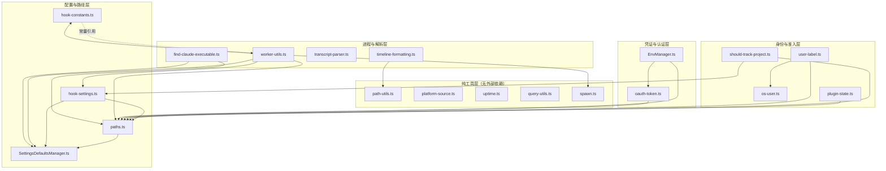

# SHARED 模块汇总

> 基于目录下 19 份文件级需求文档合并生成，分析日期：2026-07-23

## 1. 模块职责总述

shared 模块是 claude-mem 系统的基础设施层，为上层 hooks、worker-service、数据库等所有业务模块提供横切能力：路径解析、配置管理、凭证隔离、进程生命周期、身份标识、项目准入控制以及通用工具函数。它不直接承载业务逻辑，而是作为"底层公共桩"被全系统依赖，确保路径、设置、认证、超时策略等核心关注点在单一来源中维护。

## 2. 功能需求汇总

> 原编号与来源文档保留，按文件分组排列。

### 2.1 SettingsDefaultsManager.ts [来源](SettingsDefaultsManager.ts.md)

| 编号 | 需求描述 | 触发条件 / 输入 | 处理规则与输出 |
|------|---------|----------------|---------------|
| FR-settings-01 | 获取所有默认配置的副本 | 调用 `getAllDefaults()` | 返回 `DEFAULTS` 对象的浅拷贝 |
| FR-settings-02 | 获取单个配置值（环境变量优先） | 调用 `get(key)` | 返回 `process.env[key] ?? DEFAULTS[key]` |
| FR-settings-03 | 获取配置值的整数形式 | 调用 `getInt(key)` | `parseInt(get(key), 10)` |
| FR-settings-04 | 获取配置值的布尔形式 | 调用 `getBool(key)` | `'true'` 或 `true` 视为 `true`，其余 `false` |
| FR-settings-05 | 从文件加载配置并应用环境变量覆盖 | 调用 `loadFromFile(settingsPath)` | 读取 JSON → 嵌套到扁平迁移 → 与默认值合并 → DASHSCOPE 迁移 → 环境变量覆盖 |
| FR-settings-06 | settings.json 不存在时自动创建含默认值的文件 | 文件不存在 | 创建目录并写入默认值 JSON |
| FR-settings-07 | 自动将嵌套 schema 迁移为扁平 schema | settings.json 含 `env` 键 | 合并顶层键与 env 键（env 优先），覆写文件 |
| FR-settings-08 | 处理 UTF-8 BOM | settings.json 以 BOM 开头 | 去除 `` 后再 JSON.parse |
| FR-settings-09 | 执行 DASHSCOPE_API_KEY → CLAUDE_MEM_REPORT_QWEN_API_KEY 迁移 | 旧键存在 | 新键为空时用旧键兜底，持久化后删除旧键 |

### 2.2 paths.ts [来源](paths.md)

| 编号 | 需求描述 | 触发条件 / 输入 | 处理规则与输出 |
|------|---------|----------------|---------------|
| FR-paths-01 | 优先从环境变量获取数据目录 | `CLAUDE_MEM_DATA_DIR` 已设置 | 直接使用该值 |
| FR-paths-02 | 从 settings.json 读取数据目录 | 环境变量为空，settings.json 存在 | 读取 `env.CLAUDE_MEM_DATA_DIR` 或顶层 `CLAUDE_MEM_DATA_DIR` |
| FR-paths-03 | 使用 `~/.claude-mem` 作为默认数据目录 | 环境变量和 settings 均未配置 | 返回 `join(homedir(), '.claude-mem')` |
| FR-paths-04 | 支持从环境变量获取 Claude 配置目录 | `CLAUDE_CONFIG_DIR` 已设置 | 使用该值，否则使用 `~/.claude` |
| FR-paths-05 | 创建所有必要的数据子目录 | 调用 `ensureAllDataDirs()` | 递归创建 DATA_DIR 及子目录：archives、logs、trash、backups、modes |
| FR-paths-06 | 为文件创建带时间戳的备份文件名 | 传入原始文件路径 | 生成 `<原路径>.backup.<YYYY-MM-DD_HH-MM-SS>` 格式 |
| FR-paths-07 | 提供项目归档目录路径 | 传入项目名 | 返回 `$ARCHIVES_DIR/<projectName>` |
| FR-paths-08 | 提供 worker Unix socket 路径 | 传入 session ID | 返回 `$DATA_DIR/worker-<sessionId>.sock` |

### 2.3 EnvManager.ts [来源](EnvManager.ts.md)

| 编号 | 需求描述 | 触发条件 / 输入 | 处理规则与输出 |
|------|---------|----------------|---------------|
| FR-envmgr-01 | 从 `.env` 文件加载 API 凭证 | `.env` 文件存在 | 解析 6 种 API 密钥，支持旧键兼容 |
| FR-envmgr-02 | 安全保存 API 凭证到 `.env` 文件 | 调用 `saveClaudeMemEnv(env)` | 合并现有值，空值删除，权限 `0o600` |
| FR-envmgr-03 | 为子进程构建隔离环境变量 | 调用 `buildIsolatedEnv(includeCredentials?)` | 复制 `process.env` 但排除敏感变量，注入入口标记 |
| FR-envmgr-04 | spawn 时注入新鲜的 OAuth token | 调用 `buildIsolatedEnvWithFreshOAuth()` | 从密钥链读取 token：present 注入、expired 写标记、absent 跳过 |
| FR-envmgr-05 | 自定义网关时不注入 OAuth token | `isolatedEnv` 含 `ANTHROPIC_BASE_URL` | 跳过 OAuth 注入，清除过期标记 |
| FR-envmgr-06 | 阻止敏感环境变量泄漏到子进程 | 构建隔离环境时 | 阻塞 5 个敏感变量 |
| FR-envmgr-07 | 支持通过环境变量覆盖 `.env` 文件路径 | 设置 `CLAUDE_MEM_ENV_FILE` | 使用该值替代默认路径 |
| FR-envmgr-08 | 识别当前认证方式 | 调用 `getAuthMethodDescription()` | 按优先级检查 API Key → Auth Token → OAuth token |

### 2.4 oauth-token.ts [来源](oauth-token.ts.md)

| 编号 | 需求描述 | 触发条件 / 输入 | 处理规则与输出 |
|------|---------|----------------|---------------|
| FR-oauth-01 | 从 macOS Keychain 读取 OAuth token | `process.platform === 'darwin'` | 使用 `security find-generic-password` |
| FR-oauth-02 | 从 Windows Credential Manager 读取 OAuth token | `process.platform === 'win32'` | 通过 PowerShell 调用 `Advapi32.dll` CredRead |
| FR-oauth-03 | 从 Linux libsecret 读取 OAuth token | `process.platform === 'linux'` | 使用 `secret-tool lookup` |
| FR-oauth-04 | 解析密钥链返回的 JSON payload | 获取到原始字符串 | 提取 accessToken 和 expiresAt，回退到 JWT exp claim |
| FR-oauth-05 | 识别裸 token 格式（非 JSON） | payload 不是有效 JSON | 以 `sk-ant-` 开头或三段 JWT 格式直接使用 |
| FR-oauth-06 | 密钥链无结果时回退到环境变量 | 密钥链返回 absent | 读取 `CLAUDE_CODE_OAUTH_TOKEN` 环境变量 |
| FR-oauth-07 | 基于过期时间加 60 秒宽限窗口判断状态 | `expiresAt` 存在 | `expiresAt + 60_000 < Date.now()` 则过期 |
| FR-oauth-08 | 管理过期标记文件 | token 过期时 | 写入/清除 `$DATA_DIR/oauth-stale.marker` |
| FR-oauth-09 | 解码 JWT 的 exp claim | 传入 JWT 字符串 | Base64 解码中间段，提取 `exp` 字段 |
| FR-oauth-10 | 读取 sidecar 元数据文件获取过期时间 | `$DATA_DIR/oauth-token-meta.json` 存在 | 解析其中的 `expiresAt` 字段 |

### 2.5 hook-settings.ts [来源](hook-settings.ts.md)

| 编号 | 需求描述 | 触发条件 / 输入 | 处理规则与输出 |
|------|---------|----------------|---------------|
| FR-hooksettings-01 | 首次调用时从磁盘加载 settings 并缓存 | 首次调用 `loadFromFileOnce()` | 从 `USER_SETTINGS_PATH` 加载，结果存入模块级变量 |
| FR-hooksettings-02 | 后续调用直接返回缓存结果 | 缓存非 null 时调用 | 返回 `cachedSettings`，不再读取磁盘 |

### 2.6 hook-constants.ts [来源](hook-constants.ts.md)

| 编号 | 需求描述 | 触发条件 / 输入 | 处理规则与输出 |
|------|---------|----------------|---------------|
| FR-hookconst-01 | 提供 Windows 平台超时自适应函数 | 调用 `getTimeout(baseTimeout)` | Windows 乘以 1.5 倍系数，其他平台原样返回 |

### 2.7 worker-utils.ts [来源](worker-utils.ts.md)

| 编号 | 需求描述 | 触发条件 / 输入 | 处理规则与输出 |
|------|---------|----------------|---------------|
| FR-workerutils-01 | 缓存 worker 端口号和主机名 | 调用 `getWorkerPort()` / `getWorkerHost()` | 从 settings.json 读取并缓存 |
| FR-workerutils-02 | 构建 worker API URL | 调用 `buildWorkerUrl(apiPath)` | 返回 `http://<host>:<port><apiPath>` |
| FR-workerutils-03 | 发起带超时的 HTTP 请求到 worker | 调用 `workerHttpRequest(apiPath, options)` | 使用 `fetchWithTimeout`，默认超时 30 秒 |
| FR-workerutils-04 | 检查 worker 健康状态 | 调用 `isWorkerHealthy()` | GET `/api/health`，返回 `response.ok` |
| FR-workerutils-05 | 检查 worker 就绪状态 | 调用 `isWorkerReady()` | GET `/api/readiness`，返回 `response.ok` |
| FR-workerutils-06 | 发现 Bun 运行时 | 进程启动时 | 优先级：`BUN` 环境变量 → 规范安装位 → 系统 PATH |
| FR-workerutils-07 | 确保 worker 运行 | hook 调用 API 前 | 检查存活→版本匹配→回收旧版本→懒启动→等待端口→等待就绪 |
| FR-workerutils-08 | 版本不匹配时自动回收旧 worker | 已有 worker 但版本不同 | 通过 `/api/admin/restart` 请求重启，等待后重新 spawn |
| FR-workerutils-09 | 退避策略等待 worker 端口可用 | spawn 后 | 最多 6 次尝试，初始 500ms 指数退避 |
| FR-workerutils-10 | 缓存 worker 存活状态为进程级单例 | 调用 `ensureWorkerAliveOnce()` | 首次完整检查，后续返回缓存 |
| FR-workerutils-11 | 追踪连续失败次数并在达到阈值时阻断 | worker 不可达 | 递增计数器，达到阈值时 `exit(2)` |
| FR-workerutils-12 | worker API 成功时重置失败计数 | 成功调用 worker API | 将计数器重置为 0 |
| FR-workerutils-13 | 以 fallback 模式执行 worker API 调用 | 调用 `executeWithWorkerFallback()` | 先确保存活，不可达返回 fallback；429/5xx 也返回 fallback |

### 2.8 find-claude-executable.ts [来源](find-claude-executable.ts.md)

| 编号 | 需求描述 | 触发条件 / 输入 | 处理规则与输出 |
|------|---------|----------------|---------------|
| FR-findexec-01 | 优先使用 settings.json 中的 `CLAUDE_CODE_PATH` | settings 中已配置 | 检查存在性 + `--version` 验证 |
| FR-findexec-02 | Windows 上优先查找 PATH 中的 `claude.cmd` | `process.platform === 'win32'` | `where claude.cmd` + 验证 |
| FR-findexec-03 | 通过 `which`/`where` 自动检测 Claude CLI | 前两步未找到 | 逐个验证候选路径 |
| FR-findexec-04 | 通过 `--version` 验证候选 CLI | 每个候选路径 | 10 秒超时，成功返回版本字符串 |
| FR-findexec-05 | 识别并排除 Windows 桌面应用安装路径 | 候选路径含 `appdata` 或 `program files` | 但排除 npm 全局安装路径 |
| FR-findexec-06 | 所有候选失败时抛出明确异常 | 未找到有效 CLI | 提示用户添加 PATH 或设置配置 |

### 2.9 should-track-project.ts [来源](should-track-project.ts.md)

| 编号 | 需求描述 | 触发条件 / 输入 | 处理规则与输出 |
|------|---------|----------------|---------------|
| FR-trackproj-01 | 内部标记为内部进程时拒绝追踪 | `CLAUDE_MEM_INTERNAL === '1'` | 返回 `false` |
| FR-trackproj-02 | 工作目录为空时默认允许追踪 | `cwd` 为空字符串 | 返回 `true` |
| FR-trackproj-03 | 排除观察者会话目录下的项目 | `cwd` 位于 `OBSERVER_SESSIONS_DIR` 内部 | 调用 `isWithin()` 判断，是则返回 `false` |
| FR-trackproj-04 | 根据用户排除列表过滤项目 | 读取 settings 中的 `CLAUDE_MEM_EXCLUDED_PROJECTS` | 调用 `isProjectExcluded()` 判断 |
| FR-trackproj-05 | 判断一行数据是否应当输出到观测表 | 调用 `shouldEmitProjectRow(project)` | 空/null/undefined 返回 `true`；等于 `OBSERVER_SESSIONS_PROJECT` 返回 `false` |

### 2.10 user-label.ts [来源](user-label.ts.md)

| 编号 | 需求描述 | 触发条件 / 输入 | 处理规则与输出 |
|------|---------|----------------|---------------|
| FR-userlabel-01 | 将用户标签标准化为大写形式 | 调用 `normalizeUserLabel(raw)` | `trim()` 后 `toUpperCase()`，空值返回 `'UNKNOWN'` |
| FR-userlabel-02 | 按优先级解析用户标签 | 调用 `resolveUserLabel()` | settings 配置 → OS 用户名 → `'unknown'` |
| FR-userlabel-03 | settings 有显式标签时直接使用 | `CLAUDE_MEM_USER_LABEL` 非空 | 标准化+清理后缓存并返回 |
| FR-userlabel-04 | settings 无标签时使用 OS 用户名并持久化 | settings 中标签为空或缺失 | 获取 OS 用户名，清理后原子写入 settings.json |
| FR-userlabel-05 | 对标签中的非法字符进行清理 | 标签含非安全字符 | 非 `[A-Za-z0-9._ -]` 替换为 `-`，去除首尾连字符 |
| FR-userlabel-06 | 使用原子写入方式持久化标签 | `persistUserLabel(path, value)` | 先写临时文件再 rename |
| FR-userlabel-07 | 进程生命周期内缓存用户标签 | 首次调用后 | 后续调用直接返回缓存值 |

### 2.11 transcript-parser.ts [来源](transcript-parser.ts.md)

| 编号 | 需求描述 | 触发条件 / 输入 | 处理规则与输出 |
|------|---------|----------------|---------------|
| FR-extract-01 | 提取指定角色的最后一条非空文本消息 | 调用 `extractLastMessage()` | 先尝试 Gemini 格式，否则 JSONL 反向扫描 |
| FR-extract-02 | 兼容 Claude Code `type` 字段和 Cursor `role` 字段 | JSONL 逐行解析 | `line.type ?? line.role` |
| FR-extract-03 | 支持 Gemini 格式 transcript 解析 | 单 JSON `messages` 数组 | `assistant` → `gemini`，`user` → `user` |
| FR-extract-04 | 可选的 System Reminder 剥离 | `stripSystemReminders=true` | 正则移除 + 压缩换行 |
| FR-extract-05 | 容忍损坏/截断的 JSONL 行 | JSON 解析失败 | 捕获异常跳过当前行 |
| FR-extract-06 | 兼容消息内容多种结构形态 | string/Array/其他 | string 直接取，Array 过滤 text block 拼接 |
| FR-ts-01 | 提取主链 assistant 消息文本及墙钟时间戳 | 调用 `extractLastAssistantEntry()` | 反向扫描排除 sidechain |
| FR-ts-02 | 对时间戳进行安全钳制 | 解析时 | 过滤无值/非 string/无法解析/<=0/超过当前+60s 的行 |
| FR-activity-01 | 基于 liveness 检测计算每个 turn 的真实活跃时长 | 调用 `computePerTurnActivity()` | 按 split 切 turn，超阈值间隔计入 idle |
| FR-activity-02 | 将 AskUserQuestion 等待时间从活跃时长中扣除 | liveness 检测完成后 | 扫描 tool_use → tool_result 配对 |
| FR-activity-03 | 区分 AI 活动事件与用户分隔点 | 分类 transcript 行 | assistant 及含 tool_result 的 user 为 `ai`，其余为 `split` |
| FR-activity-04 | 单事件 turn 做特殊保底处理 | turn 内仅 1 个 AI 事件 | `activeMs = max(span-idle, lastAi - promptedAt)` |

### 2.12 os-user.ts [来源](os-user.ts.md)

| 编号 | 需求描述 | 触发条件 / 输入 | 处理规则与输出 |
|------|---------|----------------|---------------|
| FR-osuser-01 | 获取当前进程运行用户的 OS 用户名 | 调用 `getOsUserName()` | `os.userInfo().username`，返回字符串或 null |
| FR-osuser-02 | 进程生命周期内缓存用户名 | 首次调用后 | 后续直接返回缓存值 |
| FR-osuser-03 | 空字符串视为无效返回 null | `userInfo().username` 为空 | 返回 `null` |
| FR-osuser-04 | 获取用户名失败时返回 null | `os.userInfo()` 抛出异常 | 捕获异常，设置缓存为 `null` |

### 2.13 plugin-state.ts [来源](plugin-state.ts.md)

| 编号 | 需求描述 | 触发条件 / 输入 | 处理规则与输出 |
|------|---------|----------------|---------------|
| FR-pluginstate-01 | 检查 Claude 配置中插件是否被禁用 | 调用 `isPluginDisabledInClaudeSettings()` | 检查 `enabledPlugins['claude-mem@thedotmack'] === false` |
| FR-pluginstate-02 | 配置文件不存在时返回 false | settings.json 不存在 | 返回 `false`（未禁用） |
| FR-pluginstate-03 | 读取或解析失败时返回 false | 文件读取/JSON 解析异常 | 捕获异常，输出日志，返回 `false` |
| FR-pluginstate-04 | 优先使用环境变量指定的配置目录 | `CLAUDE_CONFIG_DIR` 已设置 | 使用该值替代 `~/.claude` |

### 2.14 platform-source.ts [来源](platform-source.ts.md)

| 编号 | 需求描述 | 触发条件 / 输入 | 处理规则与输出 |
|------|---------|----------------|---------------|
| FR-platfmt-01 | 空值/null/undefined 归一化为默认平台 `claude` | 传入空值 | 返回 `'claude'` |
| FR-platfmt-02 | `transcript` 映射为 `codex` | 输入包含 `transcript` | 返回 `'codex'` |
| FR-platfmt-03 | 清理输入：去空白、转小写、空白替换为连字符 | 任何非空字符串 | `trim().toLowerCase().replace(/\s+/g, '-')` |
| FR-platfmt-04 | 按关键词匹配平台 | 清理后值含特定关键词 | 含 `codex`→codex、含 `cursor`→cursor、含 `claude`→claude |
| FR-platfmt-05 | 不匹配已知关键词的值直接返回 | 输入不含已知关键词 | 返回清理后的原始值 |
| FR-platfmt-06 | 按固定优先级排序平台列表 | 调用 `sortPlatformSources()` | claude > codex > cursor，其余按字母序 |

### 2.15 query-utils.ts [来源](query-utils.ts.md)

| 编号 | 需求描述 | 触发条件 / 输入 | 处理规则与输出 |
|------|---------|----------------|---------------|
| FR-queryutils-01 | 将多种格式查询参数归一化为字符串数组 | 传入 `unknown` 类型值 | 处理顺序：数组展开→JSON 解析→逗号分隔→单值包装 |
| FR-queryutils-02 | 解析复数和单数两种项目参数格式 | 传入 `projectsValue` 和 `projectValue` | 优先 `projectsValue`，回退 `projectValue` |
| FR-queryutils-03 | 构建上下文注入 API 查询路径 | 传入项目 ID 列表 | 始终使用 `?projects=a&projects=b` 重复键格式 |

### 2.16 timeline-formatting.ts [来源](timeline-formatting.ts.md)

| 编号 | 需求描述 | 触发条件 / 输入 | 处理规则与输出 |
|------|---------|----------------|---------------|
| FR-tlformat-01 | 安全解析 JSON 字符串数组 | 传入字符串或 null | 非数组返回 `[]`，异常返回 `[]` |
| FR-tlformat-02 | 格式化日期时间为 "Mon DD, h:mm AM/PM" | 传入日期字符串或数字 | `en-US` locale，12 小时制 |
| FR-tlformat-03 | 格式化时间戳为 "h:mm AM/PM" | 传入日期字符串或数字 | 仅显示小时和分钟 |
| FR-tlformat-04 | 格式化时间戳为 "Mon DD, YYYY" | 传入日期字符串或数字 | 月、日、年 |
| FR-tlformat-05 | 绝对路径转为相对于 cwd 的相对路径 | 传入绝对路径和 cwd | 使用 `path.relative()` |
| FR-tlformat-06 | 提取首个文件名用于展示 | 传入 filesModified 和 cwd | 优先 modified 首项，其次 read 首项，空则 `'General'` |
| FR-tlformat-07 | 估算文本 token 数量 | 传入字符串或 null | `Math.ceil(length / 4)` |
| FR-tlformat-08 | 按日期分组并排序列表 | 传入项目列表和日期提取函数 | 按 `formatDate` 分组，各组按日期升序 |

### 2.17 uptime.ts [来源](uptime.ts.md)

| 编号 | 需求描述 | 触发条件 / 输入 | 处理规则与输出 |
|------|---------|----------------|---------------|
| FR-uptime-01 | 根据启动时间戳计算运行秒数 | 传入 `startedAtMs` 和可选 `now()` | `(now() - startedAtMs) / 1000`，钳制 `>= 0` |
| FR-uptime-02 | 默认使用 `Date.now` 作为时间源 | 不传 `now` 参数 | 默认 `Date.now` |
| FR-uptime-03 | 启动时间戳大于当前时间时返回 0 | 时钟漂移 | `Math.max(0, ...)` |

### 2.18 spawn.ts [来源](spawn.ts.md)

| 编号 | 需求描述 | 触发条件 / 输入 | 处理规则与输出 |
|------|---------|----------------|---------------|
| FR-spawn-01 | 启动子进程并在 Windows 上默认隐藏窗口 | 调用 `spawnHidden()` | 默认注入 `windowsHide: true` |
| FR-spawn-02 | 未传入 args 时使用空数组 | `args` 未传 | 默认 `[]` |

### 2.19 path-utils.ts [来源](path-utils.ts.md)

| 编号 | 需求描述 | 触发条件 / 输入 | 处理规则与输出 |
|------|---------|----------------|---------------|
| FR-pathutils-01 | 路径标准化 | 传入任意格式路径 | 反斜杠转正斜杠、合并连续斜杠、去尾部斜杠 |
| FR-pathutils-02 | 判断文件是否为文件夹的直接子项 | 传入文件路径和文件夹路径 | 多策略判定：前缀匹配→段对齐→后缀匹配 |

## 3. 模块内部结构

shared 模块由 19 个文件组成，可按职责划分为 5 个内聚子域。文件间依赖关系形成分层结构：底层纯工具（无依赖）→ 中层配置与路径 → 上层进程与认证管理。

**关键依赖链路**：

| 上游文件 | 依赖的 shared 内部文件 |
|---------|---------------------|
| `worker-utils.ts` | `spawn.ts`、`hook-constants.ts`、`SettingsDefaultsManager.ts`、`paths.ts`、`hook-settings.ts` |
| `EnvManager.ts` | `paths.ts`、`oauth-token.ts` |
| `user-label.ts` | `os-user.ts`、`paths.ts` |
| `should-track-project.ts` | `hook-settings.ts`、`paths.ts` |
| `hook-settings.ts` | `SettingsDefaultsManager.ts`、`paths.ts` |
| `find-claude-executable.ts` | `SettingsDefaultsManager.ts`、`paths.ts` |
| `plugin-state.ts` | 无 shared 内部依赖（直接使用 `CLAUDE_CONFIG_DIR` 常量，来源推断为 paths.ts 导出） |

## 4. 对外接口

shared 模块作为基础层，主要暴露以下几类接口供上层模块使用：

### 4.1 配置管理接口

| 导出 | 来源文件 | 说明 |
|------|---------|------|
| `SettingsDefaults` 接口 | SettingsDefaultsManager.ts | 全局配置类型定义（约 85 个字段） |
| `SettingsDefaultsManager.getAllDefaults()` | SettingsDefaultsManager.ts | 获取默认值副本 |
| `SettingsDefaultsManager.get(key)` | SettingsDefaultsManager.ts | 获取单个值（env 优先） |
| `SettingsDefaultsManager.getInt(key)` | SettingsDefaultsManager.ts | 获取整数 |
| `SettingsDefaultsManager.getBool(key)` | SettingsDefaultsManager.ts | 获取布尔值 |
| `SettingsDefaultsManager.loadFromFile(path)` | SettingsDefaultsManager.ts | 从文件加载配置 |
| `loadFromFileOnce()` | hook-settings.ts | 惰性加载并缓存 settings |

### 4.2 路径常量与函数

| 导出 | 来源文件 | 说明 |
|------|---------|------|
| `DATA_DIR`、`LOGS_DIR`、`DB_PATH` 等 20+ 常量 | paths.ts | 全部关键路径 |
| `ensureAllDataDirs()` | paths.ts | 确保所有数据子目录 |
| `createBackupFilename(path)` | paths.ts | 生成备份文件名 |
| `paths` 对象（18 个路径函数） | paths.ts | 延迟求值路径集合 |
| `normalizePath(p)` | path-utils.ts | 路径标准化 |
| `isDirectChild(file, folder)` | path-utils.ts | 判断直接子项 |

### 4.3 凭证与认证接口

| 导出 | 来源文件 | 说明 |
|------|---------|------|
| `loadClaudeMemEnv()` | EnvManager.ts | 从 `.env` 加载凭证 |
| `saveClaudeMemEnv(env)` | EnvManager.ts | 保存凭证 |
| `buildIsolatedEnv(withCreds?)` | EnvManager.ts | 构建隔离环境变量 |
| `buildIsolatedEnvWithFreshOAuth(withCreds?)` | EnvManager.ts | 构建含新鲜 OAuth 的隔离环境 |
| `getAuthMethodDescription()` | EnvManager.ts | 认证方式描述 |
| `readClaudeOAuthToken()` | oauth-token.ts | 从密钥链/环境变量读取 OAuth token |
| `OAuthTokenResult` 联合类型 | oauth-token.ts | token 状态判别联合 |
| `decodeJwtExpMs(token)` | oauth-token.ts | 解码 JWT exp claim |
| `writeStaleMarker(reason)` / `clearStaleMarker()` / `readStaleMarker()` | oauth-token.ts | 过期标记管理 |

### 4.4 进程生命周期接口

| 导出 | 来源文件 | 说明 |
|------|---------|------|
| `ensureWorkerRunning()` | worker-utils.ts | 确保 worker 运行（健康检查+懒启动+版本回收） |
| `ensureWorkerAliveOnce()` | worker-utils.ts | 单例模式确保存活 |
| `executeWithWorkerFallback(url, method, body?, options?)` | worker-utils.ts | 带 fallback 的 worker API 调用 |
| `isWorkerHealthy()` / `isWorkerReady()` | worker-utils.ts | 健康状态检查 |
| `workerHttpRequest(apiPath, options)` | worker-utils.ts | 带超时的 HTTP 请求 |
| `fetchWithTimeout(url, init, timeoutMs)` | worker-utils.ts | 通用带超时 fetch |
| `findClaudeExecutable(logComponent?)` | find-claude-executable.ts | 查找并验证 Claude CLI |
| `spawnHidden(command, args?, options?)` | spawn.ts | 跨平台子进程启动 |

### 4.5 常量接口

| 导出 | 来源文件 | 说明 |
|------|---------|------|
| `HOOK_TIMEOUTS` | hook-constants.ts | 12 个超时常量 |
| `HOOK_EXIT_CODES` | hook-constants.ts | 4 种退出码语义 |
| `getTimeout(baseTimeout)` | hook-constants.ts | Windows 自适应超时 |

### 4.6 身份与准入接口

| 导出 | 来源文件 | 说明 |
|------|---------|------|
| `resolveUserLabel(settingsPath?)` | user-label.ts | 解析并缓存用户标签 |
| `normalizeUserLabel(raw)` | user-label.ts | 标签标准化 |
| `getOsUserName()` | os-user.ts | 获取（并缓存）OS 用户名 |
| `shouldTrackProject(cwd)` | should-track-project.ts | 项目追踪准入判断 |
| `shouldEmitProjectRow(project)` | should-track-project.ts | 观测表行输出判断 |
| `isPluginDisabledInClaudeSettings()` | plugin-state.ts | 插件启用/禁用状态 |
| `normalizePlatformSource(value?)` | platform-source.ts | 平台来源归一化 |
| `sortPlatformSources(sources)` | platform-source.ts | 平台列表排序 |

### 4.7 数据解析与格式化接口

| 导出 | 来源文件 | 说明 |
|------|---------|------|
| `extractLastMessage(path, role, strip?)` | transcript-parser.ts | 提取指定角色最后消息 |
| `extractLastAssistantEntry(path)` | transcript-parser.ts | 提取最后 assistant 消息+时间戳 |
| `computePerTurnActivity(path, threshold)` | transcript-parser.ts | per-turn liveness 活动度 |
| `TurnActivity` / `AssistantEntry` | transcript-parser.ts | 数据结构导出 |
| `parseJsonArray(json)` | timeline-formatting.ts | 安全解析 JSON 数组 |
| `formatDateTime` / `formatTime` / `formatDate` | timeline-formatting.ts | 日期时间格式化 |
| `extractFirstFile(modified, cwd, read?)` | timeline-formatting.ts | 提取展示用首文件名 |
| `estimateTokens(text)` | timeline-formatting.ts | token 粗略估算 |
| `groupByDate(items, getDate)` | timeline-formatting.ts | 日期分组排序 |
| `getUptimeSeconds(startedAtMs, now?)` | uptime.ts | 进程运行秒数 |
| `normalizeStringArrayQuery(value)` | query-utils.ts | 查询参数归一化 |
| `parseProjectQuery(projects, project)` | query-utils.ts | 项目参数解析 |
| `buildContextInjectPath(projects)` | query-utils.ts | 上下文注入路径构建 |

## 5. 数据与外部资源

### 5.1 文件系统路径

| 路径 | 来源 | 用途 |
|------|------|------|
| `~/.claude-mem/`（默认）或 `CLAUDE_MEM_DATA_DIR` 指定路径 | paths.ts | 核心数据目录 |
| `$DATA_DIR/claude-mem.db` | paths.ts | SQLite 数据库 |
| `$DATA_DIR/.env` | EnvManager.ts | API 凭证存储（权限 `0o600`） |
| `$DATA_DIR/settings.json` | paths.ts / SettingsDefaultsManager.ts | 用户配置文件 |
| `$DATA_DIR/logs/` | paths.ts | 日志目录 |
| `$DATA_DIR/archives/` | paths.ts | 项目归档目录 |
| `$DATA_DIR/trash/` | paths.ts | 回收站目录 |
| `$DATA_DIR/backups/` | paths.ts | 备份目录 |
| `$DATA_DIR/modes/` | paths.ts | 模式配置目录 |
| `$DATA_DIR/oauth-stale.marker` | oauth-token.ts | OAuth 过期标记（权限 `0o600`） |
| `$DATA_DIR/oauth-token-meta.json` | oauth-token.ts | sidecar 过期时间元数据 |
| `$DATA_DIR/state/hook-failures.json` | worker-utils.ts | 连续失败计数持久化 |
| `~/.claude/settings.json`（或 `CLAUDE_CONFIG_DIR` 指定） | plugin-state.ts / user-label.ts | Claude 配置目录 |

### 5.2 环境变量

| 环境变量 | 来源 | 用途 |
|---------|------|------|
| `CLAUDE_MEM_DATA_DIR` | paths.ts | 数据目录覆盖 |
| `CLAUDE_MEM_ENV_FILE` | EnvManager.ts | `.env` 文件路径覆盖 |
| `CLAUDE_MEM_INTERNAL` | should-track-project.ts | 内部进程标记（`1`=内部） |
| `CLAUDE_CONFIG_DIR` | paths.ts / plugin-state.ts | Claude 配置目录覆盖 |
| `BUN` | worker-utils.ts | Bun 运行时路径 |
| `CLAUDE_CODE_PATH` | find-claude-executable.ts | Claude CLI 路径配置 |
| `CLAUDE_CODE_OAUTH_TOKEN` | oauth-token.ts | OAuth token 环境变量回退 |
| `CLAUDE_MEM_HEALTH_TIMEOUT_MS` | worker-utils.ts | 健康检查超时覆盖 |
| `CLAUDE_MEM_API_TIMEOUT_MS` | worker-utils.ts | API 请求超时覆盖 |
| `CLAUDE_MEM_HOOK_READINESS_TIMEOUT_MS` | worker-utils.ts | Hook 就绪等待超时覆盖 |

### 5.3 外部系统资源

| 资源 | 来源 | 用途 |
|------|------|------|
| macOS Keychain（`security find-generic-password`） | oauth-token.ts | 读取 Claude OAuth token |
| Windows Credential Manager（`Advapi32.dll` CredRead） | oauth-token.ts | 读取 Claude OAuth token |
| Linux libsecret（`secret-tool`） | oauth-token.ts | 读取 Claude OAuth token |
| Claude CLI（`claude --version`） | find-claude-executable.ts | CLI 发现与验证 |
| Worker HTTP API（`/api/health`、`/api/readiness`、`/api/admin/restart`） | worker-utils.ts | 健康检查/版本管理 |

### 5.4 数据结构

| 结构名 | 来源文件 | 说明 |
|--------|---------|------|
| `SettingsDefaults` | SettingsDefaultsManager.ts | 约 85 个字段的配置接口 |
| `ClaudeMemEnv` | EnvManager.ts | 6 个可选 API 密钥字段 |
| `BLOCKED_ENV_VARS` | EnvManager.ts | 5 个敏感环境变量名数组 |
| `OAuthTokenResult` | oauth-token.ts | 判别联合（present/expired/absent） |
| `ClaudeKeychainPayload` | oauth-token.ts | 密钥链 JSON 结构 |
| `HookFailureState` | worker-utils.ts | 连续失败计数+最后失败时间 |
| `WorkerFallback` | worker-utils.ts | 带 Symbol 标记的 fallback 对象 |
| `TurnActivity` | transcript-parser.ts | 单 turn 活动度结构 |
| `AskUserQuestionGap` | transcript-parser.ts | tool_use→tool_result 配对间隔 |

## 6. 存疑与备注

> 汇总各文件"逆向备注"中的未证实项，原样保留。

1. **SettingsDefaultsManager.ts**：默认端口号使用 `process.getuid?.() ?? 77`，`?? 77` 的 fallback 值推断是为非 Unix 环境（Windows 无 getuid）准备的。[来源](SettingsDefaultsManager.ts.md)
2. **SettingsDefaultsManager.ts**：`CLAUDE_MEM_QUEUE_REDIS_PREFIX` 包含与 `CLAUDE_MEM_WORKER_PORT` 相同的 UID 派生逻辑，推断是防止 Redis key 冲突。[来源](SettingsDefaultsManager.ts.md)
3. **SettingsDefaultsManager.ts**：`CLAUDE_MEM_SERVER_BETA_URL` 默认值使用独立端口公式 `37877 + (uid % 100)`，与 worker 端口隔离。[来源](SettingsDefaultsManager.ts.md)
4. **SettingsDefaultsManager.ts**：DASHSCOPE 迁移注释标注为 X-008，属于内部迁移编号系统。[来源](SettingsDefaultsManager.ts.md)
5. **paths.ts**：`resolveDataDir` 中导入了 `SettingsDefaultsManager` 但实际未使用，推断是残留的冗余引用。[来源](paths.md)
6. **EnvManager.ts**：`ENV_FILE_PATH` 标记为 `@deprecated`，建议使用 `envFilePath()` 函数。[来源](EnvManager.ts.md)
7. **EnvManager.ts**：OAuth token 注入逻辑解决了 #2215（过期 token 泄漏）和 #2375（BASE_URL 泄漏绕过 OAuth）。[来源](EnvManager.ts.md)
8. **oauth-token.ts**：解决了 Issue #2215（过期 token 注入子进程导致 401 错误）。[来源](oauth-token.ts.md)
9. **oauth-token.ts**：Windows Credential Manager 使用 PowerShell + P/Invoke 调用 `Advapi32.dll`，而非依赖第三方模块。[来源](oauth-token.ts.md)
10. **oauth-token.ts**：环境变量回退路径专为 CI/headless 环境设计。[来源](oauth-token.ts.md)
11. **hook-settings.ts**：缓存不可手动清除（无公开的 reset 方法），推断仅在进程重启后生效。[来源](hook-settings.ts.md)
12. **hook-constants.ts**：退出码 3（`USER_MESSAGE_ONLY`）定义在常量中但未在此文件中描述用途，推断用于仅需向用户输出消息而不阻断的 hook 场景。[来源](hook-constants.ts.md)
13. **worker-utils.ts**：`executeWithWorkerFallback` 对 429 和 5xx 返回 fallback 但对其他错误码（如 4xx）返回解析后的原始响应，策略不一致。[来源](worker-utils.ts.md)
14. **worker-utils.ts**：冷启动等待的退避策略上限约 15.5 秒，但第 6 次实际等待时间被 remainingMs 限制。[来源](worker-utils.ts.md)
15. **find-claude-executable.ts**：注释中引用 #2222（功能需求）、#2723（npm 路径误判修复），说明经过迭代优化。[来源](find-claude-executable.ts.md)
16. **find-claude-executable.ts**：注释特别强调 Windows 上 `claude` 二进制约 225MB，冷启动可达数秒。[来源](find-claude-executable.ts.md)
17. **os-user.ts**：注释说明了 claude-mem 的单机单用户模型设计：worker 用户即为数据产生者。[来源](os-user.ts.md)
18. **os-user.ts**：注释中提到 locked-down headless 环境可能触发 `userInfo()` 异常的场景。[来源](os-user.ts.md)
19. **plugin-state.ts**：该函数采用"容错启用"策略：任何异常情况均视为启用。[来源](plugin-state.ts.md)
20. **transcript-parser.ts**：下游调用方推断为 worker-service 中的 session-init、summarize 等子命令（未在代码中证实具体调用点）。[来源](transcript-parser.ts.md)
21. **transcript-parser.ts**：`FUTURE_SKEW_MS` 与 `TRANSCRIPT_FUTURE_SKEW_MS` 两个常量值相同（60,000ms），分别在不同函数中定义，未共享。推断为有意隔离。[来源](transcript-parser.ts.md)
22. **timeline-formatting.ts**：Token 估算模型极为简单（字符数/4），推断是仅用于 UI 展示的粗略估算，不用于精确计费。[来源](timeline-formatting.ts.md)
23. **spawn.ts**：注释引用 `src/shared/spawn.ts.test.ts` 存在不变式测试。[来源](spawn.ts.md)
24. **uptime.ts**：注释提到此函数源于 PR #2282 的 CodeRabbit 审查。[来源](uptime.ts.md)
25. **user-label.ts**：`_resetUserLabelCacheForTests` 仅用于测试，标记为非生产 API。[来源](user-label.ts.md)
26. **query-utils.ts**：文件注释明确了"未证实"的隐含语义：`undefined` vs `[]` 的区别。[来源](query-utils.ts.md)
27. **path-utils.ts**：`isDirectChild` 函数第三个 for 循环分支推断是处理嵌套目录场景的兜底逻辑。[来源](path-utils.ts.md)
