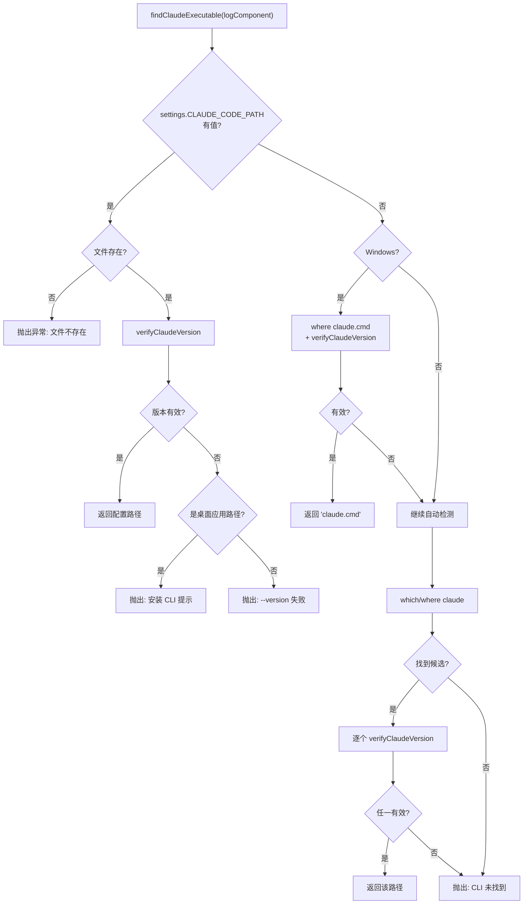

# find-claude-executable.ts 需求说明

> 源文件：src/shared/find-claude-executable.ts ｜ 类型：源码 ｜ 行数：181 ｜ 所属模块：shared ｜ 分析日期：2026-07-23

## 1. 文件定位总述

本文件是 Claude Code CLI 可执行文件的发现与验证模块，为 SDKAgent 和 KnowledgeAgent 定位可用的 CLI。它按三级优先级（settings 配置 → Windows PATH 中的 claude.cmd → 系统 PATH 自动检测）搜索候选路径，并通过 `--version` 验证区分真正的 CLI 与桌面应用二进制。找不到有效 CLI 时抛出明确异常。

## 2. 功能需求

| 编号 | 需求描述（系统应当…） | 触发条件 / 输入 | 处理规则与输出 | 证据 |
|------|----------------------|----------------|---------------|------|
| FR-findexec-01 | 系统应当优先使用 settings.json 中的 `CLAUDE_CODE_PATH` | settings 中配置了 `CLAUDE_CODE_PATH` | 检查文件存在性，验证 `--version`；失败时区分桌面应用和一般失败给出不同错误信息 | `src/shared/find-claude-executable.ts:91-114` |
| FR-findexec-02 | 系统应当在 Windows 上优先查找 PATH 中的 `claude.cmd` | `process.platform === 'win32'` | 使用 `where claude.cmd` 查找，通过 `--version` 验证 | `src/shared/find-claude-executable.ts:117-134` |
| FR-findexec-03 | 系统应当通过 `which`/`where` 自动检测 Claude CLI | 前两步未找到 | 执行 `which claude`（Unix）或 `where claude`（Windows），逐个验证候选路径 | `src/shared/find-claude-executable.ts:137-174` |
| FR-findexec-04 | 系统应当通过 `--version` 验证候选 CLI | 每个候选路径 | 使用 `execFileSync` 运行 `--version`，10 秒超时；成功返回版本字符串，失败返回 null | `src/shared/find-claude-executable.ts:57-69` |
| FR-findexec-05 | 系统应当识别并排除 Windows 桌面应用安装路径 | 候选路径含 `appdata` 或 `program files` | 但排除 `node_modules`/`npm` 路径（npm 全局安装不算桌面应用） | `src/shared/find-claude-executable.ts:32-46` |
| FR-findexec-06 | 系统应当在所有候选都失败时抛出明确异常 | 未找到任何有效 CLI | 提示用户添加 PATH 或设置 CLAUDE_CODE_PATH | `src/shared/find-claude-executable.ts:176-181` |

## 3. 业务规则与约束

- `--version` 验证超时为 10 秒， accommodate Windows 上大体积 CLI 的冷启动。`src/shared/find-claude-executable.ts:26`
- 使用 `execFileSync`（非 `execSync`）防止 shell 注入——候选路径作为独立参数传递，不被 shell 解释。`src/shared/find-claude-executable.ts:57-58`
- `where` 命令可能返回多行结果，需要逐个验证。`src/shared/find-claude-executable.ts:144`

## 4. 对外暴露

| 导出名称 | 类型 | 说明 |
|---------|------|------|
| `findClaudeExecutable` | `(logComponent?: Component) => string` | 查找并验证 Claude CLI 路径，返回有效路径或抛出异常 |

## 5. 依赖关系

- **Node.js 内置**：`child_process`（`execSync`、`execFileSync`）、`fs`（`existsSync`）
- **内部依赖**：`./SettingsDefaultsManager.js`、`./paths.js`、`../utils/logger.js`

## 6. 数据结构

- `VERSION_CHECK_TIMEOUT_MS`: `10_000`，`--version` 验证超时。`src/shared/find-claude-executable.ts:26`

## 7. 复杂逻辑图示

## 8. 逆向备注

- 注释中引用 #2222（功能需求）、#2723（npm 路径误判修复），说明经过迭代优化。`src/shared/find-claude-executable.ts:9,38`
- 注释特别强调 Windows 上 `claude` 二进制约 225MB，冷启动可达数秒。`src/shared/find-claude-executable.ts:21`
