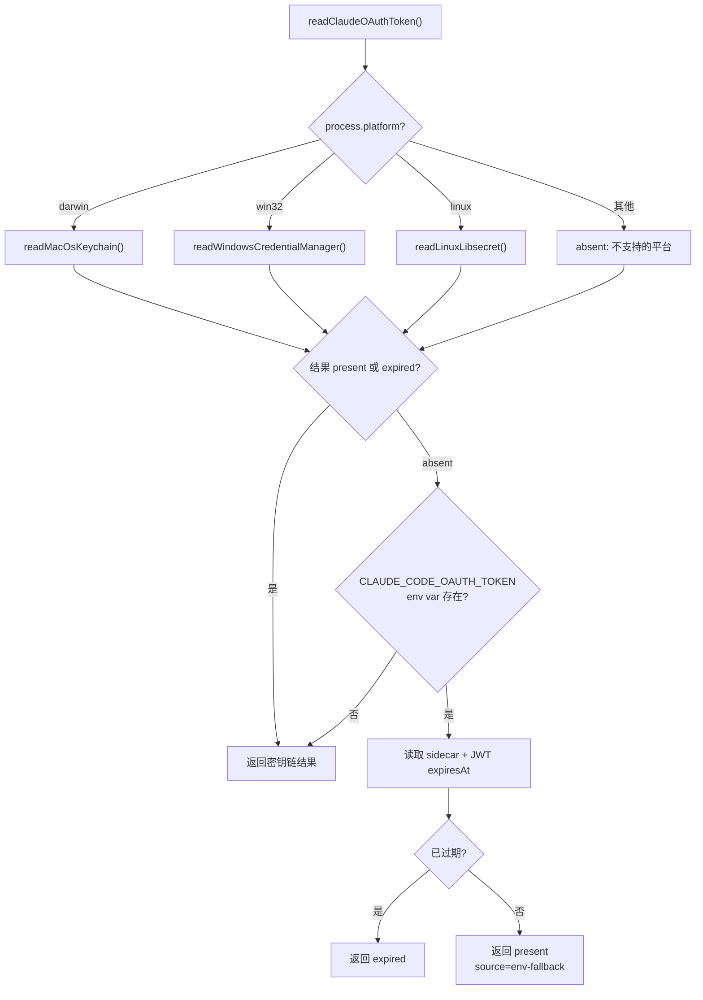

# oauth-token.ts 需求说明

> 源文件：src/shared/oauth-token.ts ｜ 类型：源码 ｜ 行数：362 ｜ 所属模块：shared ｜ 分析日期：2026-07-23

## 1. 文件定位总述

本文件是跨平台 OAuth token 读取模块，负责从操作系统原生的凭证存储（macOS Keychain、Windows Credential Manager、Linux libsecret）中读取 Claude Desktop 的 OAuth token，并根据过期时间分类为 present/expired/absent 三种状态。它是 `EnvManager.ts` 在 spawn 子进程时获取新鲜 token 的核心依赖，通过密钥链直读避免了 token 过期导致的 401 错误。

## 2. 功能需求

| 编号 | 需求描述（系统应当…） | 触发条件 / 输入 | 处理规则与输出 | 证据 |
|------|----------------------|----------------|---------------|------|
| FR-oauth-01 | 系统应当从 macOS Keychain 读取 OAuth token | `process.platform === 'darwin'` | 使用 `security find-generic-password -s "Claude Code-credentials" -a <username> -w` | `src/shared/oauth-token.ts:79-100` |
| FR-oauth-02 | 系统应当从 Windows Credential Manager 读取 OAuth token | `process.platform === 'win32'` | 通过 PowerShell 脚本调用 `Advapi32.dll` 的 `CredRead` API，尝试多个目标名称 | `src/shared/oauth-token.ts:112-170` |
| FR-oauth-03 | 系统应当从 Linux libsecret 读取 OAuth token | `process.platform === 'linux'` | 使用 `secret-tool lookup service "Claude Code-credentials" account <username>` | `src/shared/oauth-token.ts:177-197` |
| FR-oauth-04 | 系统应当解析密钥链返回的 JSON payload | 获取到原始字符串 | 提取 `claudeAiOauth.accessToken` 和 `claudeAiOauth.expiresAt`，回退到 JWT exp claim | `src/shared/oauth-token.ts:203-242` |
| FR-oauth-05 | 系统应当识别裸 token 格式（非 JSON） | payload 不是有效 JSON | 若以 `sk-ant-` 开头或为三段 JWT 格式，直接作为 token 使用 | `src/shared/oauth-token.ts:209-218` |
| FR-oauth-06 | 系统应当在密钥链无结果时回退到环境变量 | 密钥链返回 absent | 读取 `CLAUDE_CODE_OAUTH_TOKEN` 环境变量，结合 sidecar 和 JWT 校验过期 | `src/shared/oauth-token.ts:297-319` |
| FR-oauth-07 | 系统应当基于过期时间加 60 秒宽限窗口判断 token 状态 | `expiresAt` 存在 | `expiresAt + 60_000 < Date.now()` 则过期 | `src/shared/oauth-token.ts:69-72` |
| FR-oauth-08 | 系统应当管理过期标记文件 | token 过期时 | 写入 `$DATA_DIR/oauth-stale.marker`（含原因），token 刷新后清除 | `src/shared/oauth-token.ts:330-352` |
| FR-oauth-09 | 系统应当解码 JWT 的 exp claim | 传入 JWT 字符串 | Base64 解码中间段，提取 `exp` 字段（秒转毫秒） | `src/shared/oauth-token.ts:49-63` |
| FR-oauth-10 | 系统应当读取 sidecar 元数据文件获取过期时间 | `$DATA_DIR/oauth-token-meta.json` 存在 | 解析其中的 `expiresAt` 字段 | `src/shared/oauth-token.ts:251-262` |

## 3. 业务规则与约束

- 密钥链服务名固定为 `"Claude Code-credentials"`，硬编码。`src/shared/oauth-token.ts:22`
- 密钥链读取超时为 5 秒。`src/shared/oauth-token.ts:23`
- 过期宽限窗口为 60 秒，覆盖时钟漂移和刷新进行中的场景。`src/shared/oauth-token.ts:28`
- `expired` 优先于环境变量回退——已知的过期密钥链条目比 freshness 未知的 env 变量更可靠。`src/shared/oauth-token.ts:291-295`
- Windows 上尝试 3 种目标名称：`Claude Code-credentials`、`Claude Code:credentials`、`Claude Code-credentials:<username>`。`src/shared/oauth-token.ts:122`
- 过期标记文件权限为 `0o600`。`src/shared/oauth-token.ts:335`

## 4. 对外暴露

| 导出名称 | 类型 | 说明 |
|---------|------|------|
| `OAuthTokenResult` | 联合类型 | `{kind:'present', token, source, expiresAt?}` / `{kind:'expired', reason, expiresAt?}` / `{kind:'absent', reason}` |
| `readClaudeOAuthToken` | `() => Promise<OAuthTokenResult>` | 从密钥链/环境变量读取 OAuth token |
| `decodeJwtExpMs` | `(token: string) => number \| undefined` | 解码 JWT exp claim |
| `writeStaleMarker` | `(reason: string) => void` | 写入过期标记文件 |
| `clearStaleMarker` | `() => void` | 清除过期标记文件 |
| `readStaleMarker` | `() => string \| undefined` | 读取过期标记文件 |

## 5. 依赖关系

- **Node.js 内置**：`child_process`（`execFile`）、`fs`、`os`、`path`、`util`
- **内部依赖**：`./paths.js`、`../utils/logger.js`

## 6. 数据结构

- `OAuthTokenResult`: 判别联合类型，`kind` 字段区分三种状态。`src/shared/oauth-token.ts:30-33`
- `ClaudeKeychainPayload`: Claude Desktop 写入密钥链的 JSON 结构，包含 `claudeAiOauth.accessToken`、`refreshToken`、`expiresAt`、`scopes`。`src/shared/oauth-token.ts:35-42`

## 7. 复杂逻辑图示

## 8. 逆向备注

- 此模块解决了 Issue #2215（过期 token 注入子进程导致 401 错误）。`src/shared/oauth-token.ts:7-9`
- Windows Credential Manager 使用 PowerShell + P/Invoke 调用 `Advapi32.dll`，而非依赖第三方模块。`src/shared/oauth-token.ts:123-136`
- 环境变量回退路径专为 CI/headless 环境设计，密钥链不可用时从 env 获取。`src/shared/oauth-token.ts:265-268`
