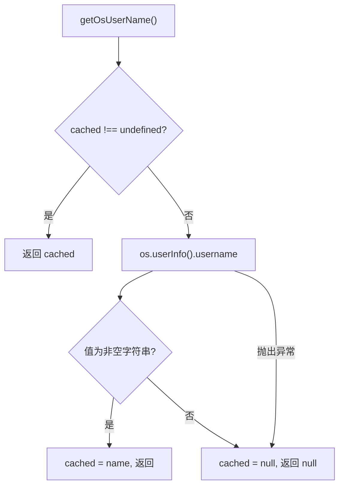

# os-user.ts 需求说明

> 源文件：src/shared/os-user.ts ｜ 类型：源码 ｜ 行数：30 ｜ 所属模块：shared ｜ 分析日期：2026-07-23

## 1. 文件定位总述

本文件提供跨平台的操作系统用户名获取功能，通过 `os.userInfo()` 获取当前进程运行的用户名并缓存。它是用户身份识别链的底层来源之一，被 `user-label.ts` 等模块在 settings 未配置用户标签时作为回退方案调用。

## 2. 功能需求

| 编号 | 需求描述（系统应当…） | 触发条件 / 输入 | 处理规则与输出 | 证据 |
|------|----------------------|----------------|---------------|------|
| FR-osuser-01 | 系统应当获取当前进程运行用户的操作系统用户名 | 调用 `getOsUserName()` | 调用 `os.userInfo().username`，返回用户名字符串或 null | `src/shared/os-user.ts:24` |
| FR-osuser-02 | 系统应当在进程生命周期内缓存用户名 | 首次调用后 | 后续调用直接返回缓存值，不再发起系统调用 | `src/shared/os-user.ts:21-22` |
| FR-osuser-03 | 系统应当将空字符串视为无效并返回 null | `userInfo().username` 为空字符串 | 返回 `null` | `src/shared/os-user.ts:25` |
| FR-osuser-04 | 系统应当在获取用户名失败时返回 null | `os.userInfo()` 抛出异常 | 捕获异常，设置缓存为 `null` | `src/shared/os-user.ts:26-28` |

## 3. 业务规则与约束

- 用户名在进程启动后固定不变，即使操作系统层面发生变更（不可能在运行时发生），缓存值也不会刷新。`src/shared/os-user.ts:20`
- `cached` 变量使用 `undefined` 表示"未初始化"，`null` 表示"获取失败/用户未知"。`src/shared/os-user.ts:20`

## 4. 对外暴露

| 导出名称 | 类型 | 说明 |
|---------|------|------|
| `getOsUserName` | `() => string \| null` | 获取（并缓存）OS 用户名 |

## 5. 依赖关系

- **Node.js 内置**：`os`（`userInfo`）

## 6. 数据结构

- `cached`: `string | null | undefined`，`undefined`=未查询，`null`=查询失败或结果为空，`string`=有效用户名。`src/shared/os-user.ts:20`

## 7. 复杂逻辑图示

## 8. 逆向备注

- 注释说明了 claude-mem 的单机单用户模型设计：worker 用户即为数据产生者。`src/shared/os-user.ts:7-8`
- 注释中提到 locked-down headless 环境可能触发 `userInfo()` 异常的场景。`src/shared/os-user.ts:15-16`
