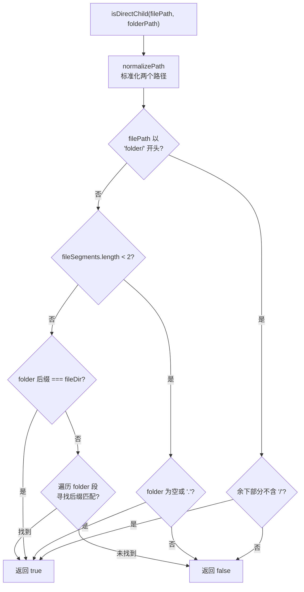

# path-utils.ts 需求说明

> 源文件：src/shared/path-utils.ts ｜ 类型：源码 ｜ 行数：37 ｜ 所属模块：shared ｜ 分析日期：2026-07-23

## 1. 文件定位总述

本文件提供路径操作的通用工具函数，包括路径标准化和判断文件是否为指定目录的直接子项。它是观测会话文件管理、目录扫描等场景的底层工具。

## 2. 功能需求

| 编号 | 需求描述（系统应当…） | 触发条件 / 输入 | 处理规则与输出 | 证据 |
|------|----------------------|----------------|---------------|------|
| FR-pathutils-01 | 系统应当将路径中的反斜杠转为正斜杠、合并连续斜杠、去除尾部斜杠 | 传入任意格式的路径字符串 | 返回标准化后的路径 | `src/shared/path-utils.ts:2-3` |
| FR-pathutils-02 | 系统应当判断文件是否为文件夹的直接子项 | 传入文件路径和文件夹路径 | 标准化后判断文件路径是否以 `folder/` 开头且余下部分不含 `/` | `src/shared/path-utils.ts:6-37` |

## 3. 业务规则与约束

- `normalizePath` 的处理链：`\` → `/`，`//+` → `/`，尾 `/+` 移除。`src/shared/path-utils.ts:2-3`
- `isDirectChild` 采用多策略判定：先尝试前缀匹配，再尝试段对齐匹配，最后尝试后缀匹配。`src/shared/path-utils.ts:10-36`

## 4. 对外暴露

| 导出名称 | 类型 | 说明 |
|---------|------|------|
| `normalizePath` | `(p: string) => string` | 路径标准化（统一正斜杠、去重、去尾斜杠） |
| `isDirectChild` | `(filePath: string, folderPath: string) => boolean` | 判断文件是否为目录的直接子项 |

## 5. 依赖关系

- 无外部依赖，纯逻辑模块。

## 6. 数据结构

不适用。

## 7. 复杂逻辑图示

## 8. 逆向备注

- `isDirectChild` 函数有多个判定分支，其中第三个 for 循环分支（line 29-34）推断是处理嵌套目录场景的兜底逻辑。`src/shared/path-utils.ts:29-34`
