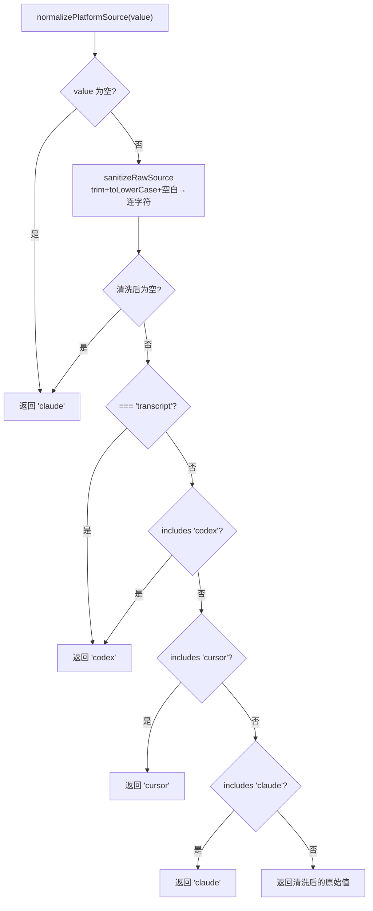

# platform-source.ts 需求说明

> 源文件：src/shared/platform-source.ts ｜ 类型：源码 ｜ 行数：36 ｜ 所属模块：shared ｜ 分析日期：2026-07-23

## 1. 文件定位总述

本文件提供 AI 平台来源标识的标准化与排序工具，将用户配置的原始平台名称（如 transcript、cursor 等）规范化为统一的标识符（`claude`、`codex`、`cursor`），并按优先级排序。它是上下文注入、观测记录等模块区分数据来源的基础工具。

## 2. 功能需求

| 编号 | 需求描述（系统应当…） | 触发条件 / 输入 | 处理规则与输出 | 证据 |
|------|----------------------|----------------|---------------|------|
| FR-platfmt-01 | 系统应当将空值或 null/undefined 归一化为默认平台 `claude` | 传入 `undefined`/`null`/空字符串 | 返回 `'claude'` | `src/shared/platform-source.ts:8,11` |
| FR-platfmt-02 | 系统应当将 `transcript` 映射为 `codex` | 输入包含 `transcript` | 返回 `'codex'` | `src/shared/platform-source.ts:13` |
| FR-platfmt-03 | 系统应当对输入进行清理：去空白、转小写、空白替换为连字符 | 任何非空字符串输入 | `trim().toLowerCase().replace(/\s+/g, '-')` | `src/shared/platform-source.ts:4` |
| FR-platfmt-04 | 系统应当按关键词匹配平台：含 `codex` 归为 codex、含 `cursor` 归为 cursor、含 `claude` 归为 claude | 清理后的值包含特定关键词 | 返回对应平台标识 | `src/shared/platform-source.ts:14-16` |
| FR-platfmt-05 | 系统应当对不匹配已知关键词的值直接返回清理后结果 | 输入不含任何已知关键词 | 返回清理后的原始值 | `src/shared/platform-source.ts:18` |
| FR-platfmt-06 | 系统应当按固定优先级排序平台列表：claude > codex > cursor，其余按字母序 | 调用 `sortPlatformSources(sources)` | 已知平台按优先级排列，未知平台按 localeCompare 排序 | `src/shared/platform-source.ts:22-35` |

## 3. 业务规则与约束

- 默认平台为 `claude`。`src/shared/platform-source.ts:1`
- 排序优先级固定为 `['claude', 'codex', 'cursor']`，硬编码在函数内。`src/shared/platform-source.ts:22`
- `transcript` 是 `codex` 的别名，永远映射为 `codex`。`src/shared/platform-source.ts:13`

## 4. 对外暴露

| 导出名称 | 类型 | 说明 |
|---------|------|------|
| `DEFAULT_PLATFORM_SOURCE` | `string`（常量 `'claude'`） | 默认平台标识 |
| `normalizePlatformSource` | `(value?: string \| null) => string` | 归一化平台来源标识 |
| `sortPlatformSources` | `(sources: string[]) => string[]` | 按优先级排序平台列表 |

## 5. 依赖关系

- 无外部依赖，纯逻辑模块。

## 6. 数据结构

不适用。

## 7. 复杂逻辑图示

## 8. 逆向备注

- 排序函数对数组做了浅拷贝 `[...sources]`，不修改原数组。`src/shared/platform-source.ts:24`
