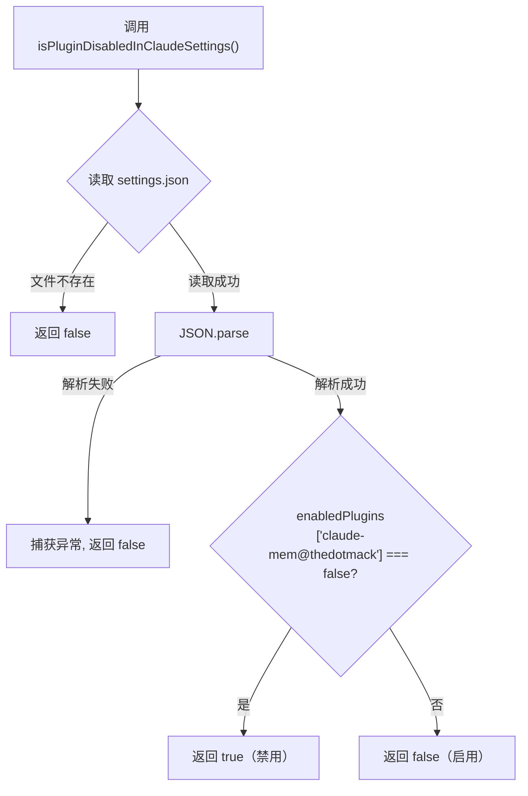

# plugin-state.ts 需求说明

> 源文件：src/shared/plugin-state.ts ｜ 类型：源码 ｜ 行数：20 ｜ 所属模块：shared ｜ 分析日期：2026-07-23

## 1. 文件定位总述

本文件负责从 Claude Code 的配置目录中读取插件启用/禁用状态，判断 claude-mem 插件是否被用户在 Claude 的 settings.json 中显式禁用。它是系统运行时行为控制的入口之一，决定 hooks 是否应当激活。

## 2. 功能需求

| 编号 | 需求描述（系统应当…） | 触发条件 / 输入 | 处理规则与输出 | 证据 |
|------|----------------------|----------------|---------------|------|
| FR-pluginstate-01 | 系统应当检查 Claude 配置中插件是否被禁用 | 调用 `isPluginDisabledInClaudeSettings()` | 读取 `~/.claude/settings.json`（或 `CLAUDE_CONFIG_DIR` 指定路径），检查 `settings.enabledPlugins['claude-mem@thedotmack'] === false` | `src/shared/plugin-state.ts:8-20` |
| FR-pluginstate-02 | 系统应当在配置文件不存在时返回 false（未禁用） | `settings.json` 文件不存在 | 返回 `false` | `src/shared/plugin-state.ts:12` |
| FR-pluginstate-03 | 系统应当在读取或解析失败时返回 false（未禁用） | 文件读取异常或 JSON 解析异常 | 捕获异常，输出错误日志，返回 `false` | `src/shared/plugin-state.ts:16-18` |
| FR-pluginstate-04 | 系统应当优先使用环境变量指定的配置目录 | `CLAUDE_CONFIG_DIR` 环境变量已设置 | 使用该值替代 `~/.claude` | `src/shared/plugin-state.ts:10` |

## 3. 业务规则与约束

- 插件标识为 `claude-mem@thedotmack`（marketplace 注册名），硬编码在模块内。`src/shared/plugin-state.ts:6`
- 仅当 `enabledPlugins[pluginKey] === false`（严格等于 false）时判定为禁用，其他情况（undefined、其他值）均视为启用。`src/shared/plugin-state.ts:15`

## 4. 对外暴露

| 导出名称 | 类型 | 说明 |
|---------|------|------|
| `isPluginDisabledInClaudeSettings` | `() => boolean` | 检查插件是否被用户禁用 |

## 5. 依赖关系

- **Node.js 内置**：`fs`（`existsSync`、`readFileSync`）、`path`（`join`）、`os`（`homedir`）
- **常量**：无内部依赖

## 6. 数据结构

不适用。

## 7. 复杂逻辑图示

## 8. 逆向备注

- 该函数采用"容错启用"策略：任何异常情况均视为启用，确保不会因配置文件损坏而意外禁用插件。
