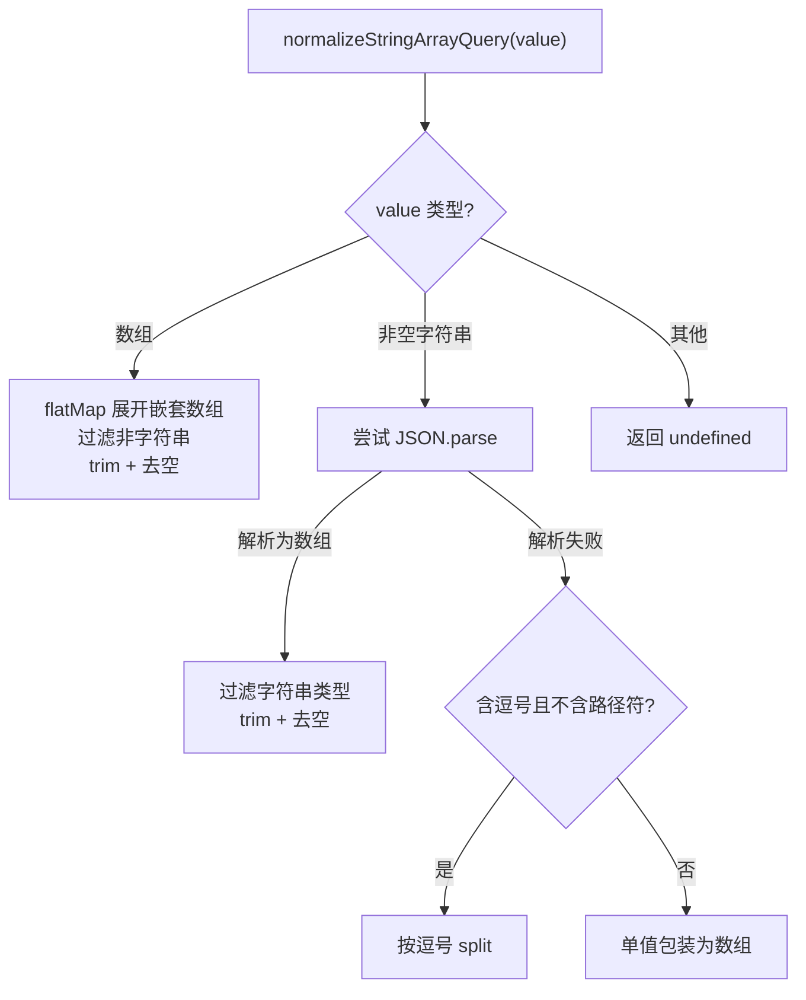

# query-utils.ts 需求说明

> 源文件：src/shared/query-utils.ts ｜ 类型：源码 ｜ 行数：87 ｜ 所属模块：shared ｜ 分析日期：2026-07-23

## 1. 文件定位总述

本文件是 worker HTTP API 的查询参数工具模块，负责服务端接收请求时的项目参数解析和客户端构建请求路径。它统一了 `?projects=a&projects=b`（多值键）和 `?project=a`（单值键/旧版）两种格式的处理逻辑，确保上下文注入端点的参数一致性。

## 2. 功能需求

| 编号 | 需求描述（系统应当…） | 触发条件 / 输入 | 处理规则与输出 | 证据 |
|------|----------------------|----------------|---------------|------|
| FR-queryutils-01 | 系统应当将多种格式的查询参数归一化为字符串数组 | 传入 `unknown` 类型值（数组/字符串/JSON 字符串/逗号分隔字符串） | 处理顺序：数组展开→JSON 解析→逗号分隔→单值包装；空值返回 `undefined` | `src/shared/query-utils.ts:24-56` |
| FR-queryutils-02 | 系统应当解析复数和单数两种项目参数格式 | 传入 `projectsValue` 和 `projectValue` | 优先使用 `projectsValue`（复数），回退到 `projectValue`（单数），都无则返回 `[]` | `src/shared/query-utils.ts:64-68` |
| FR-queryutils-03 | 系统应当构建上下文注入 API 的查询路径 | 传入项目 ID 列表 | 始终使用 `?projects=a&projects=b` 重复键格式，构建 `/api/context/inject?...` 路径 | `src/shared/query-utils.ts:81-87` |

## 3. 业务规则与约束

- `normalizeStringArrayQuery` 返回 `undefined` 表示"无参数"，返回 `[]` 表示"空数组"，两者语义不同。`src/shared/query-utils.ts:22-23`
- `parseProjectQuery` 返回 `[]`（非 `undefined`），调用方通过 `.length === 0` 判断无项目。`src/shared/query-utils.ts:61-62`
- 逗号分隔的反向兼容仅在字符串不含 `/` 或 `\` 时启用，避免路径中的逗号误拆。`src/shared/query-utils.ts:48`
- 客户端路径构建始终使用复数键格式（`projects`），不使用旧版单数键。`src/shared/query-utils.ts:81-87`

## 4. 对外暴露

| 导出名称 | 类型 | 说明 |
|---------|------|------|
| `normalizeStringArrayQuery` | `(value: unknown) => string[] \| undefined` | 归一化查询参数为字符串数组 |
| `parseProjectQuery` | `(projectsValue: unknown, projectValue: unknown) => string[]` | 解析 projects/project 查询参数 |
| `buildContextInjectPath` | `(projects: string[]) => string` | 构建上下文注入 API 路径 |

## 5. 依赖关系

- **Node.js 内置**：`URLSearchParams`

## 6. 数据结构

不适用。

## 7. 复杂逻辑图示

## 8. 逆向备注

- 文件注释明确了"未证实"的隐含语义：`undefined` vs `[]` 的区别。`src/shared/query-utils.ts:22-23`
