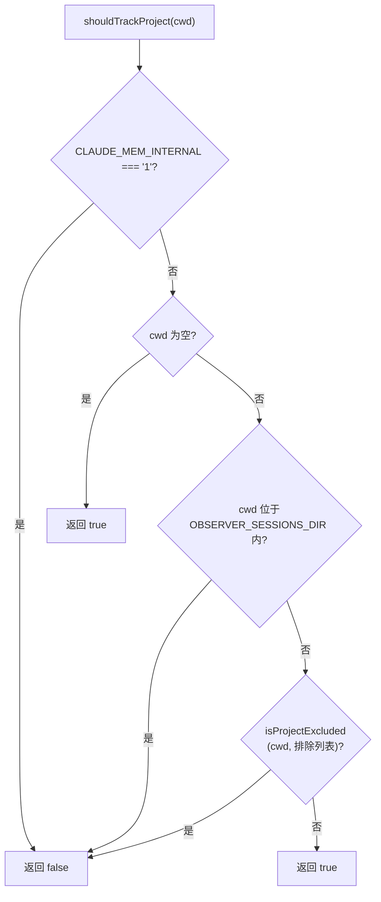

# should-track-project.ts 需求说明

> 源文件：src/shared/should-track-project.ts ｜ 类型：源码 ｜ 行数：28 ｜ 所属模块：shared ｜ 分析日期：2026-07-23

## 1. 文件定位总述

本文件是项目追踪的准入控制模块，决定是否应当对特定工作目录进行观测记录。它综合了内部进程标记、观察者会话目录排除、用户配置的项目排除列表三个维度进行判断，是 hooks 中项目级事件过滤的核心入口。

## 2. 功能需求

| 编号 | 需求描述（系统应当…） | 触发条件 / 输入 | 处理规则与输出 | 证据 |
|------|----------------------|----------------|---------------|------|
| FR-trackproj-01 | 系统应当在内部标记为内部进程时拒绝追踪 | `CLAUDE_MEM_INTERNAL === '1'` | 返回 `false`，跳过所有项目追踪 | `src/shared/should-track-project.ts:16` |
| FR-trackproj-02 | 系统应当在工作目录为空时默认允许追踪 | `cwd` 为空字符串 | 返回 `true` | `src/shared/should-track-project.ts:17` |
| FR-trackproj-03 | 系统应当排除观察者会话目录下的项目 | `cwd` 位于 `OBSERVER_SESSIONS_DIR` 内部 | 调用 `isWithin()` 判断路径包含关系，是则返回 `false` | `src/shared/should-track-project.ts:18-19` |
| FR-trackproj-04 | 系统应当根据用户排除列表过滤项目 | 读取 settings 中的 `CLAUDE_MEM_EXCLUDED_PROJECTS` | 调用 `isProjectExcluded()` 判断，排除则返回 `false`，否则返回 `true` | `src/shared/should-track-project.ts:21-22` |
| FR-trackproj-05 | 系统应当判断一行数据是否应当输出到观测表 | 调用 `shouldEmitProjectRow(project)` | 当 `project` 为空/null/undefined 时返回 `true`；当等于 `OBSERVER_SESSIONS_PROJECT` 时返回 `false` | `src/shared/should-track-project.ts:25-28` |

## 3. 业务规则与约束

- 内部进程（`CLAUDE_MEM_INTERNAL=1`）永远不追踪，防止 worker 自身产生的子进程事件被递归记录。`src/shared/should-track-project.ts:16`
- 观察者会话目录本身不作为被追踪项目。`src/shared/should-track-project.ts:18-19`
- `isWithin` 使用路径规范化后通过 `relative` 判断包含关系，支持等值（同目录）场景。`src/shared/should-track-project.ts:7-13`

## 4. 对外暴露

| 导出名称 | 类型 | 说明 |
|---------|------|------|
| `shouldTrackProject` | `(cwd: string) => boolean` | 判断是否应当追踪该项目 |
| `shouldEmitProjectRow` | `(project: string \| null \| undefined) => boolean` | 判断是否应当输出到观测表 |

## 5. 依赖关系

- **内部依赖**：`../utils/project-filter.js`（`isProjectExcluded`）、`./hook-settings.js`（`loadFromFileOnce`）、`./paths.js`（`OBSERVER_SESSIONS_DIR`、`OBSERVER_SESSIONS_PROJECT`）

## 6. 数据结构

不适用。

## 7. 复杂逻辑图示

## 8. 逆向备注

- `isWithin` 函数未导出，仅在模块内部使用。
