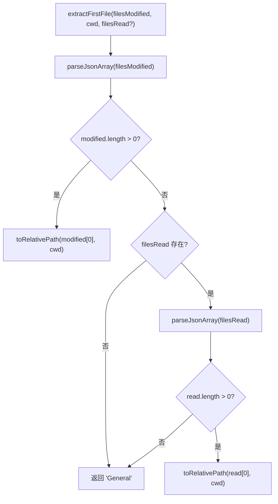

# timeline-formatting.ts 需求说明

> 源文件：src/shared/timeline-formatting.ts ｜ 类型：源码 ｜ 行数：100 ｜ 所属模块：shared ｜ 分析日期：2026-07-23

## 1. 文件定位总述

本文件是时间线展示层的格式化工具集，提供日期时间格式化、JSON 数组解析、相对路径计算、token 估算、日期分组等功能。它是 Viewer UI 中时间线页面和会话历史展示的底层格式化依赖，将数据库中的原始数据转换为用户友好的展示格式。

## 2. 功能需求

| 编号 | 需求描述（系统应当…） | 触发条件 / 输入 | 处理规则与输出 | 证据 |
|------|----------------------|----------------|---------------|------|
| FR-tlformat-01 | 系统应当安全解析 JSON 字符串数组 | 传入字符串或 null | 解析 JSON，非数组返回 `[]`，异常时记录 debug 日志并返回 `[]` | `src/shared/timeline-formatting.ts:5-16` |
| FR-tlformat-02 | 系统应当将日期/时间戳格式化为 "Mon DD, h:mm AM/PM" | 传入日期字符串或数字 | 使用 `en-US` locale 格式化（月日+小时分钟，12 小时制） | `src/shared/timeline-formatting.ts:18-27` |
| FR-tlformat-03 | 系统应当将时间戳格式化为 "h:mm AM/PM" | 传入日期字符串或数字 | 仅显示小时和分钟，12 小时制 | `src/shared/timeline-formatting.ts:29-36` |
| FR-tlformat-04 | 系统应当将时间戳格式化为 "Mon DD, YYYY" | 传入日期字符串或数字 | 显示月、日、年 | `src/shared/timeline-formatting.ts:38-45` |
| FR-tlformat-05 | 系统应当将绝对路径转为相对于 cwd 的相对路径 | 传入绝对路径和 cwd | 使用 `path.relative()` 转换，非绝对路径原样返回 | `src/shared/timeline-formatting.ts:47-52` |
| FR-tlformat-06 | 系统应当提取首个文件名用于展示 | 传入 filesModified 和 cwd | 优先从 filesModified 取第一个，其次从 filesRead 取第一个，都为空返回 `'General'` | `src/shared/timeline-formatting.ts:54-72` |
| FR-tlformat-07 | 系统应当估算文本的 token 数量 | 传入字符串或 null | 返回 `Math.ceil(length / 4)`，null 返回 0 | `src/shared/timeline-formatting.ts:74-77` |
| FR-tlformat-08 | 系统应当将列表按日期分组并排序 | 传入项目列表和日期提取函数 | 按 `formatDate` 格式化的日期分组，各组按日期升序排列 | `src/shared/timeline-formatting.ts:79-100` |

## 3. 业务规则与约束

- 所有日期格式化使用 `en-US` locale。`src/shared/timeline-formatting.ts:20,31,40`
- Token 估算采用 4 字符/token 的简单模型，不区分语言。`src/shared/timeline-formatting.ts:76`
- JSON 解析异常仅记录 debug 级别日志，不中断业务流程。`src/shared/timeline-formatting.ts:11`

## 4. 对外暴露

| 导出名称 | 类型 | 说明 |
|---------|------|------|
| `parseJsonArray` | `(json: string \| null) => string[]` | 安全解析 JSON 数组 |
| `formatDateTime` | `(dateInput: string \| number) => string` | 格式化日期时间 |
| `formatTime` | `(dateInput: string \| number) => string` | 格式化时间（仅时分） |
| `formatDate` | `(dateInput: string \| number) => string` | 格式化日期（月日年） |
| `toRelativePath` | `(filePath: string, cwd: string) => string` | 绝对路径转相对路径 |
| `extractFirstFile` | `(filesModified: string \| null, cwd: string, filesRead?: string \| null) => string` | 提取展示用首个文件名 |
| `estimateTokens` | `(text: string \| null) => number` | 估算 token 数 |
| `groupByDate` | `<T>(items: T[], getDate: (item: T) => string) => Map<string, T[]>` | 按日期分组排序 |

## 5. 依赖关系

- **Node.js 内置**：`path`、`../utils/logger.js`

## 6. 数据结构

不适用。

## 7. 复杂逻辑图示

## 8. 逆向备注

- Token 估算模型极为简单（字符数/4），推断是仅用于 UI 展示的粗略估算，不用于精确计费。`src/shared/timeline-formatting.ts:76`
