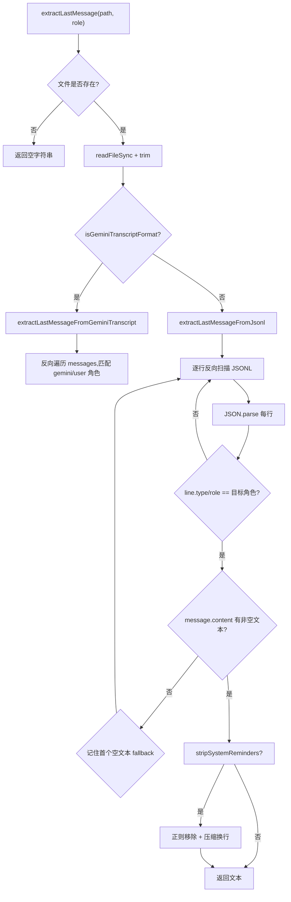
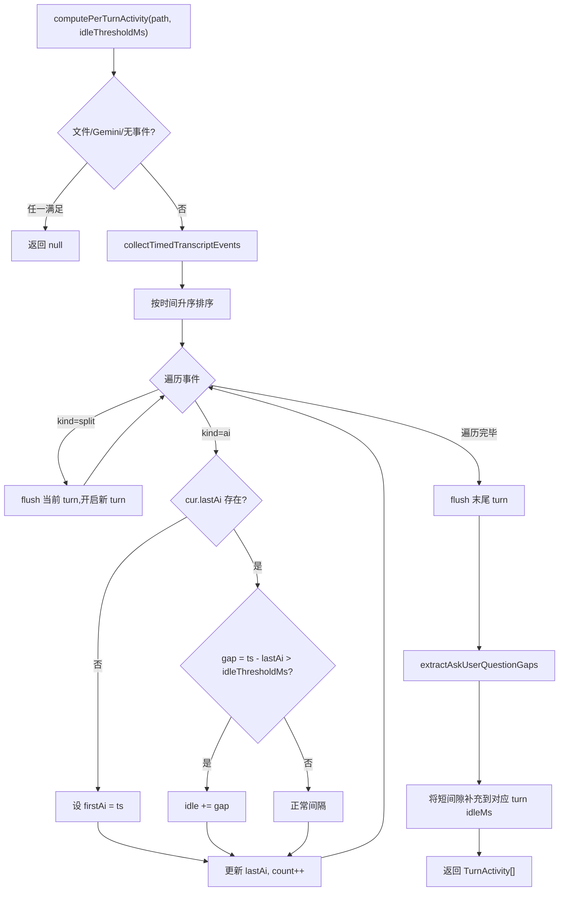

# transcript-parser.ts 需求说明

> 源文件：`src/shared/transcript-parser.ts` ｜ 类型：源码 ｜ 行数：552 ｜ 所属模块：shared ｜ 分析日期：2026-07-23

## 1. 文件定位总述

本文件是 Claude-mem 对会话记录（transcript）的核心解析层，负责从 JSONL 和 Gemini 两种格式的 transcript 文件中提取结构化信息。它处于 hook/workservice 与数据库之间的数据管道位置，为会话摘要、时间戳采集、活动度检测提供原始素材。主要调用方为 session-init、summarize 等 worker 子命令。

## 2. 功能需求

| 编号 | 需求描述（系统应当…） | 触发条件 / 输入 | 处理规则与输出 | 证据 |
|------|----------------------|----------------|---------------|------|
| FR-extract-01 | 系统应当从 transcript 文件中提取指定角色的最后一条非空文本消息 | 调用 `extractLastMessage(transcriptPath, role, stripSystemReminders)` | 先尝试 Gemini 格式（单 JSON `messages` 数组），否则按 JSONL 逐行反向扫描，跳过纯工具调用（无文本）的行，找到第一条含非空文本的匹配角色消息返回 | `src/shared/transcript-parser.ts:17-39` |
| FR-extract-02 | 系统应当兼容两种 transcript 行格式：Claude Code 的 `type` 字段和 Cursor 的 `role` 字段 | JSONL 逐行解析时 | 通过 `line.type ?? line.role` 获取角色标识，两种格式均可识别 | `src/shared/transcript-parser.ts:96` |
| FR-extract-03 | 系统应当支持 Gemini 格式 transcript 解析 | transcript 内容为单个 JSON 对象且包含 `messages` 数组时 | 将 `assistant` 角色映射为 `gemini`、`user` 映射为 `user`，反向遍历提取 | `src/shared/transcript-parser.ts:5-15,41-61` |
| FR-extract-04 | 系统应当支持可选的 System Reminder 剥离功能 | `stripSystemReminders=true` 时 | 用 `SYSTEM_REMINDER_REGEX` 移除系统提醒标记，并将连续3个以上换行压缩为双换行 | `src/shared/transcript-parser.ts:52-55,123-126` |
| FR-extract-05 | 系统应当容忍损坏/截断的 JSONL 行 | JSON 解析失败时 | 捕获异常跳过当前行继续扫描，不中断整个解析管线 | `src/shared/transcript-parser.ts:91-95` |
| FR-extract-06 | 系统应当兼容消息内容的多种结构形态 | `message.content` 为 string、Array（content block）、或其他类型时 | string 直接取值；Array 过滤 `type==='text'` 的 block 拼接文本；其他类型跳过 | `src/shared/transcript-parser.ts:103-121` |
| FR-ts-01 | 系统应当提取主链 assistant 消息的文本及其墙钟时间戳 | 调用 `extractLastAssistantEntry(transcriptPath)` | 反向扫描 JSONL，仅取 `type/role=assistant` 且 `isSidechain` 未设置的主链消息，返回 `{ text, timestampEpoch }`；Gemini 格式因无逐行时间戳返回 null | `src/shared/transcript-parser.ts:161-179` |
| FR-ts-02 | 系统应当对时间戳进行安全钳制 | 解析 transcript 行时间戳时 | 过滤无 timestamp、非 string、无法解析、<=0、或超过当前时间+60s 的行 | `src/shared/transcript-parser.ts:221-227` |
| FR-activity-01 | 系统应当基于 liveness 检测计算每个 turn 的真实活跃时长 | 调用 `computePerTurnActivity(transcriptPath, idleThresholdMs)` | 按"用户真输入（split）"切 turn，相邻 AI 事件间隔超过阈值计入 idle，activeMs = span - idleMs；返回 null 时调用方回落墙钟时长 | `src/shared/transcript-parser.ts:436-551` |
| FR-activity-02 | 系统应当将 AskUserQuestion 等待时间从活跃时长中扣除 | liveness 检测完成后 | 扫描 `AskUserQuestion tool_use → tool_result` 配对，将其持续时间注入对应 turn 的 idleMs（仅补充未被主检测覆盖的短间隙） | `src/shared/transcript-parser.ts:522-548` |
| FR-activity-03 | 系统应当区分 AI 活动事件与用户分隔点 | 分类 transcript 行时 | assistant 行及含 `tool_result` 的 user 行归为 `ai`；纯文本/含 text 的 user 行归为 `split`（真用户输入）；split 用于切 turn，排除用户思考间隔 | `src/shared/transcript-parser.ts:369-385` |
| FR-activity-04 | 系统应当对单事件 turn 做特殊保底处理 | turn 内仅 1 个 AI 事件时 | `activeMs = max(span-idle, lastAi - promptedAt)`，避免单次问答被记为 0 | `src/shared/transcript-parser.ts:477-483` |

## 3. 业务规则与约束

1. **未来时间戳容差**：时间戳超过 `Date.now() + 60_000ms` 的行被视为损坏/时钟偏差，一律跳过。`src/shared/transcript-parser.ts:185,262`
2. **Sidechain 过滤**：`computePerTurnActivity` 和 `extractLastAssistantEntry` 均排除 `isSidechain=true` 的子代理事件，仅计算主链活动度。`src/shared/transcript-parser.ts:200,404`
3. **Gemini 格式回落**：Gemini transcript 为单 JSON 对象（`{messages:[...]}`），无逐行 timestamp，所有依赖时间戳的功能（时间戳提取、liveness 检测）均返回 null。`src/shared/transcript-parser.ts:174-176,451`
4. **AskUserQuestion 配对策略**：同一 `tool_use_id` 仅取首次配对，防御 hook 重复注入场景。`src/shared/transcript-parser.ts:325`
5. **idleThresholdMs 推荐值**：注释中基于 143,262 个间隔样本的 P99=47.8s 统计，推荐 15min（900,000ms）作为空闲判定阈值。`src/shared/transcript-parser.ts:428`

## 4. 对外暴露

| 名称 | 类型 | 签名 | 说明 |
|------|------|------|------|
| `extractLastMessage` | exported function | `(transcriptPath: string, role: 'user'\|'assistant', stripSystemReminders?: boolean) => string` | 提取指定角色最后一条非空文本消息 |
| `extractLastMessageFromJsonl` | exported function | `(content: string, role: 'user'\|'assistant', stripSystemReminders: boolean) => string` | 从 JSONL 字符串提取最后消息 |
| `AssistantEntry` | exported interface | `{ text: string; timestampEpoch: number }` | assistant 消息+时间戳复合结构 |
| `extractLastAssistantEntry` | exported function | `(transcriptPath: string) => AssistantEntry \| null` | 提取最后一条主链 assistant 消息及时间戳 |
| `TurnActivity` | exported interface | `{ promptIndex, promptedAt, startedAt, endedAt, activeMs, idleMs, askQuestionWaitMs, eventCount }` | 单 turn 活动度结构 |
| `computePerTurnActivity` | exported function | `(transcriptPath: string, idleThresholdMs: number) => TurnActivity[] \| null` | 计算 per-turn liveness 活动度 |

## 5. 依赖关系

- **上游依赖**：`fs`（`readFileSync`, `existsSync`）、`../utils/logger.js`（日志）、`../utils/tag-stripping.js`（`SYSTEM_REMINDER_REGEX`）
- **下游调用方**：推断为 worker-service 中的 session-init、summarize 等子命令（未在代码中证实具体调用点）

## 6. 数据结构

### TurnActivity（per-turn 活动度）

| 字段 | 类型 | 说明 |
|------|------|------|
| promptIndex | number | turn 序号（1-based，对齐 prompt_number） |
| promptedAt | number \| null | 用户输入时间戳（split 点） |
| startedAt | number | turn 首个 AI 事件时间 |
| endedAt | number | turn 末个 AI 事件时间 |
| activeMs | number | 真实活跃时长（span - idle） |
| idleMs | number | 挂起时长（超阈值间隔总和） |
| askQuestionWaitMs | number | AskUserQuestion 等待时长 |
| eventCount | number | turn 内 AI 事件数 |

### AskUserQuestionGap

| 字段 | 类型 | 说明 |
|------|------|------|
| askedAt | number | tool_use 发出时间 |
| answeredAt | number | tool_result 返回时间 |
| toolUseId | string | 用于去重配对 |

## 7. 复杂逻辑图示

## 8. 逆向备注

1. **注释与代码一致性**：注释提及 P99.9=3.2min（`src/shared/transcript-parser.ts:428`），代码中未引用该数值做任何逻辑判断，仅为标定参考，一致。
2. **`foundMatchingRole` 状态变量**：在 `extractLastMessageFromJsonl` 中用于区分"无匹配角色"（返回空串）与"匹配但全部为 tool-only"（返回 fallback），是一个有意的防御设计。
3. **`FUTURE_SKEW_MS` 与 `TRANSCRIPT_FUTURE_SKEW_MS`**：两个常量值相同（60,000ms），分别在不同函数中定义，未共享。推断为有意隔离，各函数可独立调整容差。
