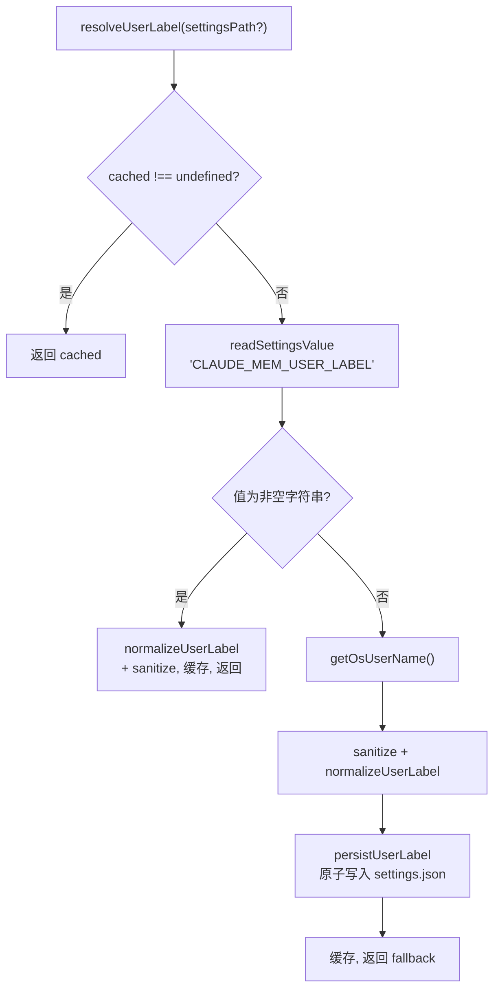

# user-label.ts 需求说明

> 源文件：src/shared/user-label.ts ｜ 类型：源码 ｜ 行数：155 ｜ 所属模块：shared ｜ 分析日期：2026-07-23

## 1. 文件定位总述

本文件是用户身份标识的解析与持久化管理模块，负责确定当前 worker 进程的同步身份标签（user_label）。它按优先级从 settings.json 配置和操作系统用户名两个来源解析标签，并在未配置时自动将 OS 用户名持久化回 settings.json，确保后续启动有稳定的身份标识。标签以大写形式存储和比较，实现不区分大小写的用户身份匹配。

## 2. 功能需求

| 编号 | 需求描述（系统应当…） | 触发条件 / 输入 | 处理规则与输出 | 证据 |
|------|----------------------|----------------|---------------|------|
| FR-userlabel-01 | 系统应当将用户标签标准化为大写形式 | 调用 `normalizeUserLabel(raw)` | `trim()` 后转为 `toUpperCase()`，空值返回 `'UNKNOWN'` | `src/shared/user-label.ts:23-27` |
| FR-userlabel-02 | 系统应当按优先级解析用户标签 | 调用 `resolveUserLabel(settingsPath?)` | 优先级：settings.json 中的 `CLAUDE_MEM_USER_LABEL` → OS 用户名 → 字面量 `'unknown'` | `src/shared/user-label.ts:50-79` |
| FR-userlabel-03 | 系统应当在 settings 中有显式标签时直接使用 | `CLAUDE_MEM_USER_LABEL` 非空 | 标准化+清理后缓存并返回 | `src/shared/user-label.ts:54-57` |
| FR-userlabel-04 | 系统应当在 settings 无标签时使用 OS 用户名并持久化 | settings 中标签为空或缺失 | 从 `getOsUserName()` 获取，清理后写入 settings.json（原子写入），缓存 | `src/shared/user-label.ts:60-78` |
| FR-userlabel-05 | 系统应当对标签中的非法字符进行清理 | 标签含非安全字符 | 将非 `[A-Za-z0-9._ -]` 字符替换为 `-`，去除首尾连字符，空结果返回 `'unknown'` | `src/shared/user-label.ts:91-95` |
| FR-userlabel-06 | 系统应当使用原子写入方式持久化标签 | `persistUserLabel(path, value)` | 先写临时文件（`.user-label.<pid>.<random>.tmp`），再 rename 覆盖目标 | `src/shared/user-label.ts:131-155` |
| FR-userlabel-07 | 系统应当在进程生命周期内缓存用户标签 | 首次调用 `resolveUserLabel()` | 后续调用直接返回缓存值 | `src/shared/user-label.ts:34,51` |

## 3. 业务规则与约束

- 标签以 `UPPERCASE` 形式存储，所有比较操作均在此形式上进行。`src/shared/user-label.ts:26`
- 安全字符集为 `[A-Za-z0-9._ -]`，空格被保留但其他特殊字符被替换。`src/shared/user-label.ts:9`
- 持久化是"加法性"的——只写入/修改 `CLAUDE_MEM_USER_LABEL`，不触碰 settings.json 的其他键。`src/shared/user-label.ts:131-132`
- settings.json 支持嵌套（`env` 键）和扁平两种 schema 格式，读取和写入均兼容。`src/shared/user-label.ts:108-109,141-143`
- 持久化失败为非致命错误，不影响标签返回。`src/shared/user-label.ts:68-75`

## 4. 对外暴露

| 导出名称 | 类型 | 说明 |
|---------|------|------|
| `normalizeUserLabel` | `(raw: string) => string` | 标签标准化（大写化） |
| `resolveUserLabel` | `(settingsPath?: string) => string` | 解析并缓存用户标签 |
| `_resetUserLabelCacheForTests` | `() => void` | 仅测试用：清除缓存 |

## 5. 依赖关系

- **Node.js 内置**：`fs`、`path`、`os`、`crypto`
- **内部依赖**：`./os-user.js`（`getOsUserName`）、`./paths.js`（`paths`）、`../utils/logger.js`

## 6. 数据结构

- `cached`: `string | undefined`，进程级缓存，`undefined`=未解析。`src/shared/user-label.ts:34`
- 临时文件命名模式：`.user-label.<process.pid>.<6位随机hex>.tmp`。`src/shared/user-label.ts:150`

## 7. 复杂逻辑图示

## 8. 逆向备注

- `_resetUserLabelCacheForTests` 仅用于测试，标记为非生产 API。`src/shared/user-label.ts:81-84`
- 持久化操作在值未变化时跳过（`flatHost.CLAUDE_MEM_USER_LABEL === value` 时 early return），避免无谓写入。`src/shared/user-label.ts:145`
