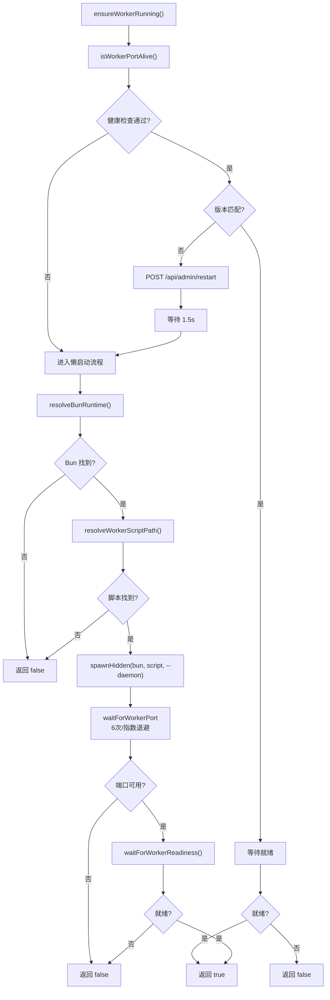

# worker-utils.ts 需求说明

> 源文件：src/shared/worker-utils.ts ｜ 类型：源码 ｜ 行数：489 ｜ 所属模块：shared ｜ 分析日期：2026-07-23

## 1. 文件定位总述

本文件是 worker 进程生命周期管理的核心模块，负责确保 worker 服务可用——包括健康检查、版本不匹配时的自动回收、懒启动（Bun 运行时发现+daemon 模式 spawn）、冷启动等待、端口缓存、HTTP 请求超时封装，以及连续失败时的阻断退出机制。它是所有 hook 脚本调用 worker API 的前置依赖。

## 2. 功能需求

| 编号 | 需求描述（系统应当…） | 触发条件 / 输入 | 处理规则与输出 | 证据 |
|------|----------------------|----------------|---------------|------|
| FR-workerutils-01 | 系统应当缓存 worker 端口号和主机名 | 调用 `getWorkerPort()` / `getWorkerHost()` | 从 settings.json 读取并缓存，后续调用直接返回缓存 | `src/shared/worker-utils.ts:66-86` |
| FR-workerutils-02 | 系统应当构建 worker API URL | 调用 `buildWorkerUrl(apiPath)` | 返回 `http://<host>:<port><apiPath>` | `src/shared/worker-utils.ts:93-95` |
| FR-workerutils-03 | 系统应当发起带超时的 HTTP 请求到 worker | 调用 `workerHttpRequest(apiPath, options)` | 使用 `fetchWithTimeout` 发起请求，默认超时 30 秒 | `src/shared/worker-utils.ts:97-122` |
| FR-workerutils-04 | 系统应当检查 worker 健康状态 | 调用 `isWorkerHealthy()` | GET `/api/health`，返回 `response.ok` | `src/shared/worker-utils.ts:124-127` |
| FR-workerutils-05 | 系统应当检查 worker 就绪状态 | 调用 `isWorkerReady()` | GET `/api/readiness`，返回 `response.ok` | `src/shared/worker-utils.ts:129-132` |
| FR-workerutils-06 | 系统应当发现 Bun 运行时 | 进程启动时 | 优先级：`BUN` 环境变量 → 规范安装位（`~/.bun/bin`）→ 系统 PATH | `src/shared/worker-utils.ts:145-176` |
| FR-workerutils-07 | 系统应当确保 worker 运行 | hook 调用 API 前 | 检查存活→版本匹配→回收旧版本→懒启动→等待端口→等待就绪 | `src/shared/worker-utils.ts:234-327` |
| FR-workerutils-08 | 系统应当在版本不匹配时自动回收旧 worker | 已有 worker 但版本不同 | 通过 `/api/admin/restart` 端点请求重启，等待 1.5 秒后重新 spawn | `src/shared/worker-utils.ts:246-275` |
| FR-workerutils-09 | 系统应当使用退避策略等待 worker 端口可用 | spawn 后 | 最多 6 次尝试，初始 500ms 指数退避（500→1s→2s→4s→8s→16s） | `src/shared/worker-utils.ts:178-188` |
| FR-workerutils-10 | 系统应当缓存 worker 存活状态为进程级单例 | 调用 `ensureWorkerAliveOnce()` | 首次调用执行完整检查，后续返回缓存结果 | `src/shared/worker-utils.ts:331-335` |
| FR-workerutils-11 | 系统应当追踪连续 hook 失败次数并在达到阈值时阻断 | worker 不可达 | 递增计数器并持久化，达到 `CLAUDE_MEM_HOOK_FAIL_LOUD_THRESHOLD` 时 `exit(2)` | `src/shared/worker-utils.ts:398-414` |
| FR-workerutils-12 | 系统应当在 worker API 成功时重置失败计数 | 成功调用 worker API | 将计数器重置为 0 | `src/shared/worker-utils.ts:416-420` |
| FR-workerutils-13 | 系统应当以 fallback 模式执行 worker API 调用 | 调用 `executeWithWorkerFallback()` | 先确保 worker 存活，不可达则返回 fallback 对象；429/5xx 也返回 fallback | `src/shared/worker-utils.ts:440-489` |

## 3. 业务规则与约束

- 端口和主机名使用进程级缓存，可通过 `clearPortCache()` 重置。`src/shared/worker-utils.ts:63-64,88-91`
- 健康检查超时支持环境变量 `CLAUDE_MEM_HEALTH_TIMEOUT_MS` 覆盖，范围 500-300000ms。`src/shared/worker-utils.ts:32-36`
- API 请求超时支持 `CLAUDE_MEM_API_TIMEOUT_MS` 覆盖。`src/shared/worker-utils.ts:38-42`
- Hook 就绪等待支持 `CLAUDE_MEM_HOOK_READINESS_TIMEOUT_MS` 覆盖，设为 0 则立即单次检查。`src/shared/worker-utils.ts:44-48`
- 默认失败阈值 3 次，可通过 settings.json `CLAUDE_MEM_HOOK_FAIL_LOUD_THRESHOLD` 配置。`src/shared/worker-utils.ts:342,386-396`
- 失败状态持久化到 `$DATA_DIR/state/hook-failures.json`，原子写入。`src/shared/worker-utils.ts:348-384`
- 冷启动等待最多约 15.5 秒（6 次 * 指数退避），解决 #2795 macOS+Chroma 冷启动慢的问题。`src/shared/worker-utils.ts:309-316`

## 4. 对外暴露

| 导出名称 | 类型 | 说明 |
|---------|------|------|
| `fetchWithTimeout` | `(url, init, timeoutMs) => Promise<Response>` | 带超时的 fetch |
| `getWorkerPort` | `() => number` | 获取（并缓存）worker 端口 |
| `getWorkerHost` | `() => string` | 获取（并缓存）worker 主机 |
| `clearPortCache` | `() => void` | 清除端口缓存 |
| `buildWorkerUrl` | `(apiPath: string) => string` | 构建 worker URL |
| `workerHttpRequest` | `(apiPath, options) => Promise<Response>` | 发起 worker HTTP 请求 |
| `ensureWorkerRunning` | `() => Promise<boolean>` | 确保 worker 运行 |
| `ensureWorkerAliveOnce` | `() => Promise<boolean>` | 单例模式确保 worker 存活 |
| `WorkerFallback` | 类型 | fallback 结果类型 |
| `WorkerCallResult<T>` | 类型 | 联合类型（结果或 fallback） |
| `isWorkerFallback` | `<T>(result) => result is WorkerFallback` | 类型守卫 |
| `executeWithWorkerFallback` | `<T>(url, method, body?, options?) => Promise<WorkerCallResult<T>>` | 带 fallback 的 worker 调用 |

## 5. 依赖关系

- **Node.js 内置**：`child_process`、`fs`、`os`、`path`
- **内部依赖**：`./spawn.js`、`./hook-constants.js`、`./SettingsDefaultsManager.js`、`./paths.js`、`./hook-settings.js`、`../supervisor/index.js`、`../services/infrastructure/index.js`、`../utils/logger.js`

## 6. 数据结构

- `HookFailureState`: `{ consecutiveFailures: number, lastFailureAt: number }`，持久化到 JSON。`src/shared/worker-utils.ts:337-340`
- `WorkerFallback`: 带唯一 Symbol 标记的 `{ continue: true }` 对象。`src/shared/worker-utils.ts:422-428`
- `readTimeoutEnv`: 从环境变量读取超时值，带 min/max 边界校验。`src/shared/worker-utils.ts:14-30`

## 7. 复杂逻辑图示

## 8. 逆向备注

- `executeWithWorkerFallback` 对 429 和 5xx 返回 fallback 但对其他错误码（如 4xx）返回解析后的原始响应，策略不一致。`src/shared/worker-utils.ts:465-479`
- `WORKER_FALLBACK_BRAND` 使用 `Symbol.for` 确保跨模块实例的唯一性。`src/shared/worker-utils.ts:422`
- Windows 超时乘数通过 `getTimeout()` 自动应用。`src/shared/worker-utils.ts:32-34`
- 冷启动等待的退避策略上限约 15.5 秒（sum of 0.5+1+2+4+8+16*0.5），但第 6 次实际等待时间为 16 秒*0.5=8 秒（被 remainingMs 限制）。`src/shared/worker-utils.ts:316`
