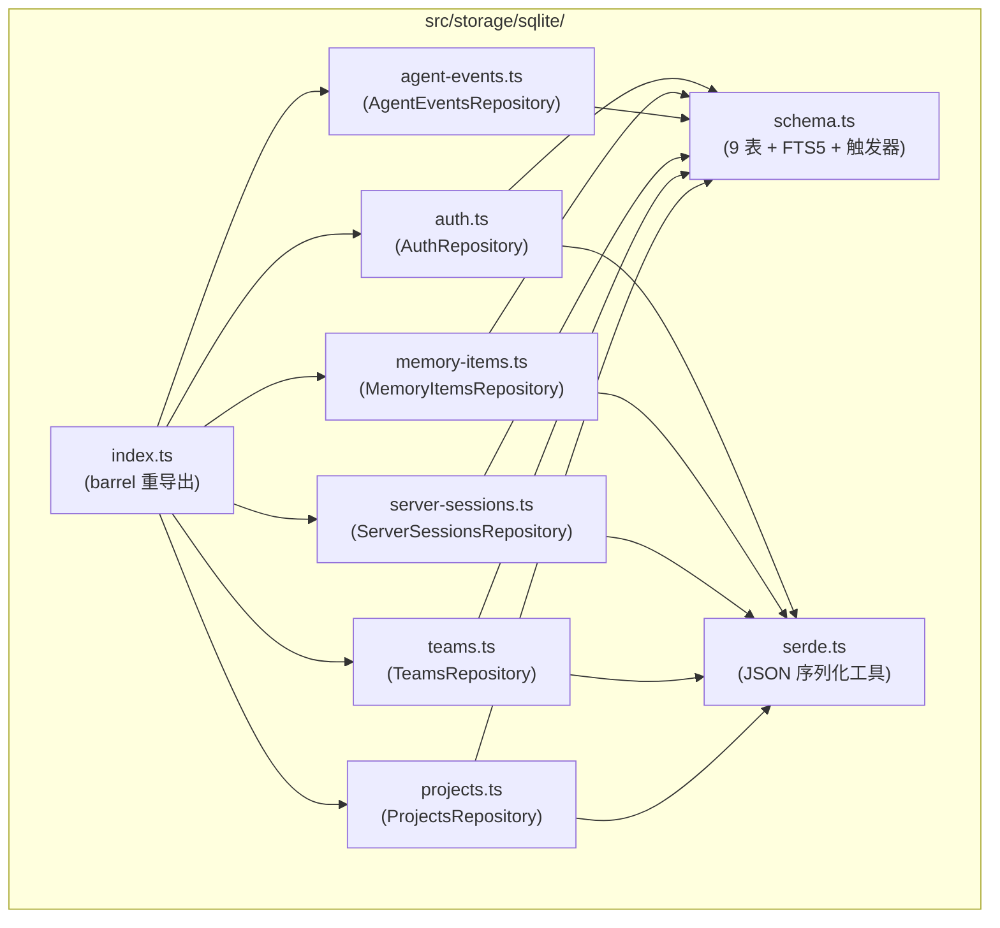
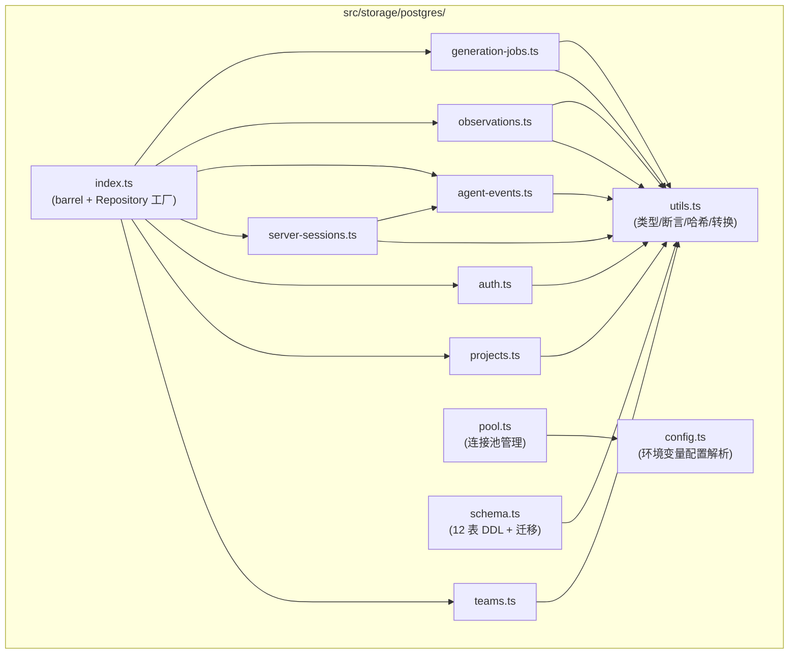

# STORAGE 模块汇总

> 分析范围：`src/storage/sqlite/`（9 个文件）+ `src/storage/postgres/`（11 个文件），共 20 个文件级需求文档。

## 1. 模块职责总述

Storage 模块是 Claude-mem 的持久化层，负责全部业务数据的存储、检索与 Schema 管理。它采用**双引擎架构**：SQLite 子模块服务于本地单用户模式（Local），PostgreSQL 子模块服务于 Server Beta 多租户模式。两者在领域概念上高度对齐（项目、团队、会话、事件、记忆/观察），但在租户隔离、状态机复杂度、全文搜索方案上各有侧重。模块通过 Repository 模式将 SQL 细节封装在存储层内部，向上层暴露领域模型和方法接口，是整个系统的数据访问基座。

## 2. 功能需求汇总

### 2.1 SQLite 子模块（9 个文件）

| 编号 | 需求描述（系统应当…） | 来源文档 |
|------|----------------------|----------|
| FR-schema-ensure-01 | 惰性创建全部表结构（WeakSet 防重复） | [sqlite/schema.ts.md](sqlite/schema.ts.md) |
| FR-schema-tables-01 | 创建 9 张业务表 | [sqlite/schema.ts.md](sqlite/schema.ts.md) |
| FR-schema-index-01 | 创建 17 个普通索引 + 2 个部分唯一索引 | [sqlite/schema.ts.md](sqlite/schema.ts.md) |
| FR-schema-fts-01 | 创建 FTS5 全文搜索虚拟表并按需事务性重建 | [sqlite/schema.ts.md](sqlite/schema.ts.md) |
| FR-schema-trigger-01 | 创建 5 个 BEFORE 数据完整性触发器 | [sqlite/schema.ts.md](sqlite/schema.ts.md) |
| FR-schema-fts-trigger-01 | 创建 3 个 AFTER FTS 自动同步触发器 | [sqlite/schema.ts.md](sqlite/schema.ts.md) |
| FR-proj-create-01 | 创建新项目（Zod 验证，metadata JSON 序列化） | [sqlite/projects.ts.md](sqlite/projects.ts.md) |
| FR-proj-upsert-01 | 项目 upsert（ON CONFLICT 幂等写入） | [sqlite/projects.ts.md](sqlite/projects.ts.md) |
| FR-proj-get-01 | 按 ID 查询项目 | [sqlite/projects.ts.md](sqlite/projects.ts.md) |
| FR-proj-root-01 | 按根路径查询项目 | [sqlite/projects.ts.md](sqlite/projects.ts.md) |
| FR-proj-list-01 | 列出全部项目 | [sqlite/projects.ts.md](sqlite/projects.ts.md) |
| FR-team-create-01 | 创建团队（Zod 验证） | [sqlite/teams.ts.md](sqlite/teams.ts.md) |
| FR-team-member-add-01 | 添加或更新团队成员（ON CONFLICT 幂等） | [sqlite/teams.ts.md](sqlite/teams.ts.md) |
| FR-team-get-01 | 按 ID 查询团队 | [sqlite/teams.ts.md](sqlite/teams.ts.md) |
| FR-team-member-get-01 | 按 teamId+userId 查询成员 | [sqlite/teams.ts.md](sqlite/teams.ts.md) |
| FR-team-member-list-01 | 列出团队成员 | [sqlite/teams.ts.md](sqlite/teams.ts.md) |
| FR-ss-create-01 | 创建服务会话（默认 status=active, platformSource=claude） | [sqlite/server-sessions.ts.md](sqlite/server-sessions.ts.md) |
| FR-ss-complete-01 | 标记会话为已完成 | [sqlite/server-sessions.ts.md](sqlite/server-sessions.ts.md) |
| FR-ss-get-01 | 按 ID 查询会话 | [sqlite/server-sessions.ts.md](sqlite/server-sessions.ts.md) |
| FR-ss-memory-01 | 按记忆会话 ID 查询关联服务会话 | [sqlite/server-sessions.ts.md](sqlite/server-sessions.ts.md) |
| FR-ss-list-01 | 按项目列出会话 | [sqlite/server-sessions.ts.md](sqlite/server-sessions.ts.md) |
| FR-ae-create-01 | 创建 Agent 事件（Zod 双重验证） | [sqlite/agent-events.ts.md](sqlite/agent-events.ts.md) |
| FR-ae-get-01 | 按 ID 查询事件 | [sqlite/agent-events.ts.md](sqlite/agent-events.ts.md) |
| FR-ae-list-01 | 按项目列出事件 | [sqlite/agent-events.ts.md](sqlite/agent-events.ts.md) |
| FR-mem-create-01 | 创建记忆条目（数组字段 JSON 序列化） | [sqlite/memory-items.ts.md](sqlite/memory-items.ts.md) |
| FR-mem-source-add-01 | 添加记忆来源（支持 legacy 追溯） | [sqlite/memory-items.ts.md](sqlite/memory-items.ts.md) |
| FR-mem-get-01 | 按 ID 查询记忆条目 | [sqlite/memory-items.ts.md](sqlite/memory-items.ts.md) |
| FR-mem-legacy-01 | 按历史 observation ID 查询记忆条目 | [sqlite/memory-items.ts.md](sqlite/memory-items.ts.md) |
| FR-mem-update-01 | 更新记忆条目（先读后写全量更新） | [sqlite/memory-items.ts.md](sqlite/memory-items.ts.md) |
| FR-mem-list-01 | 按项目列出记忆条目 | [sqlite/memory-items.ts.md](sqlite/memory-items.ts.md) |
| FR-mem-search-01 | FTS5 全文搜索记忆条目（NFKC + 短语匹配） | [sqlite/memory-items.ts.md](sqlite/memory-items.ts.md) |
| FR-mem-source-list-01 | 列出记忆条目的所有来源 | [sqlite/memory-items.ts.md](sqlite/memory-items.ts.md) |
| FR-auth-key-create-01 | 创建 API Key（初始 status=active） | [sqlite/auth.ts.md](sqlite/auth.ts.md) |
| FR-auth-key-revoke-01 | 撤销 API Key（status→revoked） | [sqlite/auth.ts.md](sqlite/auth.ts.md) |
| FR-auth-key-use-01 | 标记 API Key 使用记录 | [sqlite/auth.ts.md](sqlite/auth.ts.md) |
| FR-auth-audit-create-01 | 创建审计日志 | [sqlite/auth.ts.md](sqlite/auth.ts.md) |
| FR-auth-key-get-01 | 按 ID 查询 API Key | [sqlite/auth.ts.md](sqlite/auth.ts.md) |
| FR-auth-key-hash-01 | 按哈希值查询 API Key | [sqlite/auth.ts.md](sqlite/auth.ts.md) |
| FR-auth-key-list-01 | 列出 API Key | [sqlite/auth.ts.md](sqlite/auth.ts.md) |
| FR-auth-audit-get-01 | 按 ID 查询审计日志 | [sqlite/auth.ts.md](sqlite/auth.ts.md) |
| FR-auth-audit-list-01 | 按项目列出审计日志 | [sqlite/auth.ts.md](sqlite/auth.ts.md) |
| FR-stringify-01 | JSON 序列化（null/undefined→`{}`） | [sqlite/serde.ts.md](sqlite/serde.ts.md) |
| FR-parse-obj-01 | JSON 反序列化为对象（失败→`{}`） | [sqlite/serde.ts.md](sqlite/serde.ts.md) |
| FR-parse-arr-01 | JSON 反序列化为字符串数组（过滤非 string） | [sqlite/serde.ts.md](sqlite/serde.ts.md) |

### 2.2 PostgreSQL 子模块（11 个文件）

| 编号 | 需求描述（系统应当…） | 来源文档 |
|------|----------------------|----------|
| FR-SCHEMA-01 | 启动时 bootstrap 自动创建 12 张表及索引（事务内） | [postgres/schema.ts.md](postgres/schema.ts.md) |
| FR-SCHEMA-02 | 支持 Pool 连接自动获取 client 后再 bootstrap | [postgres/schema.ts.md](postgres/schema.ts.md) |
| FR-SCHEMA-03 | CREATE TABLE IF NOT EXISTS 保障 DDL 幂等 | [postgres/schema.ts.md](postgres/schema.ts.md) |
| FR-SCHEMA-04 | 迁移记录表防止重复版本升级 | [postgres/schema.ts.md](postgres/schema.ts.md) |
| FR-pool-create-01 | 根据配置创建连接池（max/idleTimeout/ssl 等） | [postgres/pool.ts.md](postgres/pool.ts.md) |
| FR-pool-singleton-01 | 进程级共享连接池单例 | [postgres/pool.ts.md](postgres/pool.ts.md) |
| FR-pool-singleton-02 | 环境变量未配置时抛出明确异常 | [postgres/pool.ts.md](postgres/pool.ts.md) |
| FR-pool-health-01 | 连接池健康检查（SELECT 1） | [postgres/pool.ts.md](postgres/pool.ts.md) |
| FR-pool-tx-01 | 事务执行包装器（BEGIN→fn→COMMIT/ROLLBACK） | [postgres/pool.ts.md](postgres/pool.ts.md) |
| FR-pool-close-01 | 关闭连接池（同步清除单例引用） | [postgres/pool.ts.md](postgres/pool.ts.md) |
| FR-cfg-url-01 | 从环境变量获取连接字符串 | [postgres/config.ts.md](postgres/config.ts.md) |
| FR-cfg-parse-01 | 解析完整 PostgresConfig（正整数安全解析） | [postgres/config.ts.md](postgres/config.ts.md) |
| FR-cfg-int-01 | 安全解析正整数参数（非正数回退默认值） | [postgres/config.ts.md](postgres/config.ts.md) |
| FR-cfg-ssl-01 | 多来源确定 SSL 配置（优先级链） | [postgres/config.ts.md](postgres/config.ts.md) |
| FR-barrel-01 | 统一导出所有 Postgres 子模块符号（barrel） | [postgres/index.ts.md](postgres/index.ts.md) |
| FR-factory-01 | Repository 工厂函数（9 个 Repository 聚合） | [postgres/index.ts.md](postgres/index.ts.md) |
| FR-pteam-create-01 | 创建团队（jsonb metadata） | [postgres/teams.ts.md](postgres/teams.ts.md) |
| FR-pteam-member-add-01 | 添加/更新团队成员（ON CONFLICT 幂等） | [postgres/teams.ts.md](postgres/teams.ts.md) |
| FR-pteam-get-user-01 | 按用户查询其所属团队（INNER JOIN 归属校验） | [postgres/teams.ts.md](postgres/teams.ts.md) |
| FR-pteam-member-get-01 | 查询特定团队特定成员 | [postgres/teams.ts.md](postgres/teams.ts.md) |
| FR-proj-create-01 | 创建项目（teamId + name，jsonb metadata） | [postgres/projects.ts.md](postgres/projects.ts.md) |
| FR-proj-get-01 | 团队范围内按 ID 查询项目（租户隔离） | [postgres/projects.ts.md](postgres/projects.ts.md) |
| FR-pauth-key-create-01 | 创建 API Key（断言项目归属，jsonb scopes） | [postgres/auth.ts.md](postgres/auth.ts.md) |
| FR-pauth-audit-01 | 创建审计日志（断言项目归属） | [postgres/auth.ts.md](postgres/auth.ts.md) |
| FR-pauth-key-hash-01 | 按哈希值查询 API Key | [postgres/auth.ts.md](postgres/auth.ts.md) |
| FR-pss-create-01 | 幂等创建服务会话（确定性 SHA-256 幂等键） | [postgres/server-sessions.ts.md](postgres/server-sessions.ts.md) |
| FR-pss-get-scope-01 | 租户范围内按 ID 查询会话 | [postgres/server-sessions.ts.md](postgres/server-sessions.ts.md) |
| FR-pss-list-01 | 按项目列出全部会话 | [postgres/server-sessions.ts.md](postgres/server-sessions.ts.md) |
| FR-pss-external-01 | 按外部会话 ID 查询 | [postgres/server-sessions.ts.md](postgres/server-sessions.ts.md) |
| FR-pss-end-01 | 幂等结束会话（COALESCE 首次生效） | [postgres/server-sessions.ts.md](postgres/server-sessions.ts.md) |
| FR-pss-gen-start-01 | 标记生成状态为处理中 | [postgres/server-sessions.ts.md](postgres/server-sessions.ts.md) |
| FR-pss-gen-done-01 | 标记生成状态为已完成 | [postgres/server-sessions.ts.md](postgres/server-sessions.ts.md) |
| FR-pss-gen-fail-01 | 标记生成状态为失败（jsonb_set 错误信息） | [postgres/server-sessions.ts.md](postgres/server-sessions.ts.md) |
| FR-pss-unproc-01 | 查询会话中未处理的 Agent 事件（Exactly-Once） | [postgres/server-sessions.ts.md](postgres/server-sessions.ts.md) |
| FR-OBS-01 | 创建观察记录（多级归属校验 + UPSERT） | [postgres/observations.ts.md](postgres/observations.ts.md) |
| FR-OBS-02 | 基于 generation_key 的幂等去重 | [postgres/observations.ts.md](postgres/observations.ts.md) |
| FR-OBS-03 | 按 ID + project + team 三重条件精确查询 | [postgres/observations.ts.md](postgres/observations.ts.md) |
| FR-OBS-04 | 按 project 分页列表查询（可选 session 过滤） | [postgres/observations.ts.md](postgres/observations.ts.md) |
| FR-OBS-05 | PostgreSQL 全文检索（tsquery + ts_rank） | [postgres/observations.ts.md](postgres/observations.ts.md) |
| FR-OBS-06 | 添加观察来源（多类型归属断言） | [postgres/observations.ts.md](postgres/observations.ts.md) |
| FR-OBS-07 | generationJobId 一致性校验（manual 禁止关联） | [postgres/observations.ts.md](postgres/observations.ts.md) |
| FR-OBS-08 | 观察来源幂等写入（metadata 合并） | [postgres/observations.ts.md](postgres/observations.ts.md) |
| FR-OBS-09 | 按观察 ID 查询来源（INNER JOIN 作用域隔离） | [postgres/observations.ts.md](postgres/observations.ts.md) |
| FR-OBS-10 | 构建 generation_key 工具函数 | [postgres/observations.ts.md](postgres/observations.ts.md) |
| FR-JOB-01 | 创建生成任务（按 sourceType 校验归属） | [postgres/generation-jobs.ts.md](postgres/generation-jobs.ts.md) |
| FR-JOB-02 | 基于幂等键的 payload 合并更新 | [postgres/generation-jobs.ts.md](postgres/generation-jobs.ts.md) |
| FR-JOB-03 | 状态转换时自动维护 attempts/时间戳/锁定字段 | [postgres/generation-jobs.ts.md](postgres/generation-jobs.ts.md) |
| FR-JOB-04 | SQL 层强制状态机合法转换规则 | [postgres/generation-jobs.ts.md](postgres/generation-jobs.ts.md) |
| FR-JOB-05 | 代码层断言精确错误原因（双重保证） | [postgres/generation-jobs.ts.md](postgres/generation-jobs.ts.md) |
| FR-JOB-06 | 按状态 + 项目 + 团队过滤查询任务 | [postgres/generation-jobs.ts.md](postgres/generation-jobs.ts.md) |
| FR-JOB-07 | 追加任务事件日志（INNER JOIN 校验归属） | [postgres/generation-jobs.ts.md](postgres/generation-jobs.ts.md) |
| FR-JOB-08 | 查询指定任务的全部事件日志 | [postgres/generation-jobs.ts.md](postgres/generation-jobs.ts.md) |
| FR-JOB-09 | 构建任务幂等键工具函数 | [postgres/generation-jobs.ts.md](postgres/generation-jobs.ts.md) |
| FR-util-query-01 | 单行查询封装（泛型 queryOne） | [postgres/utils.ts.md](postgres/utils.ts.md) |
| FR-util-project-01 | 断言项目归属关系（预检查门卫） | [postgres/utils.ts.md](postgres/utils.ts.md) |
| FR-util-session-01 | 断言会话归属关系 | [postgres/utils.ts.md](postgres/utils.ts.md) |
| FR-util-json-01 | 转换为 JSON 对象 | [postgres/utils.ts.md](postgres/utils.ts.md) |
| FR-util-array-01 | 转换为 JSON 数组 | [postgres/utils.ts.md](postgres/utils.ts.md) |
| FR-util-epoch-01 | 多类型转 epoch 毫秒数 | [postgres/utils.ts.md](postgres/utils.ts.md) |
| FR-util-date-01 | 多类型转 Date 或 null | [postgres/utils.ts.md](postgres/utils.ts.md) |
| FR-util-hash-01 | 确定性 SHA-256 哈希键 | [postgres/utils.ts.md](postgres/utils.ts.md) |
| FR-util-cjson-01 | 规范 JSON（递归排序键名） | [postgres/utils.ts.md](postgres/utils.ts.md) |
| FR-util-id-01 | 生成 UUID（crypto.randomUUID） | [postgres/utils.ts.md](postgres/utils.ts.md) |

## 3. 模块内部结构

Storage 模块在文件系统上分为两个平行的子目录，各自独立运行，不存在交叉依赖。内部依赖关系如下图所示。

### 3.1 SQLite 子模块依赖关系

- **schema.ts** 是最底层模块，被所有 Repository 构造函数调用以确保表结构就绪。
- **serde.ts** 是序列化基础设施，被 projects、teams、server-sessions、auth、memory-items 引用。
- **index.ts** 为纯 barrel 文件，重导出全部子模块公开符号。

### 3.2 PostgreSQL 子模块依赖关系

- **utils.ts** 是核心基础设施，被所有 Repository 和 schema 共享（类型定义、所有权断言、确定性哈希）。
- **config.ts → pool.ts** 构成连接池基础设施链。
- **schema.ts** 独立于 Repository 链，仅在应用启动时被调用。
- **server-sessions.ts 依赖 agent-events.ts**（类型引用）。
- **index.ts** 既是 barrel 又是工厂，将 9 个 Repository 聚合为 `PostgresStorageRepositories` 接口。

## 4. 对外接口

### 4.1 SQLite 对外接口

通过 `src/storage/sqlite/index.ts` barrel 导出：

| 导出项 | 类型 | 说明 |
|--------|------|------|
| `AgentEventsRepository` | class | Agent 事件 CRUD（create, getById, listByProject） |
| `AuthRepository` | class | API Key 全生命周期 + 审计日志（9 个方法） |
| `MemoryItemsRepository` | class | 记忆条目 CRUD + FTS5 搜索 + 来源管理（10 个方法） |
| `ProjectsRepository` | class | 项目 CRUD + upsert（5 个方法） |
| `ServerSessionsRepository` | class | 服务会话管理（5 个方法） |
| `TeamsRepository` | class | 团队 + 成员管理（5 个方法） |
| `ensureServerStorageSchema` | function | 惰性 Schema 初始化 |
| `SERVER_STORAGE_SCHEMA_VERSION` | const (33) | Schema 版本号 |
| `SERVER_OWNED_TABLES` | const | 9 张表名数组 |
| `stringifyJson` / `parseJsonObject` / `parseJsonArray` | function | JSON 序列化工具 |

### 4.2 PostgreSQL 对外接口

通过 `src/storage/postgres/index.ts` barrel 导出 + 工厂创建：

| 导出项 | 类型 | 说明 |
|--------|------|------|
| `PostgresStorageRepositories` | interface | 9 个 Repository 聚合接口 |
| `createPostgresStorageRepositories()` | function | Repository 工厂（接收 PostgresQueryable） |
| `PostgresTeamsRepository` | class | 团队 + 成员（create, addMember, getByIdForUser, getMember） |
| `PostgresProjectsRepository` | class | 项目（create, getByIdForTeam） |
| `PostgresAuthRepository` | class | API Key + 审计日志（createApiKey, createAuditLog, getApiKeyByHash） |
| `PostgresServerSessionsRepository` | class | 会话全生命周期（幂等创建、generation 状态机、未处理事件查询，9 个方法） |
| `PostgresAgentEventsRepository` | class | Agent 事件 |
| `PostgresObservationRepository` | class | 观察记录（CRUD + 全文检索） |
| `PostgresObservationSourcesRepository` | class | 观察来源（addSource, listByObservationForScope） |
| `PostgresObservationGenerationJobRepository` | class | 生成任务全生命周期（有限状态机） |
| `PostgresObservationGenerationJobEventsRepository` | class | 任务事件日志（append, listByJobForScope） |
| 连接池全套 | function | createPostgresPool, getSharedPostgresPool, checkPostgresHealth, withPostgresTransaction, closePostgresPool |
| Schema 引导 | function + const | bootstrapServerBetaPostgresSchema, SERVER_BETA_POSTGRES_SCHEMA_VERSION, SERVER_BETA_POSTGRES_TABLES |

## 5. 数据与外部资源

### 5.1 数据库与表

| 引擎 | 数据库/文件 | 表数量 | 核心表 |
|------|-------------|--------|--------|
| SQLite | `~/.claude-mem/claude-mem.db`（bun:sqlite） | 9 张业务表 + 1 张 FTS5 虚拟表 | projects, teams, team_members, server_sessions, agent_events, memory_items, memory_sources, api_keys, audit_log, memory_items_fts |
| PostgreSQL | `CLAUDE_MEM_SERVER_DATABASE_URL` 环境变量指定 | 12 张表 + 1 张迁移表 | teams, projects, team_members, api_keys, audit_log, server_sessions, agent_events, observation_generation_jobs, observations, observation_sources, observation_generation_job_events, server_beta_schema_migrations |

### 5.2 存储差异对照

| 维度 | SQLite | PostgreSQL |
|------|--------|------------|
| 租户隔离 | 无（单用户本地模式） | 全面的 project x team 双重隔离，所有写操作前置归属断言 |
| JSON 存储 | TEXT + serde 序列化/反序列化 | 原生 jsonb 类型 |
| 全文搜索 | FTS5 虚拟表（porter unicode61），触发器自动同步 | GENERATED ALWAYS tsvector STORED 列 + GIN 索引 + websearch_to_tsquery |
| 外键 | 物理外键 + CASCADE/SET NULL | 物理外键（projects→teams），多数靠应用层逻辑 |
| 幂等键 | ON CONFLICT(upsert) | SHA-256 确定性哈希幂等键（会话、观察、生成任务） |
| 状态机 | session 简单 status（active/completed/failed） | generation_jobs 有限状态机（queued/processing/completed/failed/cancelled），SQL + 代码双重保证 |
| Schema 版本 | v33（`SERVER_STORAGE_SCHEMA_VERSION`） | v1（`SERVER_BETA_POSTGRES_SCHEMA_VERSION`），迁移记录表 |
| 连接管理 | 同步 bun:sqlite Database | 异步 pg Pool（单例 + 事务包装器） |
| 验证方式 | Zod Schema 双重验证（输入 + 输出） | 类型系统 + Repository 层断言 |

### 5.3 环境变量

| 变量 | 用途 | 引擎 |
|------|------|------|
| `CLAUDE_MEM_SERVER_DATABASE_URL` | PostgreSQL 连接字符串 | Postgres |
| `CLAUDE_MEM_POSTGRES_SSL` | SSL 配置（优先级最高） | Postgres |
| `PGSSLMODE` | 标准 PG SSL 环境变量 | Postgres |

### 5.4 外部依赖

| 依赖 | 引擎 | 用途 |
|------|------|------|
| `bun:sqlite` | SQLite | Database 类型 |
| `pg` (npm) | PostgreSQL | Pool, PoolClient |
| `crypto` | 两者 | randomUUID, createHash |
| Zod Schema（`../../core/schemas/`） | SQLite | 输入/输出验证 |

## 6. 存疑与备注

### 6.1 跨引擎设计差异

1. **Postgres 版 ApiKey 无 name/prefix/status/last_used 字段**，无 revoke/markUsed 方法。推断两个版本处于不同演进阶段。[postgres/auth.ts.md](postgres/auth.ts.md)
2. **Postgres 版 AuditLog 使用 actorId/resourceType/resourceId**，SQLite 版使用 actor_type/target_type/target_id。字段命名与结构不同。[postgres/auth.ts.md](postgres/auth.ts.md)
3. **Postgres 版 ProjectsRepository 仅有 create + getByIdForTeam**，SQLite 版有 upsert/getByRootPath/list。推断 Postgres 版按需实现，尚未完全对齐。[postgres/projects.ts.md](postgres/projects.ts.md)
4. **Postgres 版 TeamsRepository 无 slug 字段、无 getById**（仅 getByIdForUser），成员无 id 字段（复合键 team_id+user_id）。推断两个存储引擎按各自场景优化字段设计。[postgres/teams.ts.md](postgres/teams.ts.md)
5. **Postgres 版 server-sessions 功能显著更丰富**（幂等创建、generation 状态机、未处理事件查询、外部会话关联、agentId/agentType 字段）。推断 Postgres 版是 Server 模式主实现，SQLite 版为简化本地模式。[postgres/server-sessions.ts.md](postgres/server-sessions.ts.md)
6. **SQLite 版 server-sessions 缺失 markFailed 方法**，但数据库 schema 支持 `'failed'` 状态。推断 SQLite 版尚未实现或通过其他途径处理。[sqlite/server-sessions.ts.md](sqlite/server-sessions.ts.md)

### 6.2 物理外键冲突

7. **SQLite Schema 大量使用物理外键**（CASCADE/SET NULL），与项目全局规范"禁用物理外键，通过应用层逻辑控制依赖"存在冲突。Postgres 版在 projects→teams 使用物理外键，多数关系由应用层 assertProjectOwnership 断言控制。以代码为准。[sqlite/schema.ts.md](sqlite/schema.ts.md), [postgres/schema.ts.md](postgres/schema.ts.md)

### 6.3 未证实/推断项

8. **observations 表 content_search 列先在 CREATE TABLE 中定义，又在 ALTER TABLE 中重复声明**，推断用于兼容从旧 schema 迁移。[postgres/schema.ts.md](postgres/schema.ts.md)
9. **DROP CONSTRAINT IF EXISTS 语句**暗示曾经存在这些约束，用于清理旧版本遗留，未在代码中证实具体旧版内容。[postgres/schema.ts.md](postgres/schema.ts.md)
10. **Schema 版本 33（SQLite）和版本 1（Postgres）**均未在建表逻辑中直接引用，推断为预留或供迁移系统使用。[sqlite/schema.ts.md](sqlite/schema.ts.md)
11. **Postgres generation_status 无数据库 CHECK 约束**，推断该字段为自由文本，未做枚举约束。[postgres/server-sessions.ts.md](postgres/server-sessions.ts.md)
12. **deterministicKey 的用途**推断用于幂等键生成，如 server-sessions 中的 buildServerSessionIdempotencyKey 依赖此函数。[postgres/utils.ts.md](postgres/utils.ts.md)
13. **Postgres 版无 agent-events.ts.md 需求文档**，但被 index.ts barrel 导出和 PostgresStorageRepositories 聚合。推断该文件存在但未在本批次分析范围内。
14. **FTS5 事务性重建**在 Schema 初始化时比较行数并按需重建，推断首次运行或数据迁移后需要此操作，正常启动后行数一致则跳过。[sqlite/schema.ts.md](sqlite/schema.ts.md)
15. **Pool 检测使用鸭子类型**（检查 connect、totalCount、idleCount 等属性），而非 instanceof，推断为兼容不同 pg 驱动实现。[postgres/schema.ts.md](postgres/schema.ts.md)
