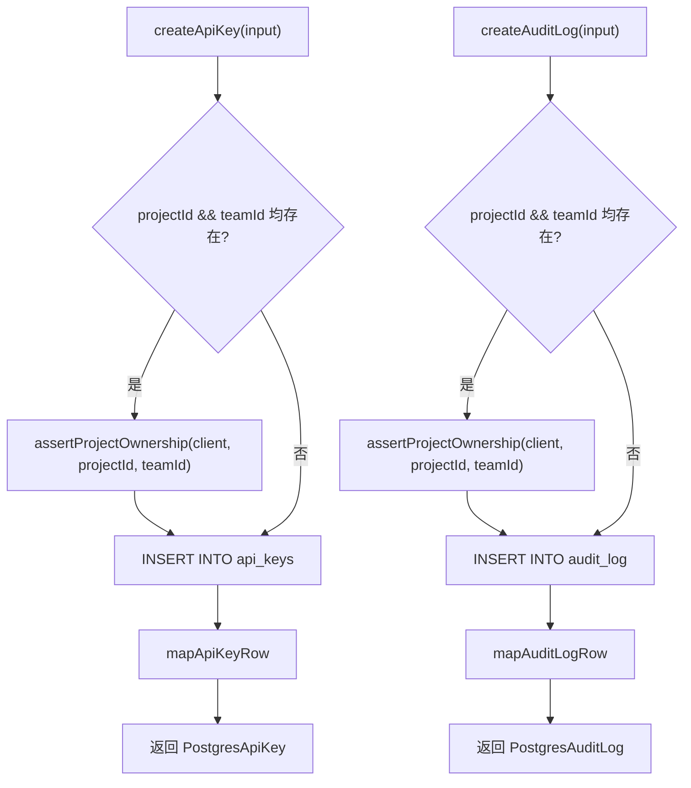

# auth.ts（Postgres）需求说明

> 源文件：`src/storage/postgres/auth.ts` ｜ 类型：源码 ｜ 行数：169 ｜ 所属模块：storage/postgres ｜ 分析日期：2026-07-23

## 1. 文件定位总述

本文件是 PostgreSQL 存储层中认证与审计实体的 Repository 实现，提供 API Key 的创建和哈希查询、审计日志的创建功能。与 SQLite 版相比，Postgres 版的 ApiKey 结构更精简（无 name/prefix/status/last_used 字段），但增加了项目归属断言作为写操作前置校验。

## 2. 功能需求

| 编号 | 需求描述（系统应当…） | 触发条件 / 输入 | 处理规则与输出 | 证据 |
|------|----------------------|----------------|---------------|------|
| FR-pauth-key-create-01 | 系统应当创建 API Key | 调用 `createApiKey(input)` | 输入含 keyHash、actorId、可选 teamId/projectId/scopes/expiresAt；若同时提供 projectId 和 teamId 则先断言归属关系；scopes 以 jsonb 存储；返回 PostgresApiKey | `src/storage/postgres/auth.ts:61-92` |
| FR-pauth-audit-01 | 系统应当创建审计日志 | 调用 `createAuditLog(input)` | 输入含 action、resourceType，可选 teamId/projectId/actorId/apiKeyId/resourceId/details；同样在 projectId+teamId 同存时断言归属；返回 PostgresAuditLog | `src/storage/postgres/auth.ts:94-132` |
| FR-pauth-key-hash-01 | 系统应当按哈希值查询 API Key | 调用 `getApiKeyByHash(keyHash)` | 返回匹配的 PostgresApiKey 或 null | `src/storage/postgres/auth.ts:134-137` |

## 3. 业务规则与约束

1. **写操作归属校验**：`createApiKey` 和 `createAuditLog` 在同时提供 projectId 和 teamId 时，先调用 `assertProjectOwnership` 确认项目确实属于该团队，否则抛异常。`src/storage/postgres/auth.ts:70-72,105-107`
2. **ApiKey 无显式 status 字段**：与 SQLite 版不同，Postgres 版 ApiKey 无 `status` 列，推断通过 `revoked_at` 是否为 null 判断是否撤销。`src/storage/postgres/auth.ts:32-43`
3. **无撤销/更新方法**：Postgres 版仅提供 create 和 get，无 `revokeApiKey` 或 `markApiKeyUsed` 方法（SQLite 版有）。推断撤销操作可能在其他层处理。

## 4. 对外暴露

| 名称 | 类型 | 签名 | 说明 |
|------|------|------|------|
| `PostgresApiKey` | exported interface | ApiKey 实体（含 id, keyHash, teamId, projectId, actorId, scopes, revokedAtEpoch, expiresAtEpoch, createdAtEpoch, updatedAtEpoch） | API 密钥 |
| `PostgresAuditLog` | exported interface | 审计日志实体（含 id, teamId, projectId, actorId, apiKeyId, action, resourceType, resourceId, details, createdAtEpoch） | 审计日志 |
| `PostgresAuthRepository` | exported class | 构造函数接收 `PostgresQueryable` | 认证 Repository |
| `createApiKey()` | public async method | `(input) => Promise<PostgresApiKey>` | 创建 API Key |
| `createAuditLog()` | public async method | `(input) => Promise<PostgresAuditLog>` | 创建审计日志 |
| `getApiKeyByHash()` | public async method | `(keyHash) => Promise<PostgresApiKey \| null>` | 按哈希查询 |

## 5. 依赖关系

- **上游依赖**：`./utils.js`（`assertProjectOwnership`, `newId`, `queryOne`, `toDate`, `toEpoch`, `toJsonArray`, `toJsonObject`）
- **下游调用方**：通过 `./index.ts` barrel 导出

## 6. 数据结构

### PostgresApiKey

| 字段 | 类型 | 说明 |
|------|------|------|
| id | string | UUID |
| keyHash | string | 密钥哈希值 |
| teamId | string \| null | 所属团队 |
| projectId | string \| null | 所属项目 |
| actorId | string | 创建者 ID |
| scopes | unknown[] | 权限范围 |
| revokedAtEpoch | number \| null | 撤销时间 |
| expiresAtEpoch | number \| null | 过期时间 |

### PostgresAuditLog

| 字段 | 类型 | 说明 |
|------|------|------|
| id | string | UUID |
| teamId | string \| null | 所属团队 |
| projectId | string \| null | 所属项目 |
| actorId | string \| null | 执行者 ID |
| apiKeyId | string \| null | 关联 API Key |
| action | string | 操作名称 |
| resourceType | string | 资源类型 |
| resourceId | string \| null | 资源 ID |
| details | JsonObject | 操作详情 |

## 7. 复杂逻辑图示

## 8. 逆向备注

1. **与 SQLite 版字段差异**：
   - SQLite 版 ApiKey 有 `name`、`prefix`、`status`、`last_used_at_epoch` 字段，Postgres 版没有。
   - SQLite 版 AuditLog 用 `actor_type`/`target_type`/`target_id`，Postgres 版用 `actorId`/`resourceType`/`resourceId`。
   - 推断两个版本的 schema 设计处于不同演进阶段。
