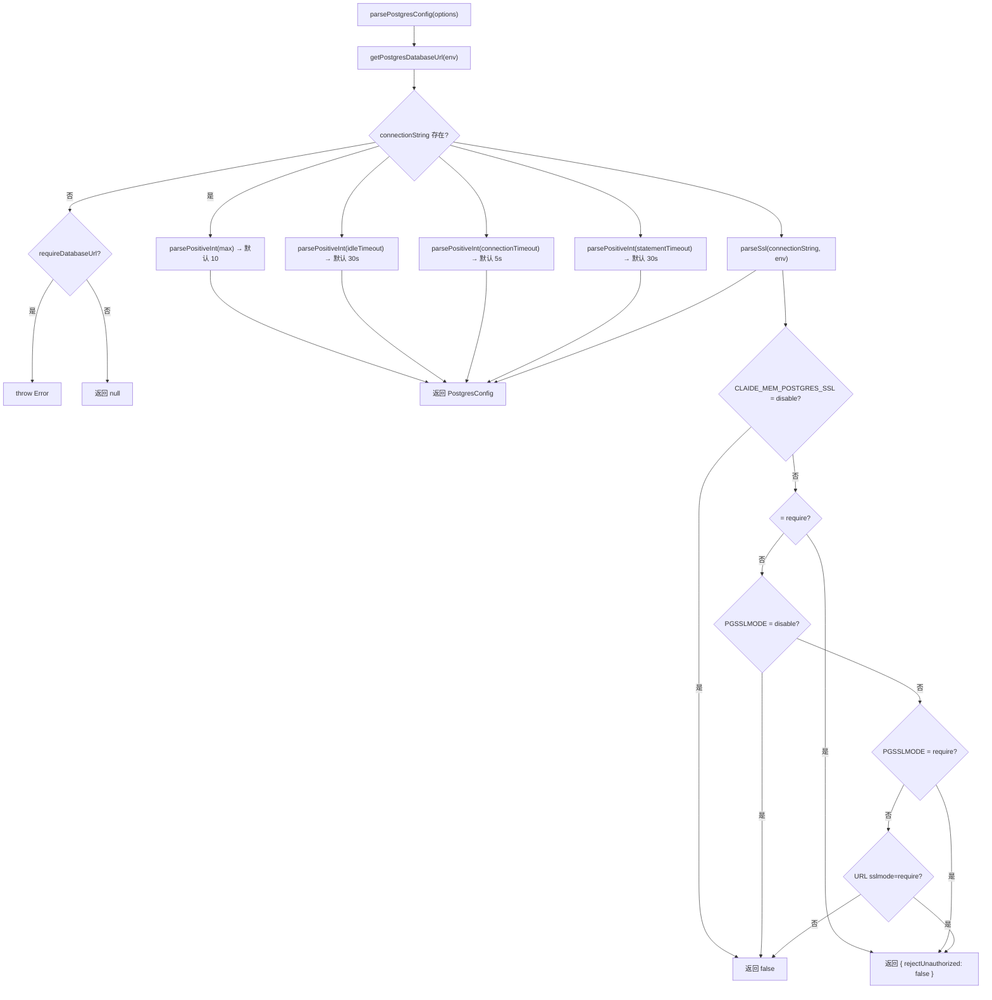

# config.ts 需求说明

> 源文件：`src/storage/postgres/config.ts` ｜ 类型：源码 ｜ 行数：73 ｜ 所属模块：storage/postgres ｜ 分析日期：2026-07-23

## 1. 文件定位总述

本文件是 PostgreSQL 连接配置的解析模块，负责从环境变量中读取并构造 `PostgresConfig` 对象。它定义了连接字符串、连接池参数、语句超时和 SSL 等全部配置项及其默认值，支持灵活的环境变量覆盖和可选的 requireDatabaseUrl 校验模式。

## 2. 功能需求

总述：系统应当从环境变量中解析 PostgreSQL 连接配置，在缺失必要配置时按需抛出异常或返回 null，并对各数值参数做正整数安全解析。

| 编号 | 需求描述（系统应当…） | 触发条件 / 输入 | 处理规则与输出 | 证据 |
|------|----------------------|----------------|---------------|------|
| FR-cfg-url-01 | 系统应当从环境变量 `CLAUDE_MEM_SERVER_DATABASE_URL` 获取连接字符串 | 调用 `getPostgresDatabaseUrl(env)` | 返回值或 null（未设置时） | `src/storage/postgres/config.ts:22-24` |
| FR-cfg-parse-01 | 系统应当解析完整的 PostgresConfig 对象 | 调用 `parsePostgresConfig(options)` | 从环境变量获取 connectionString；若 requireDatabaseUrl=true 且缺失则抛异常；解析 max/idleTimeout/connectionTimeout/statementTimeout/ssl 各项 | `src/storage/postgres/config.ts:26-44` |
| FR-cfg-int-01 | 系统应当安全解析正整数参数 | 环境变量值为字符串时 | `parsePositiveInt` 仅接受 >0 的有限整数，否则回退到默认值 | `src/storage/postgres/config.ts:46-52` |
| FR-cfg-ssl-01 | 系统应当从多个来源确定 SSL 配置 | 检查 SSL 设置时 | 优先级：`CLAUDE_MEM_POSTGRES_SSL` > `PGSSLMODE` > 连接字符串 `sslmode=require` 参数；`disable` 返回 false，`require` 返回 `{ rejectUnauthorized: false }`，其他返回 false | `src/storage/postgres/config.ts:54-72` |

## 3. 业务规则与约束

1. **默认值**：
   - `max`（连接池大小）：10 `src/storage/postgres/config.ts:17`
   - `idleTimeoutMillis`：30,000（30s）`src/storage/postgres/config.ts:18`
   - `connectionTimeoutMillis`：5,000（5s）`src/storage/postgres/config.ts:19`
   - `statementTimeoutMillis`：30,000（30s）`src/storage/postgres/config.ts:20`
2. **requireDatabaseUrl 双模式**：默认 true（必须配置），设为 false 时返回 null 而非抛异常，适用于 Postgres 可选的场景。`src/storage/postgres/config.ts:29-33`
3. **SSL 环境变量优先级**：`CLAUDE_MEM_POSTGRES_SSL` 优先于 `PGSSLMODE`（标准 PG 环境变量）。`src/storage/postgres/config.ts:55-59`
4. **连接字符串 SSL 解析**：当环境变量均未设置时，尝试从 `connectionString` 的 `sslmode=require` 查询参数推断 SSL。`src/storage/postgres/config.ts:62-66`

## 4. 对外暴露

| 名称 | 类型 | 说明 |
|------|------|------|
| `PostgresConfig` | exported interface | 完整配置结构 |
| `ParsePostgresConfigOptions` | exported interface | 解析选项（env、requireDatabaseUrl） |
| `getPostgresDatabaseUrl` | exported function | 获取连接字符串 |
| `parsePostgresConfig` | exported function | 解析完整配置 |

### PostgresConfig 字段

| 字段 | 类型 | 说明 |
|------|------|------|
| connectionString | string | PostgreSQL 连接字符串 |
| max | number | 连接池最大连接数 |
| idleTimeoutMillis | number | 空闲连接超时（ms） |
| connectionTimeoutMillis | number | 连接超时（ms） |
| statementTimeoutMillis | number | 语句超时（ms） |
| ssl | boolean \| { rejectUnauthorized: boolean } | SSL 配置 |

## 5. 依赖关系

- **上游依赖**：无外部依赖（仅使用 `process.env` 和原生 `URL`）
- **下游调用方**：`pool.ts`（通过 `parsePostgresConfig` 创建连接池）

## 6. 数据结构

不适用（接口结构见§4）。

## 7. 复杂逻辑图示

## 8. 逆向备注

无。
