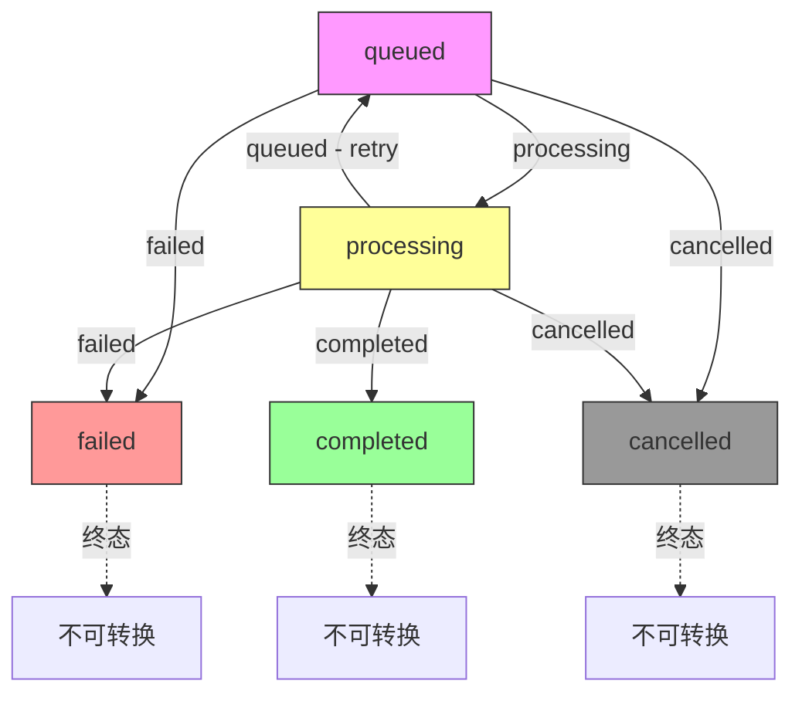

# generation-jobs.ts 需求说明

> 源文件：src/storage/postgres/generation-jobs.ts ｜ 类型：源码 ｜ 行数：458 ｜ 所属模块：storage/postgres ｜ 分析日期：2026-07-23

## 1. 文件定位总述

本文件是"观察生成任务"（Observation Generation Job）及其事件日志的 PostgreSQL Repository 实现。它管理异步生成任务的全生命周期——创建（含幂等）、状态流转（有限状态机）、按状态查询、以及事件追加与查询。任务支持三种来源类型（agent_event、session_summary、observation_reindex），每种类型在创建时有不同的归属校验规则。状态机在代码层和 SQL 层双重保证转换合法性。

## 2. 功能需求

| 编号 | 需求描述（系统应当…） | 触发条件 / 输入 | 处理规则与输出 | 证据 |
|------|----------------------|----------------|---------------|------|
| FR-JOB-01 | 创建生成任务时，系统应当先根据 sourceType 校验来源实体的归属权与一致性 | 调用 `create()` | agent_event → 校验 event 归属 + sourceId 必须等于 agentEventId + 可选校验 sessionId 匹配；session_summary → 校验 session 归属 + sourceId 必须等于 sessionId；observation_reindex → 校验 observation 归属 | `src/storage/postgres/generation-jobs.ts:244-292` |
| FR-JOB-02 | 系统应当基于幂等键生成任务，相同 idempotency_key 的任务做 payload 合并更新 | INSERT 语句 | 幂等键格式 `observation_generation_job:v1:<hash>`；ON CONFLICT (idempotency_key) DO UPDATE SET payload = ... \|\| excluded.payload | `src/storage/postgres/generation-jobs.ts:117,127-129` |
| FR-JOB-03 | 系统应当在状态转换时自动维护 attempts、时间戳、锁定等衍生字段 | 调用 `transitionStatus()` | processing → attempts+1, 设置 locked_at/locked_by；queued → 设置 next_attempt_at；completed/failed/cancelled → 设置对应时间戳 | `src/storage/postgres/generation-jobs.ts:177-186` |
| FR-JOB-04 | 系统应当在 SQL 层通过 WHERE 条件强制状态机的合法转换规则 | UPDATE 语句 | queued → 仅允许 processing/failed/cancelled；processing → 仅允许 queued/completed/failed/cancelled；且 attempts < max_attempts | `src/storage/postgres/schema.ts:192-197` |
| FR-JOB-05 | 系统应当在状态转换失败时（SQL 无匹配行），通过代码层断言给出精确的错误原因 | transitionStatus 返回 null 时 | 重新查询当前状态，调用 `assertValidJobStatusTransition()` 抛出具体错误 | `src/storage/postgres/generation-jobs.ts:214-223` |
| FR-JOB-06 | 系统应当提供按 status + project + team 过滤查询任务列表的方法 | 调用 `listByStatusForScope()` | ORDER BY created_at ASC LIMIT，默认 limit 100 | `src/storage/postgres/generation-jobs.ts:226-242` |
| FR-JOB-07 | 系统应当提供追加任务事件日志的方法，通过 INNER JOIN 验证 job 归属 | 调用 `append()` | INSERT ... SELECT FROM jobs WHERE jobs.id = $2 AND jobs.project_id = $3；job 不存在则抛异常 | `src/storage/postgres/generation-jobs.ts:298-336` |
| FR-JOB-08 | 系统应当提供查询指定任务的全部事件日志的方法 | 调用 `listByJobForScope()` | INNER JOIN jobs 保证作用域隔离，ORDER BY created_at ASC | `src/storage/postgres/generation-jobs.ts:338-355` |
| FR-JOB-09 | 系统应当提供构建任务幂等键的工具函数 | 调用 `buildObservationGenerationJobIdempotencyKey()` | 格式 `observation_generation_job:v1:<deterministicKey([teamId, projectId, sourceType, sourceId, jobType])>` | `src/storage/postgres/generation-jobs.ts:357-371` |

## 3. 业务规则与约束

| 编号 | 规则描述 | 证据 |
|------|---------|------|
| BR-JOB-01 | 任务状态机：queued → processing/failed/cancelled；processing → queued/completed/failed/cancelled；completed/failed/cancelled 为终态，不可转换 | `src/storage/postgres/generation-jobs.ts:390-396` |
| BR-JOB-02 | 终态（completed/failed/cancelled）的任务不允许任何状态转换 | `src/storage/postgres/generation-jobs.ts:402-404` |
| BR-JOB-03 | 当 attempts >= maxAttempts 时，不允许转为 processing 或 queued（防止无限重试） | `src/storage/postgres/generation-jobs.ts:410-416` |
| BR-JOB-04 | agent_event 类型的任务，agent_event_id 必须非空且等于 source_id | `src/storage/postgres/generation-jobs.ts:253-261` |
| BR-JOB-05 | session_summary 类型的任务，source_id 必须等于 server_session_id | `src/storage/postgres/generation-jobs.ts:274-277` |
| BR-JOB-06 | 默认 maxAttempts 为 3 | `src/storage/postgres/generation-jobs.ts:144` |

## 4. 对外暴露

| 导出项 | 类型 | 用途 |
|--------|------|------|
| `PostgresObservationGenerationJobRepository` | class | 任务 Repository：create、getByIdForScope、transitionStatus、listByStatusForScope |
| `PostgresObservationGenerationJobEventsRepository` | class | 事件 Repository：append、listByJobForScope |
| `PostgresObservationGenerationJob` | interface | 任务领域模型 |
| `PostgresObservationGenerationJobEvent` | interface | 事件领域模型 |
| `ObservationGenerationJobSourceType` | type | 来源类型联合字面量 |
| `ObservationGenerationJobStatus` | type | 状态联合字面量 |
| `ObservationGenerationJobEventType` | type | 事件类型联合字面量 |
| `buildObservationGenerationJobIdempotencyKey` | function | 构建幂等键工具函数 |

## 5. 依赖关系

- **内部依赖**：`./utils.js`（PostgresQueryable、assertProjectOwnership、assertSessionOwnership、deterministicKey、newId、queryOne、toDate、toEpoch、toJsonObject）
- **被依赖**：上层服务层（如 observation 生成管线）调用本文件管理任务生命周期

## 6. 数据结构

**PostgresObservationGenerationJob**：id, projectId, teamId, agentEventId, sourceType, sourceId, serverSessionId, jobType, status, idempotencyKey, bullmqJobId, attempts, maxAttempts, nextAttemptAtEpoch, lockedAtEpoch, lockedBy, completedAtEpoch, failedAtEpoch, cancelledAtEpoch, lastError(JsonObject|null), payload(JsonObject), createdAtEpoch, updatedAtEpoch

**PostgresObservationGenerationJobEvent**：id, generationJobId, eventType, statusAfter, attempt, details(JsonObject), createdAtEpoch

## 7. 复杂逻辑图示

上图展示了生成任务的状态机。queued 和 processing 为活跃态，completed/failed/cancelled 为终态。processing 可退回到 queued 实现重试，但受 maxAttempts 上限约束。

## 8. 逆向备注

- 状态机验证采用"SQL 层 WHERE 条件 + 代码层 assertValidJobStatusTransition"双重保证策略，SQL 层用于原子性条件更新，代码层用于在 SQL 未命中时提供精确错误信息。
- normalizeSourceModel 函数在 agent_event 场景下默认 agentEventId = sourceId，在 session_summary 场景下默认 serverSessionId = sourceId，这种 fallback 设计简化了上层调用方的参数传递。
