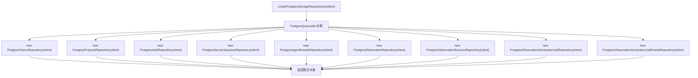

# index.ts（Postgres storage）需求说明

> 源文件：`src/storage/postgres/index.ts` ｜ 类型：源码 ｜ 行数：52 ｜ 所属模块：storage/postgres ｜ 分析日期：2026-07-23

## 1. 文件定位总述

本文件是 PostgreSQL 存储层的统一入口模块，兼具 barrel 重导出和 Repository 工厂两个职责。它将所有 Postgres 子模块的公开符号汇聚导出，同时提供 `PostgresStorageRepositories` 接口和 `createPostgresStorageRepositories` 工厂函数，允许调用方通过一个查询对象（`PostgresQueryable`）一次性获取全部 Repository 实例。

## 2. 功能需求

| 编号 | 需求描述（系统应当…） | 触发条件 / 输入 | 处理规则与输出 | 证据 |
|------|----------------------|----------------|---------------|------|
| FR-barrel-01 | 系统应当统一导出所有 Postgres 子模块符号 | 外部 import | 通过 `export *` 重导出 agent-events、auth、config、generation-jobs、observations、pool、projects、schema、server-sessions、teams、utils 的全部公开符号 | `src/storage/postgres/index.ts:15-25` |
| FR-factory-01 | 系统应当提供 Repository 工厂函数 | 调用 `createPostgresStorageRepositories(client)` | 接收一个 `PostgresQueryable` 实例，创建并返回包含 9 个 Repository 的聚合对象 | `src/storage/postgres/index.ts:39-51` |

## 3. 业务规则与约束

1. **模块许可证**：Apache-2.0。`src/storage/postgres/index.ts:1`
2. **type-only 导出**：`utils.ts` 仅导出类型（`export type *`），避免运行时副作用。`src/storage/postgres/index.ts:25`

## 4. 对外暴露

| 名称 | 类型 | 说明 |
|------|------|------|
| `PostgresStorageRepositories` | exported interface | 9 个 Repository 的聚合接口 |
| `createPostgresStorageRepositories()` | exported function | Repository 工厂 |
| 各子模块全部公开符号 | re-export | 通过 barrel 导出 |

### PostgresStorageRepositories 包含的 Repository

| 属性 | Repository 类 | 来源模块 |
|------|--------------|----------|
| teams | `PostgresTeamsRepository` | `./teams.js` |
| projects | `PostgresProjectsRepository` | `./projects.js` |
| auth | `PostgresAuthRepository` | `./auth.js` |
| sessions | `PostgresServerSessionsRepository` | `./server-sessions.js` |
| agentEvents | `PostgresAgentEventsRepository` | `./agent-events.js` |
| observations | `PostgresObservationRepository` | `./observations.js` |
| observationSources | `PostgresObservationSourcesRepository` | `./observations.js` |
| observationGenerationJobs | `PostgresObservationGenerationJobRepository` | `./generation-jobs.js` |
| observationGenerationJobEvents | `PostgresObservationGenerationJobEventsRepository` | `./generation-jobs.js` |

## 5. 依赖关系

- **内部依赖**：agent-events、auth、generation-jobs、observations、projects、server-sessions、teams、utils、config、pool、schema
- **下游调用方**：推断为 Server 模式的初始化代码或 DI 容器

## 6. 数据结构

### PostgresStorageRepositories

```typescript
interface PostgresStorageRepositories {
  teams: PostgresTeamsRepository;
  projects: PostgresProjectsRepository;
  auth: PostgresAuthRepository;
  sessions: PostgresServerSessionsRepository;
  agentEvents: PostgresAgentEventsRepository;
  observations: PostgresObservationRepository;
  observationSources: PostgresObservationSourcesRepository;
  observationGenerationJobs: PostgresObservationGenerationJobRepository;
  observationGenerationJobEvents: PostgresObservationGenerationJobEventsRepository;
}
```

## 7. 复杂逻辑图示



## 8. 逆向备注

1. **未在本文件定义的子模块**：`generation-jobs.ts`、`observations.ts` 未出现在本批次分析列表中，但被本文件引用。推断这些文件存在于同目录下。
