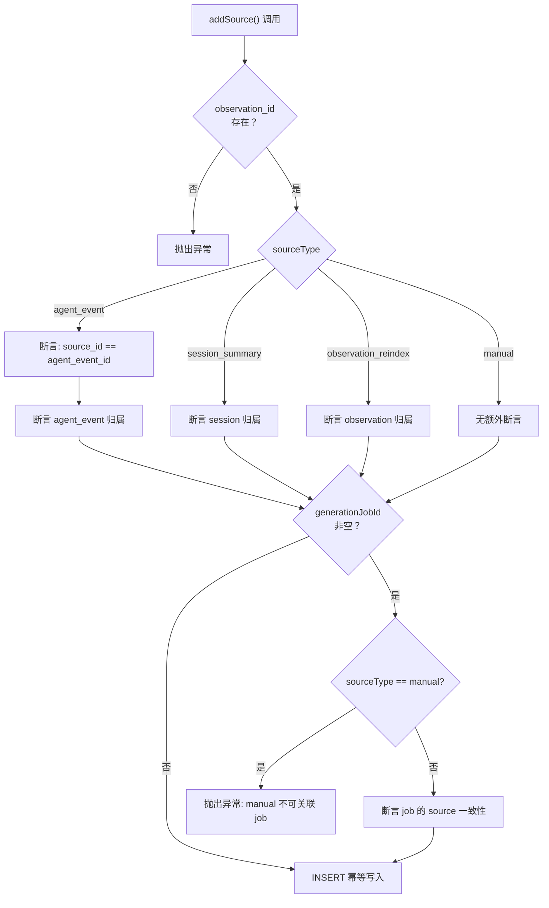

# observations.ts 需求说明

> 源文件：src/storage/postgres/observations.ts ｜ 类型：源码 ｜ 行数：396 ｜ 所属模块：storage/postgres ｜ 分析日期：2026-07-23

## 1. 文件定位总述

本文件是 PostgreSQL 存储层中"观察记录"（Observation）及其来源追溯（ObservationSource）的 Repository 实现。它封装了对 `observations` 和 `observation_sources` 两张表的全部 CRUD 与全文检索操作，并在每次写入前强制执行多租户作用域校验（project × team）以及来源归属权断言。上层服务通过调用本文件的 Repository 方法来完成观察数据的持久化与查询，不直接接触 SQL。

## 2. 功能需求

| 编号 | 需求描述（系统应当…） | 触发条件 / 输入 | 处理规则与输出 | 证据 |
|------|----------------------|----------------|---------------|------|
| FR-OBS-01 | 创建观察记录时，系统应当先断言 project 归属于 team，再执行 INSERT；当提供 serverSessionId 时须额外校验 session 归属；当提供 createdByJobId 时须额外校验 generation job 归属 | 调用 `PostgresObservationRepository.create()` | 先调 `assertProjectOwnership`，再可选调 `assertSessionOwnership` 和 `assertJobOwnership`，然后执行 INSERT ... ON CONFLICT UPSERT | `src/storage/postgres/observations.ts:84-90` |
| FR-OBS-02 | 系统应当在创建观察记录时支持基于 generation_key 的幂等去重：相同 team_id + project_id + generation_key 的记录只更新 updated_at，不插入新行 | INSERT 语句包含 ON CONFLICT 子句 | ON CONFLICT (team_id, project_id, generation_key) WHERE generation_key IS NOT NULL DO UPDATE SET updated_at = observations.updated_at | `src/storage/postgres/observations.ts:100-101` |
| FR-OBS-03 | 系统应当提供按 ID + project + team 三重条件精确查询观察记录的方法 | 调用 `getByIdForScope()` | SELECT ... WHERE id = $1 AND project_id = $2 AND team_id = $3，未命中返回 null | `src/storage/postgres/observations.ts:127-128` |
| FR-OBS-04 | 系统应当提供按 project 分页列表查询观察记录的方法，支持可选的 serverSessionId 过滤 | 调用 `listByProject()` | SELECT ... ORDER BY created_at DESC LIMIT，默认 limit 100，serverSessionId 为空时不做过滤（IS NULL OR =） | `src/storage/postgres/observations.ts:139-149` |
| FR-OBS-05 | 系统应当提供基于 PostgreSQL 全文检索（tsquery）的观察内容搜索方法 | 调用 `search()` | 使用 `websearch_to_tsquery('english', $3)` 进行全文匹配，按 `ts_rank` 降序 + updated_at 降序排序，默认 limit 20 | `src/storage/postgres/observations.ts:160-169` |
| FR-OBS-06 | 添加观察来源时，系统应当先验证 observation_id 在 project/team 作用域内存在，然后根据 sourceType 执行不同的归属权断言 | 调用 `PostgresObservationSourcesRepository.addSource()` | agent_event → 断言 agent event 归属 + source_id 必须等于 agent_event_id；session_summary → 断言 session 归属；observation_reindex → 断言 observation 归属 | `src/storage/postgres/observations.ts:188-219` |
| FR-OBS-07 | 系统应当在添加观察来源时，如果指定了 generationJobId，必须校验该 job 的 source_type/source_id/agent_event_id 与当前观察来源完全匹配；manual 类型禁止关联 generation_job_id | generationJobId 非空时触发 | 调用 `assertGenerationJobMatchesSource()`，manual 类型直接抛异常 | `src/storage/postgres/observations.ts:211-220`, `src/storage/postgres/observations.ts:306-308` |
| FR-OBS-08 | 系统应当在添加观察来源时支持幂等：相同 observation_id + source_type + source_id 的记录做 metadata 合并更新 | INSERT 语句 | ON CONFLICT (observation_id, source_type, source_id) DO UPDATE SET metadata = ... || excluded.metadata | `src/storage/postgres/observations.ts:230-231` |
| FR-OBS-09 | 系统应当提供按 observation_id 查询其所有来源记录的方法，并通过 INNER JOIN observations 保障作用域隔离 | 调用 `listByObservationForScope()` | INNER JOIN observations ON id = observation_id，WHERE observation_id = $1 AND project_id = $2 AND team_id = $3 | `src/storage/postgres/observations.ts:252-265` |
| FR-OBS-10 | 系统应当提供构建观察 generation_key 的工具函数，格式为 `generation:v1:<jobId>:<index>:<deterministicKey>` | 调用 `buildObservationGenerationKey()` | 拼接 generationJobId + parsedObservationIndex + canonicalJson(content.trim()) 的确定性哈希 | `src/storage/postgres/observations.ts:269-277` |

## 3. 业务规则与约束

| 编号 | 规则描述 | 证据 |
|------|---------|------|
| BR-OBS-01 | 所有写入操作必须经过 project × team 作用域校验，跨租户数据不可见不可写 | `src/storage/postgres/observations.ts:84` |
| BR-OBS-02 | agent_event 类型的观察来源，其 source_id 必须等于 agent_event_id（二者都指向同一 agent event） | `src/storage/postgres/observations.ts:197-204` |
| BR-OBS-03 | manual 类型的观察来源不允许关联 generation_job_id（手动添加不属于任何生成任务） | `src/storage/postgres/observations.ts:306-308` |
| BR-OBS-04 | 观察来源的四种类型为：agent_event、session_summary、observation_reindex、manual | `src/storage/postgres/observations.ts:15` |

## 4. 对外暴露

| 导出项 | 类型 | 用途 |
|--------|------|------|
| `PostgresObservationRepository` | class | 观察记录 Repository，方法：create、getByIdForScope、listByProject、search |
| `PostgresObservationSourcesRepository` | class | 观察来源 Repository，方法：addSource、listByObservationForScope |
| `PostgresObservation` | interface | 观察记录的领域模型（camelCase） |
| `PostgresObservationSource` | interface | 观察来源的领域模型 |
| `ObservationSourceType` | type | 来源类型联合字面量 |
| `buildObservationGenerationKey` | function | 构建 generation_key 的工具函数 |

## 5. 依赖关系

- **内部依赖**：`./utils.js`（PostgresQueryable、assertProjectOwnership、assertSessionOwnership、canonicalJson、deterministicKey、newId、queryOne、toEpoch、toJsonObject）
- **被依赖**：上层 service 层调用本文件的 Repository 进行观察数据持久化

## 6. 数据结构

**PostgresObservation**（输出模型）：id, projectId, teamId, serverSessionId, kind, content, generationKey, metadata(JsonObject), embedding(JsonValue|null), createdByJobId, createdAtEpoch, updatedAtEpoch

**PostgresObservationSource**（输出模型）：id, observationId, agentEventId, generationJobId, sourceType(ObservationSourceType), sourceId, metadata(JsonObject), createdAtEpoch

## 7. 复杂逻辑图示

addSource 方法的多层级归属校验流程如上图所示，确保观察来源关联的数据实体均归属于同一 project/team 作用域。

## 8. 逆向备注

- 所有私有断言函数（assertJobOwnership、assertGenerationJobMatchesSource、assertAgentEventOwnership、assertObservationOwnership）均内聚于本文件，未对外暴露。
- `mapObservationRow` 和 `mapObservationSourceRow` 将数据库 snake_case 行映射为 camelCase 领域模型，属于标准的 ORM 映射模式。
