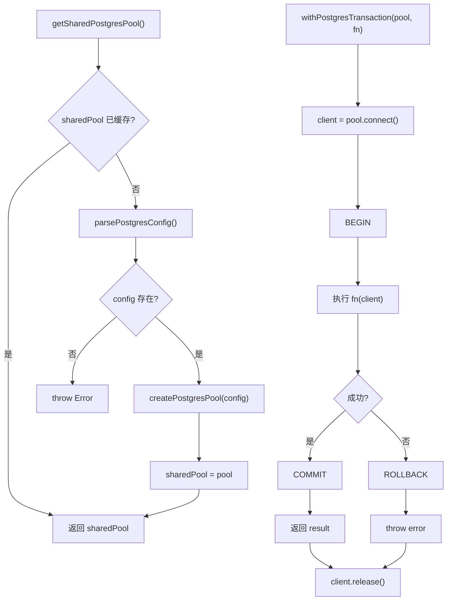

# pool.ts 需求说明

> 源文件：`src/storage/postgres/pool.ts` ｜ 类型：源码 ｜ 行数：69 ｜ 所属模块：storage/postgres ｜ 分析日期：2026-07-23

## 1. 文件定位总述

本文件是 PostgreSQL 连接池的管理模块，负责连接池的创建、共享单例获取、健康检查、事务包装和优雅关闭。它是整个 Postgres 存储层的基础设施层，被各 Repository 和上层服务依赖。通过 `getSharedPostgresPool` 提供进程级单例连接池，避免重复创建。

## 2. 功能需求

| 编号 | 需求描述（系统应当…） | 触发条件 / 输入 | 处理规则与输出 | 证据 |
|------|----------------------|----------------|---------------|------|
| FR-pool-create-01 | 系统应当根据配置创建 PostgreSQL 连接池 | 调用 `createPostgresPool(config)` | 使用 `pg.Pool` 构造，传入 connectionString、max、idleTimeoutMillis、connectionTimeoutMillis、statementTimeout、ssl 参数 | `src/storage/postgres/pool.ts:13-22` |
| FR-pool-singleton-01 | 系统应当提供进程级共享连接池单例 | 调用 `getSharedPostgresPool(options)` | 首次调用时从环境变量解析配置并创建连接池缓存到 `sharedPool`；后续调用直接返回缓存的同一实例 | `src/storage/postgres/pool.ts:24-34` |
| FR-pool-singleton-02 | 系统应当在环境变量未配置时抛出明确异常 | `requireDatabaseUrl=true`（默认）且 `CLAUDE_MEM_SERVER_DATABASE_URL` 未设置时 | 抛出 `Error('Postgres requires CLAUDE_MEM_SERVER_DATABASE_URL')` | `src/storage/postgres/pool.ts:29-30` |
| FR-pool-health-01 | 系统应当提供连接池健康检查能力 | 调用 `checkPostgresHealth(pool)` | 执行 `SELECT 1`；成功返回 true，异常返回 false | `src/storage/postgres/pool.ts:36-43` |
| FR-pool-tx-01 | 系统应当提供事务执行包装器 | 调用 `withPostgresTransaction(pool, fn)` | 从池中获取 client，BEGIN → 执行 fn → COMMIT；异常时 ROLLBACK 后重新抛出；finally 中释放 client | `src/storage/postgres/pool.ts:45-61` |
| FR-pool-close-01 | 系统应当支持关闭连接池 | 调用 `closePostgresPool(pool)` | 若关闭的是共享单例池，同时清除 `sharedPool` 引用；调用 `pool.end()` 关闭 | `src/storage/postgres/pool.ts:63-68` |

## 3. 业务规则与约束

1. **单例生命周期**：`sharedPool` 为模块级 `let` 变量，`closePostgresPool` 会将 `sharedPool` 置 null，允许进程重启连接池。`src/storage/postgres/pool.ts:11,64`
2. **事务隔离**：`withPostgresTransaction` 使用 `pool.connect()` 获取独占 client，确保事务期间该 client 不被其他操作复用。`src/storage/postgres/pool.ts:49`
3. **statement_timeout**：通过连接池配置全局设置 SQL 语句超时（默认 30s），防止慢查询阻塞。`src/storage/postgres/pool.ts:19`

## 4. 对外暴露

| 名称 | 类型 | 签名 | 说明 |
|------|------|------|------|
| `PostgresPool` | exported type | `PgPool` | pg 连接池类型别名 |
| `PostgresPoolClient` | exported type | `PgPoolClient` | pg 客户端类型别名 |
| `createPostgresPool` | exported function | `(config: PostgresConfig) => PostgresPool` | 创建连接池 |
| `getSharedPostgresPool` | exported function | `(options?) => PostgresPool` | 获取/创建共享单例池 |
| `checkPostgresHealth` | exported function | `(pool: PostgresPool) => Promise<boolean>` | 健康检查 |
| `withPostgresTransaction` | exported function | `<T>(pool, fn) => Promise<T>` | 事务包装器 |
| `closePostgresPool` | exported function | `(pool: PostgresPool) => Promise<void>` | 关闭连接池 |

## 5. 依赖关系

- **上游依赖**：`pg`（npm 包，`Pool`, `PoolClient`）、`./config.js`（`parsePostgresConfig`, `PostgresConfig`）
- **下游调用方**：推断为上层初始化代码、中间件、Repository 工厂

## 6. 数据结构

不适用。

## 7. 复杂逻辑图示

## 8. 逆向备注

无。
