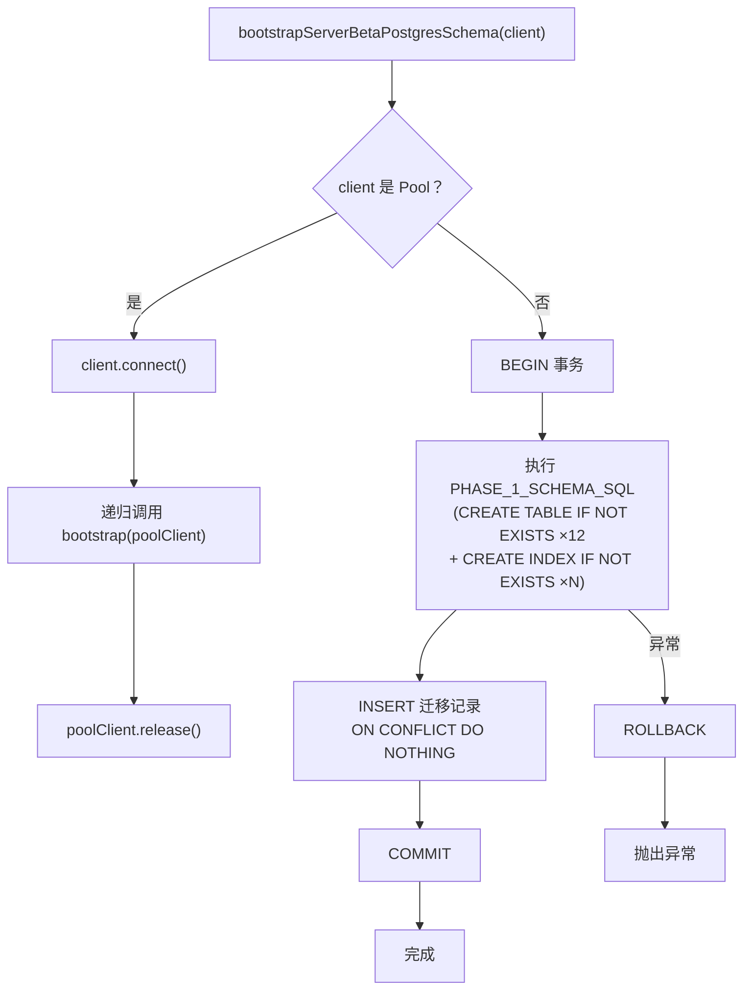

# schema.ts 需求说明

> 源文件：src/storage/postgres/schema.ts ｜ 类型：DDL ｜ 行数：284 ｜ 所属模块：storage/postgres ｜ 分析日期：2026-07-23

## 1. 文件定位总述

本文件是 Server Beta PostgreSQL 模式的引导（bootstrap）模块，负责在首次启动时自动创建全部 12 张业务表及配套索引、约束、迁移记录。它通过事务保证 DDL 的原子性，并支持 Pool 连接与普通 Client 连接两种调用方式。schema 版本控制通过 `server_beta_schema_migrations` 表实现，当前版本为 1。

## 2. 功能需求

| 编号 | 需求描述（系统应当…） | 触发条件 / 输入 | 处理规则与输出 | 证据 |
|------|----------------------|----------------|---------------|------|
| FR-SCHEMA-01 | 系统应当在应用启动时通过 bootstrap 函数自动创建完整的 PostgreSQL schema | 调用 `bootstrapServerBetaPostgresSchema(client)` | 在事务内执行 PHASE_1_SCHEMA_SQL，成功后写入迁移记录，失败则回滚 | `src/storage/postgres/schema.ts:22-49` |
| FR-SCHEMA-02 | 系统应当支持从 Pool 连接自动获取 client 后再执行 bootstrap | 传入的 client 具有 connect() 方法（Pool 特征） | 自动调用 client.connect() 获取单次 client，执行完后 release | `src/storage/postgres/schema.ts:23-31` |
| FR-SCHEMA-03 | 系统应当通过 CREATE TABLE IF NOT EXISTS 保障 DDL 的幂等性 | 多次调用 bootstrap | 每张表使用 IF NOT EXISTS 子句，已存在的表不会被重建 | `src/storage/postgres/schema.ts:73-255` |
| FR-SCHEMA-04 | 系统应当通过迁移记录表防止重复版本升级 | INSERT 迁移记录 | ON CONFLICT (version) DO NOTHING，版本号为主键 | `src/storage/postgres/schema.ts:38-42` |

## 3. 业务规则与约束

| 编号 | 规则描述 | 证据 |
|------|---------|------|
| BR-SCHEMA-01 | DDL 必须在事务（BEGIN/COMMIT/ROLLBACK）内执行，保证原子性 | `src/storage/postgres/schema.ts:33-48` |
| BR-SCHEMA-02 | 总共管理 12 张表：server_beta_schema_migrations、teams、projects、team_members、api_keys、audit_log、server_sessions、agent_events、observation_generation_jobs、observations、observation_sources、observation_generation_job_events | `src/storage/postgres/schema.ts:7-20` |
| BR-SCHEMA-03 | projects 表的 team_id 使用物理外键 REFERENCES teams(id) ON DELETE CASCADE（与本项目的"禁用物理外键"规则不同，这是 PostgreSQL Server Beta 模式） | `src/storage/postgres/schema.ts:89` |
| BR-SCHEMA-04 | observation_generation_jobs 表有复合 CHECK 约束，根据 source_type 强制 agent_event_id / server_session_id 的有无 | `src/storage/postgres/schema.ts:201-207` |
| BR-SCHEMA-05 | observations 表使用 GENERATED ALWAYS AS (to_tsvector('english', content)) STORED 列实现预计算全文搜索向量 | `src/storage/postgres/schema.ts:219` |
| BR-SCHEMA-06 | api_keys 和 audit_log 表都有 CHECK (project_id IS NULL OR team_id IS NOT NULL) 约束，确保 project 级资源必须关联 team | `src/storage/postgres/schema.ts:118,133` |

## 4. 对外暴露

| 导出项 | 类型 | 用途 |
|--------|------|------|
| `SERVER_BETA_POSTGRES_SCHEMA_VERSION` | const (值为 1) | 当前 schema 版本号 |
| `SERVER_BETA_POSTGRES_TABLES` | readonly tuple | 全部 12 张表名列表，供测试或清理使用 |
| `bootstrapServerBetaPostgresSchema` | async function | schema 引导入口，接收 PostgresQueryable |

## 5. 依赖关系

- **内部依赖**：`./utils.js`（PostgresQueryable 类型）
- **被依赖**：应用初始化流程在首次连接数据库时调用 bootstrap

## 6. 数据结构

### 核心表结构概览

| 表名 | 主键 | 核心索引 | 业务含义 |
|------|------|---------|---------|
| teams | id (TEXT) | — | 租户/团队 |
| projects | id (TEXT) | idx_projects_team(team_id, id) | 项目，UNIQUE(id, team_id) |
| team_members | (team_id, user_id) | — | 团队成员关系 |
| api_keys | id (TEXT) | key_hash UNIQUE | API 密钥 |
| audit_log | id (TEXT) | idx_audit_log_scope_created | 审计日志 |
| server_sessions | id (TEXT) | idx_server_sessions_project_idempotency | 会话，UNIQUE(project_id, external_session_id) |
| agent_events | id (TEXT) | idx_agent_events_project_session, idx_agent_events_team_project | Agent 事件 |
| observation_generation_jobs | id (TEXT) | idx_observation_jobs_status_next_attempt 等 | 观察生成任务 |
| observations | id (TEXT) | idx_observations_content_search(GIN) 等 | 观察记录 |
| observation_sources | id (TEXT) | idx_observation_sources_event, idx_observation_sources_source | 观察来源追溯 |
| observation_generation_job_events | id (TEXT) | idx_observation_job_events_job_created | 任务事件日志 |

## 7. 复杂逻辑图示

schema 引导流程采用递归模式处理 Pool vs Client 两种连接类型，DDL 全部在事务内执行以保证原子性。

## 8. 逆向备注

- Pool 检测使用鸭子类型（检查 connect、totalCount、idleCount 等属性），而非 instanceof，兼容不同 pg 驱动实现。
- `CREATE TABLE IF NOT EXISTS` 与 `ON CONFLICT (version) DO NOTHING` 组合确保 bootstrap 可安全重复调用。
- observations 表的 content_search 列先在 CREATE TABLE 中定义，又在 ALTER TABLE 中用 ADD COLUMN IF NOT EXISTS 重复声明，推断是为了兼容从旧 schema 迁移的场景（`src/storage/postgres/schema.ts:259`）。
- DROP CONSTRAINT IF EXISTS 语句暗示曾经存在这些约束，用于清理旧版本遗留（`src/storage/postgres/schema.ts:260-261`）。
