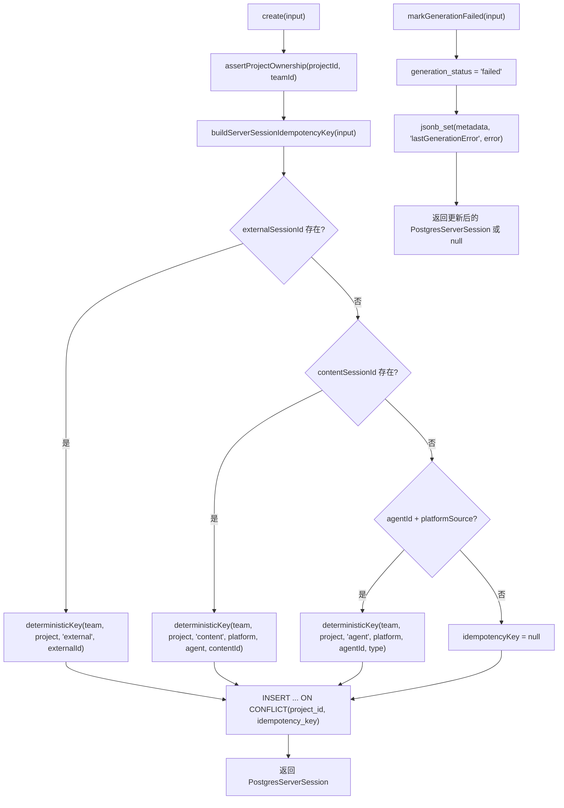
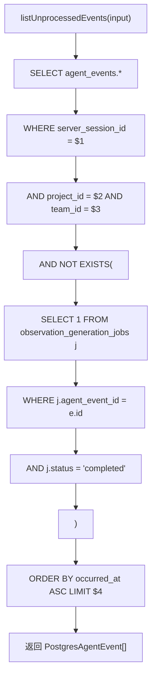

# server-sessions.ts（Postgres）需求说明

> 源文件：`src/storage/postgres/server-sessions.ts` ｜ 类型：源码 ｜ 行数：361 ｜ 所属模块：storage/postgres ｜ 分析日期：2026-07-23

## 1. 文件定位总述

本文件是 PostgreSQL 存储层中服务会话（ServerSession）实体的 Repository 实现，是本批次中功能最丰富的 Postgres Repository。它提供会话的幂等创建（基于确定性 idempotency key）、生命周期状态流转（创建→处理中→完成/失败）、未处理事件查询，以及外部会话/内容会话/Agent 等多种维度的关联查询。它是 Server 模式下观察值生成管道的核心数据端。

## 2. 功能需求

| 编号 | 需求描述（系统应当…） | 触发条件 / 输入 | 处理规则与输出 | 证据 |
|------|----------------------|----------------|---------------|------|
| FR-pss-create-01 | 系统应当幂等创建服务会话 | 调用 `create(input)` | 先 `assertProjectOwnership` 校验归属；通过 `buildServerSessionIdempotencyKey` 计算幂等键；`ON CONFLICT (project_id, idempotency_key) WHERE idempotency_key IS NOT NULL DO UPDATE` 实现幂等写入；返回 PostgresServerSession | `src/storage/postgres/server-sessions.ts:48-97` |
| FR-pss-get-scope-01 | 系统应当在租户范围内按 ID 查询会话 | 调用 `getByIdForScope({ id, projectId, teamId })` | WHERE 匹配三元组 | `src/storage/postgres/server-sessions.ts:99-110` |
| FR-pss-list-01 | 系统应当列出项目的全部会话 | 调用 `listByProject(projectId, teamId)` | 按 `started_at DESC` 排序 | `src/storage/postgres/server-sessions.ts:112-122` |
| FR-pss-external-01 | 系统应当按外部会话 ID 查询 | 调用 `findByExternalIdForScope({ externalSessionId, projectId, teamId })` | 在租户范围内匹配 | `src/storage/postgres/server-sessions.ts:124-138` |
| FR-pss-end-01 | 系统应当幂等结束会话 | 调用 `endSession({ id, projectId, teamId })` | `COALESCE(ended_at, now())` 确保仅首次设置生效；`CASE WHEN ended_at IS NULL` 仅首次更新 updated_at | `src/storage/postgres/server-sessions.ts:145-162` |
| FR-pss-gen-start-01 | 系统应当标记生成状态为处理中 | 调用 `markGenerationStarted(input)` | `generation_status = 'processing'` | `src/storage/postgres/server-sessions.ts:164-180` |
| FR-pss-gen-done-01 | 系统应当标记生成状态为已完成 | 调用 `markGenerationCompleted(input)` | `generation_status = 'completed', last_generated_at = now()` | `src/storage/postgres/server-sessions.ts:182-200` |
| FR-pss-gen-fail-01 | 系统应当标记生成状态为失败并记录错误信息 | 调用 `markGenerationFailed(input)` | `generation_status = 'failed'`；通过 `jsonb_set` 将 error 写入 `metadata.lastGenerationError` | `src/storage/postgres/server-sessions.ts:202-226` |
| FR-pss-unproc-01 | 系统应当查询会话中未处理的 Agent 事件 | 调用 `listUnprocessedEvents(input)` | 查找 `agent_events` 中关联该 session 且不存在已完成的 `observation_generation_jobs` 的事件；按 `occurred_at ASC` 排序，默认 limit=500 | `src/storage/postgres/server-sessions.ts:233-261` |

## 3. 业务规则与约束

1. **幂等键生成优先级**：externalSessionId > contentSessionId > agentId+platformSource；无匹配时幂等键为 null（非幂等创建）。`src/storage/postgres/server-sessions.ts:298-339`
2. **确定性幂等键**：使用 SHA-256 哈希（`deterministicKey`）确保相同输入组合产生相同幂等键。`src/storage/postgres/server-sessions.ts:308-314`
3. **租户隔离**：所有查询和更新操作均携带 `(projectId, teamId)` 二元组作为 WHERE 条件。`src/storage/postgres/server-sessions.ts:106-109`
4. **generation_status 生命周期**：`idle` → `processing` → `completed`/`failed`，每次状态转换独立方法。`src/storage/postgres/server-sessions.ts:92,173,190,213`
5. **错误持久化**：失败时将错误信息通过 `jsonb_set` 写入 metadata 的 `lastGenerationError` 字段，而非单独的错误表。`src/storage/postgres/server-sessions.ts:214-216`
6. **未处理事件过滤**：使用 `NOT EXISTS` 子查询排除已有完成 generation_job 的事件，实现 Exactly-Once 处理语义。`src/storage/postgres/server-sessions.ts:247-254`

## 4. 对外暴露

| 名称 | 类型 | 签名 | 说明 |
|------|------|------|------|
| `PostgresServerSession` | exported interface | 含 id, projectId, teamId, externalSessionId, idempotencyKey, contentSessionId, agentId, agentType, platformSource, generationStatus, metadata 等 | 会话实体 |
| `PostgresServerSessionsRepository` | exported class | 构造函数接收 `PostgresQueryable` | 会话 Repository |
| `create()` | public async method | `(input) => Promise<PostgresServerSession>` | 幂等创建 |
| `getByIdForScope()` | public async method | `(input) => Promise<PostgresServerSession \| null>` | 租户范围查询 |
| `listByProject()` | public async method | `(projectId, teamId) => Promise<PostgresServerSession[]>` | 按项目列出 |
| `findByExternalIdForScope()` | public async method | `(input) => Promise<PostgresServerSession \| null>` | 按外部 ID 查询 |
| `endSession()` | public async method | `(input) => Promise<PostgresServerSession \| null>` | 幂等结束 |
| `markGenerationStarted()` | public async method | `(input) => Promise<PostgresServerSession \| null>` | 标记处理中 |
| `markGenerationCompleted()` | public async method | `(input) => Promise<PostgresServerSession \| null>` | 标记完成 |
| `markGenerationFailed()` | public async method | `(input) => Promise<PostgresServerSession \| null>` | 标记失败 |
| `listUnprocessedEvents()` | public async method | `(input) => Promise<PostgresAgentEvent[]>` | 查询未处理事件 |
| `buildServerSessionIdempotencyKey()` | exported function | `(input) => string \| null` | 构建幂等键 |

## 5. 依赖关系

- **上游依赖**：`./utils.js`（`assertProjectOwnership`, `deterministicKey`, `newId`, `queryOne`, `toDate`, `toEpoch`, `toJsonObject`）、`./agent-events.js`（`PostgresAgentEvent` 类型）
- **下游调用方**：通过 `./index.ts` barrel 导出

## 6. 数据结构

### PostgresServerSession

| 字段 | 类型 | 说明 |
|------|------|------|
| id | string | UUID |
| projectId | string | 所属项目 |
| teamId | string | 所属团队 |
| externalSessionId | string \| null | 外部会话 ID |
| idempotencyKey | string \| null | 幂等键 |
| contentSessionId | string \| null | 内容会话 |
| agentId | string \| null | Agent ID |
| agentType | string \| null | Agent 类型 |
| platformSource | string \| null | 平台来源 |
| generationStatus | string | 生成状态（idle/processing/completed/failed） |
| metadata | JsonObject | 元数据（含 lastGenerationError） |
| startedAtEpoch | number | 开始时间 |
| endedAtEpoch | number \| null | 结束时间 |
| lastGeneratedAtEpoch | number \| null | 最后生成时间 |

## 7. 复杂逻辑图示

## 8. 逆向备注

1. **与 SQLite 版差异**：Postgres 版功能显著更丰富——增加了幂等创建、generation 状态机、未处理事件查询、外部会话关联、agentId/agentType 字段。推断 Postgres 版是 Server 模式的主实现，SQLite 版为简化的本地模式。
2. **generation_status 无 'idle' 校验**：代码中默认值使用 `'idle'`（`src/storage/postgres/server-sessions.ts:92`），但未见数据库 CHECK 约束。推断该字段为自由文本，未做枚举约束。
