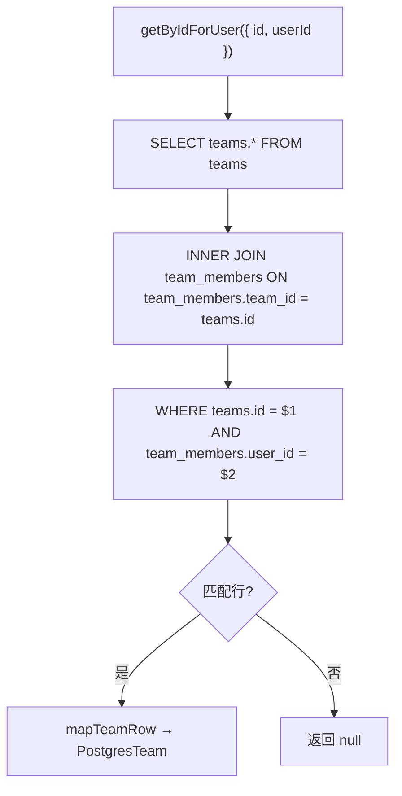

# teams.ts（Postgres）需求说明

> 源文件：`src/storage/postgres/teams.ts` ｜ 类型：源码 ｜ 行数：128 ｜ 所属模块：storage/postgres ｜ 分析日期：2026-07-23

## 1. 文件定位总述

本文件是 PostgreSQL 存储层中团队（Team）和团队成员（TeamMember）实体的 Repository 实现，与 SQLite 版功能类似但适配 Postgres 异步模型和租户隔离架构。Postgres 版增加了按用户查询团队的 JOIN 查询能力，且成员记录包含 `updated_at` 时间戳（SQLite 版没有）。

## 2. 功能需求

| 编号 | 需求描述（系统应当…） | 触发条件 / 输入 | 处理规则与输出 | 证据 |
|------|----------------------|----------------|---------------|------|
| FR-pteam-create-01 | 系统应当创建团队 | 调用 `create(input)` | 输入含 name、可选 id 和 metadata；metadata 以 jsonb 存储；支持外部指定 ID；返回完整 PostgresTeam | `src/storage/postgres/teams.ts:45-57` |
| FR-pteam-member-add-01 | 系统应当添加或更新团队成员 | 调用 `addMember(input)` | `ON CONFLICT (team_id, user_id) DO UPDATE SET role, metadata, updated_at=now()` 实现幂等写入；返回 PostgresTeamMember | `src/storage/postgres/teams.ts:59-79` |
| FR-pteam-get-user-01 | 系统应当查询用户所属的特定团队 | 调用 `getByIdForUser({ id, userId })` | 通过 `teams INNER JOIN team_members` 确保用户是该团队成员后才返回团队信息；未找到返回 null | `src/storage/postgres/teams.ts:81-96` |
| FR-pteam-member-get-01 | 系统应当查询特定团队的特定成员 | 调用 `getMember(teamId, userId)` | 直接按 team_id + user_id 查询；返回 PostgresTeamMember 或 null | `src/storage/postgres/teams.ts:98-105` |

## 3. 业务规则与约束

1. **角色枚举**：`PostgresTeamRole = 'owner' | 'admin' | 'member' | 'viewer'`，与 SQLite 版一致。`src/storage/postgres/teams.ts:6`
2. **成员 upsert 自动更新时间**：冲突时 `updated_at = now()` 自动刷新，SQLite 版无此字段。`src/storage/postgres/teams.ts:73`
3. **团队查询的用户归属校验**：`getByIdForUser` 通过 JOIN 确保只有团队成员才能查到团队，隐含了权限控制。`src/storage/postgres/teams.ts:87-93`
4. **metadata 存储**：Postgres 使用 `::jsonb` 类型，SQLite 使用 TEXT + serde。`src/storage/postgres/teams.ts:53`

## 4. 对外暴露

| 名称 | 类型 | 签名 | 说明 |
|------|------|------|------|
| `PostgresTeamRole` | exported type | `'owner' \| 'admin' \| 'member' \| 'viewer'` | 角色枚举 |
| `PostgresTeam` | exported interface | `{ id, name, metadata, createdAtEpoch, updatedAtEpoch }` | 团队实体 |
| `PostgresTeamMember` | exported interface | `{ teamId, userId, role, metadata, createdAtEpoch, updatedAtEpoch }` | 成员实体 |
| `PostgresTeamsRepository` | exported class | 构造函数接收 `PostgresQueryable` | 团队 Repository |
| `create()` | public async method | `(input) => Promise<PostgresTeam>` | 创建团队 |
| `addMember()` | public async method | `(input) => Promise<PostgresTeamMember>` | 添加/更新成员 |
| `getByIdForUser()` | public async method | `(input) => Promise<PostgresTeam \| null>` | 用户归属团队查询 |
| `getMember()` | public async method | `(teamId, userId) => Promise<PostgresTeamMember \| null>` | 查询成员 |

## 5. 依赖关系

- **上游依赖**：`./utils.js`（`newId`, `queryOne`, `toEpoch`, `toJsonObject`）
- **下游调用方**：通过 `./index.ts` barrel 导出

## 6. 数据结构

### PostgresTeam vs SQLite Team 差异

| 字段 | Postgres | SQLite | 说明 |
|------|----------|--------|------|
| slug | 无 | 有 | Postgres 版无 slug 字段 |
| metadata 类型 | jsonb | TEXT | 存储方式不同 |

## 7. 复杂逻辑图示

## 8. 逆向备注

1. **与 SQLite 版差异**：Postgres 版无 `slug` 字段、无 `getById`（仅 `getByIdForUser`）、成员无 `id` 字段（使用复合键 team_id+user_id）。推断两个存储引擎的字段设计按各自场景优化。
