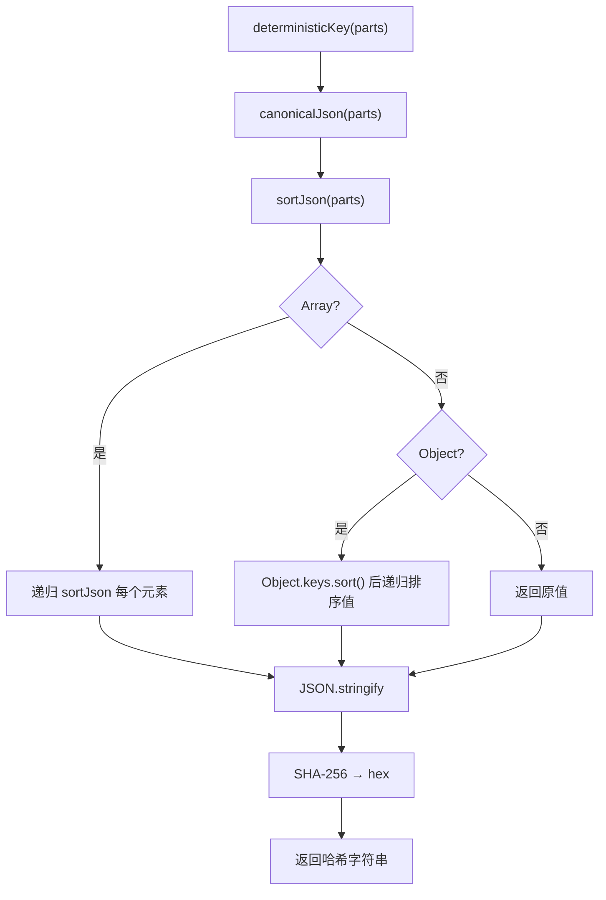

# utils.ts（Postgres）需求说明

> 源文件：`src/storage/postgres/utils.ts` ｜ 类型：源码 ｜ 行数：108 ｜ 所属模块：storage/postgres ｜ 分析日期：2026-07-23

## 1. 文件定位总述

本文件是 PostgreSQL 存储层的通用工具集，提供类型定义、ID 生成、JSON/Date 转换、单行查询封装、所有权断言和确定性哈希等功能。它是所有 Postgres Repository 的共享依赖，被频繁引用，承担着跨模块基础设施的角色。

## 2. 功能需求

| 编号 | 需求描述（系统应当…） | 触发条件 / 输入 | 处理规则与输出 | 证据 |
|------|----------------------|----------------|---------------|------|
| FR-util-query-01 | 系统应当提供单行查询封装 | 调用 `queryOne<T>(client, text, values)` | 执行 SQL 查询，返回首行或 null；泛型参数约束行类型 | `src/storage/postgres/utils.ts:42-49` |
| FR-util-project-01 | 系统应当断言项目归属关系 | 调用 `assertProjectOwnership(client, projectId, teamId)` | 查询 projects 表匹配 id+team_id，未找到时抛出 `'project_id must belong to team_id'` | `src/storage/postgres/utils.ts:51-64` |
| FR-util-session-01 | 系统应当断言会话归属关系 | 调用 `assertSessionOwnership(client, serverSessionId, projectId, teamId)` | 查询 server_sessions 表匹配三元组，未找到时抛出异常 | `src/storage/postgres/utils.ts:66-80` |
| FR-util-json-01 | 系统应当将值转换为 JSON 对象 | 调用 `toJsonObject(value)` | object 且非 Array 则直接返回，其他返回 `{}` | `src/storage/postgres/utils.ts:17-22` |
| FR-util-array-01 | 系统应当将值转换为 JSON 数组 | 调用 `toJsonArray(value)` | Array 直接返回，其他返回 `[]` | `src/storage/postgres/utils.ts:24-26` |
| FR-util-epoch-01 | 系统应当将多种类型转换为 epoch 毫秒数 | 调用 `toEpoch(value: Date \| string \| number)` | number 直接返回，其他通过 `new Date(value).getTime()` 转换 | `src/storage/postgres/utils.ts:28-33` |
| FR-util-date-01 | 系统应当将多种类型转换为 Date 或 null | 调用 `toDate(value)` | null/undefined 返回 null，Date 直接返回，其他通过 `new Date()` 转换 | `src/storage/postgres/utils.ts:35-40` |
| FR-util-hash-01 | 系统应当生成确定性哈希键 | 调用 `deterministicKey(parts)` | 将输入数组排序后序列化为规范 JSON，再 SHA-256 哈希为十六进制字符串 | `src/storage/postgres/utils.ts:86-91` |
| FR-util-cjson-01 | 系统应当生成规范 JSON 字符串 | 调用 `canonicalJson(value)` | 递归排序对象键名，确保同一内容的 JSON 表示一致 | `src/storage/postgres/utils.ts:82-84` |
| FR-util-id-01 | 系统应当生成 UUID | 调用 `newId()` | 使用 `crypto.randomUUID()` | `src/storage/postgres/utils.ts:13-15` |

## 3. 业务规则与约束

1. **所有权断言为预检查**：`assertProjectOwnership` 和 `assertSessionOwnership` 在 Repository 写操作前调用，作为数据权限的门卫。失败时抛 Error 中断后续逻辑。`src/storage/postgres/utils.ts:51-80`
2. **确定性哈希用途**：推断用于幂等键（idempotency key）生成，如 server-sessions 中的 `buildServerSessionIdempotencyKey` 依赖此函数。`src/storage/postgres/server-sessions.ts:308-314`
3. **canonicalJson 递归排序**：深层嵌套对象和数组都会被递归处理，键名按字母排序。`src/storage/postgres/utils.ts:93-107`

## 4. 对外暴露

| 名称 | 类型 | 说明 |
|------|------|------|
| `JsonObject` | exported type | `Record<string, unknown>` |
| `JsonValue` | exported type | `unknown` |
| `PostgresQueryable` | exported interface | 可查询对象抽象（query 方法） |
| `newId()` | exported function | 生成 UUID |
| `toJsonObject()` | exported function | 转换为 JSON 对象 |
| `toJsonArray()` | exported function | 转换为 JSON 数组 |
| `toEpoch()` | exported function | 转换为 epoch ms |
| `toDate()` | exported function | 转换为 Date |
| `queryOne()` | exported async function | 单行查询 |
| `assertProjectOwnership()` | exported async function | 项目归属断言 |
| `assertSessionOwnership()` | exported async function | 会话归属断言 |
| `canonicalJson()` | exported function | 规范 JSON |
| `deterministicKey()` | exported function | 确定性哈希键 |

## 5. 依赖关系

- **上游依赖**：`crypto`（createHash, randomUUID）、`pg`（QueryResult, QueryResultRow 类型）
- **下游调用方**：所有 Postgres Repository 文件（projects、teams、auth、server-sessions、agent-events 等）

## 6. 数据结构

不适用。

## 7. 复杂逻辑图示

## 8. 逆向备注

无。
