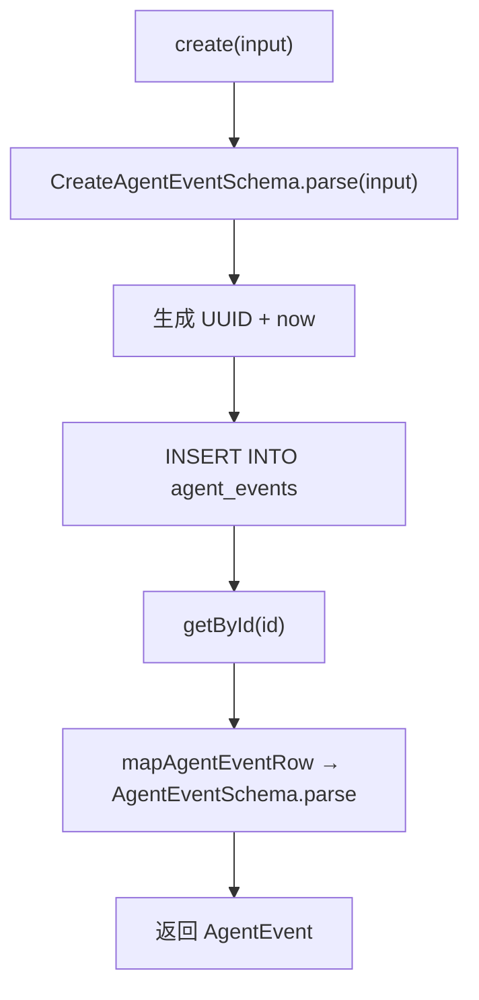

# agent-events.ts（SQLite）需求说明

> 源文件：`src/storage/sqlite/agent-events.ts` ｜ 类型：源码 ｜ 行数：83 ｜ 所属模块：storage/sqlite ｜ 分析日期：2026-07-23

## 1. 文件定位总述

本文件是 SQLite 存储层中 Agent 事件（AgentEvent）实体的 Repository 实现，负责 AI Agent 生命周期事件（如 hook 调用、worker 处理、provider 调用等）的持久化和查询。它通过 Zod schema 验证输入/输出，使用 `ensureServerStorageSchema` 保证表结构就绪，是 Server 模式下事件溯源链路的数据端。

## 2. 功能需求

| 编号 | 需求描述（系统应当…） | 触发条件 / 输入 | 处理规则与输出 | 证据 |
|------|----------------------|----------------|---------------|------|
| FR-ae-create-01 | 系统应当创建 Agent 事件记录 | 调用 `create(input: CreateAgentEvent)` | 通过 `CreateAgentEventSchema.parse` 验证输入；自动生成 UUID 和 created_at_epoch（当前时间）；payload 序列化为 JSON 字符串存储；插入后立即查询返回完整对象 | `src/storage/sqlite/agent-events.ts:41-66` |
| FR-ae-get-01 | 系统应当按 ID 查询 Agent 事件 | 调用 `getById(id)` | 返回匹配的 `AgentEvent` 或 null | `src/storage/sqlite/agent-events.ts:68-71` |
| FR-ae-list-01 | 系统应当按项目列出 Agent 事件 | 调用 `listByProject(projectId, limit)` | 按 `occurred_at_epoch DESC` 排序，默认 limit=100 | `src/storage/sqlite/agent-events.ts:73-81` |

## 3. 业务规则与约束

1. **Schema 验证**：创建时使用 `CreateAgentEventSchema.parse` 验证，查询结果映射时使用 `AgentEventSchema.parse` 验证，双重校验确保数据完整性。`src/storage/sqlite/agent-events.ts:42,22-33`
2. **自动 ID 生成**：使用 `crypto.randomUUID()` 生成 ID。`src/storage/sqlite/agent-events.ts:43`
3. **时间戳策略**：`occurred_at_epoch` 由调用方传入（事件发生时间），`created_at_epoch` 由系统自动填充（入库时间）。`src/storage/sqlite/agent-events.ts:62-63`
4. **source_type 约束**：数据库 CHECK 约束限定为 `'hook' | 'worker' | 'provider' | 'server' | 'api'`。`src/storage/sqlite/schema.ts:74`
5. **构造函数自动建表**：构造时调用 `ensureServerStorageSchema(this.db)`，确保首次使用时表已创建。`src/storage/sqlite/agent-events.ts:38`

## 4. 对外暴露

| 名称 | 类型 | 签名 | 说明 |
|------|------|------|------|
| `AgentEventsRepository` | exported class | 构造函数接收 `Database` | Agent 事件 Repository |
| `create()` | public method | `(input: CreateAgentEvent) => AgentEvent` | 创建事件 |
| `getById()` | public method | `(id: string) => AgentEvent \| null` | 按 ID 查询 |
| `listByProject()` | public method | `(projectId: string, limit?: number) => AgentEvent[]` | 按项目列出 |

## 5. 依赖关系

- **上游依赖**：`crypto`（randomUUID）、`bun:sqlite`（Database）、`../../core/schemas/agent-event.js`（Schema 定义）、`./schema.js`（ensureServerStorageSchema）
- **下游调用方**：推断为 worker-service 或 server 层的事件处理管道

## 6. 数据结构

### AgentEventRow（数据库行）

| 字段 | 类型 | 说明 |
|------|------|------|
| id | string | UUID |
| project_id | string | 所属项目 |
| server_session_id | string \| null | 关联服务会话 |
| source_type | AgentEventSourceType | 事件来源类型 |
| event_type | string | 事件类型标识 |
| payload | string | JSON 字符串 |
| content_session_id | string \| null | 内容会话 ID |
| memory_session_id | string \| null | 记忆会话 ID |
| occurred_at_epoch | number | 事件发生时间 |
| created_at_epoch | number | 入库时间 |

## 7. 复杂逻辑图示

## 8. 逆向备注

无。
