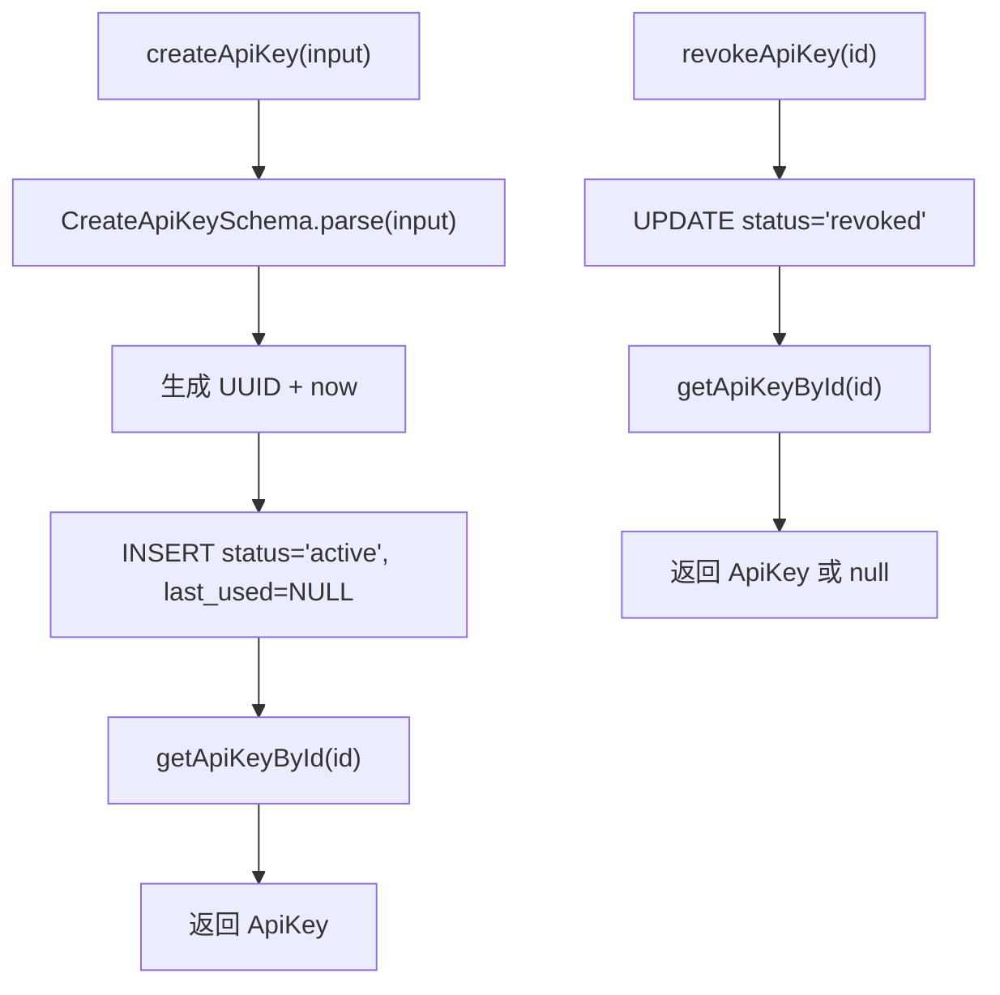

# auth.ts（SQLite）需求说明

> 源文件：`src/storage/sqlite/auth.ts` ｜ 类型：源码 ｜ 行数：196 ｜ 所属模块：storage/sqlite ｜ 分析日期：2026-07-23

## 1. 文件定位总述

本文件是 SQLite 存储层中认证与审计实体的 Repository 实现，提供 API Key 的完整生命周期管理（创建、撤销、使用标记、查询）和审计日志的创建与查询能力。它是 Claude-mem Server 模式安全子系统的数据端，通过 key_hash 实现密钥的安全存储与验证。

## 2. 功能需求

| 编号 | 需求描述（系统应当…） | 触发条件 / 输入 | 处理规则与输出 | 证据 |
|------|----------------------|----------------|---------------|------|
| FR-auth-key-create-01 | 系统应当创建 API Key | 调用 `createApiKey(input: CreateApiKey)` | 通过 Zod Schema 验证；自动生成 UUID；status 初始为 `'active'`；last_used_at_epoch 初始为 NULL；返回完整 ApiKey 对象 | `src/storage/sqlite/auth.ts:87-113` |
| FR-auth-key-revoke-01 | 系统应当撤销 API Key | 调用 `revokeApiKey(id, updatedAtEpoch)` | 将 status 更新为 `'revoked'`，更新 updated_at_epoch；返回更新后的对象或 null | `src/storage/sqlite/auth.ts:115-123` |
| FR-auth-key-use-01 | 系统应当标记 API Key 使用记录 | 调用 `markApiKeyUsed(id, usedAtEpoch)` | 更新 last_used_at_epoch 和 updated_at_epoch；返回更新后的对象或 null | `src/storage/sqlite/auth.ts:125-133` |
| FR-auth-audit-create-01 | 系统应当创建审计日志 | 调用 `createAuditLog(input: CreateAuditLog)` | 通过 Zod Schema 验证；自动生成 UUID；返回完整 AuditLog 对象 | `src/storage/sqlite/auth.ts:135-160` |
| FR-auth-key-get-01 | 系统应当按 ID 查询 API Key | 调用 `getApiKeyById(id)` | 返回 ApiKey 或 null | `src/storage/sqlite/auth.ts:162-165` |
| FR-auth-key-hash-01 | 系统应当按哈希值查询 API Key | 调用 `getApiKeyByHash(keyHash)` | 返回 ApiKey 或 null | `src/storage/sqlite/auth.ts:167-170` |
| FR-auth-key-list-01 | 系统应当列出 API Key | 调用 `listApiKeys(limit)` | 按 `created_at_epoch DESC` 排序，默认 limit=100 | `src/storage/sqlite/auth.ts:172-179` |
| FR-auth-audit-get-01 | 系统应当按 ID 查询审计日志 | 调用 `getAuditLogById(id)` | 返回 AuditLog 或 null | `src/storage/sqlite/auth.ts:181-184` |
| FR-auth-audit-list-01 | 系统应当按项目列出审计日志 | 调用 `listAuditLogByProject(projectId, limit)` | 按 `created_at_epoch DESC` 排序，默认 limit=100 | `src/storage/sqlite/auth.ts:186-194` |

## 3. 业务规则与约束

1. **ApiKey status 生命周期**：创建时为 `'active'`，通过 `revokeApiKey` 转为 `'revoked'`；数据库 CHECK 约束限定为 `'active' | 'revoked'`。`src/storage/sqlite/schema.ts:127`
2. **key_hash 唯一约束**：数据库 schema 中 `key_hash TEXT NOT NULL UNIQUE`，确保哈希值全局唯一。`src/storage/sqlite/schema.ts:124`
3. **审计 actor_type 约束**：CHECK 限定为 `'user' | 'api_key' | 'system'`。`src/storage/sqlite/schema.ts:141`
4. **外键级联**：api_keys 的 team_id 和 project_id 关联到 teams/projects 表并 ON DELETE CASCADE；audit_log 的关联为 ON DELETE SET NULL。`src/storage/sqlite/schema.ts:133-134,148-149`
5. **prefix 字段**：可选，推断用于 UI 展示（如 `sk_live_...` 的前缀部分），不影响鉴权逻辑。`src/storage/sqlite/auth.ts:104`

## 4. 对外暴露

| 名称 | 类型 | 签名 | 说明 |
|------|------|------|------|
| `AuthRepository` | exported class | 构造函数接收 `Database` | 认证 Repository |
| `createApiKey()` | public method | `(input: CreateApiKey) => ApiKey` | 创建 API Key |
| `revokeApiKey()` | public method | `(id, updatedAtEpoch?) => ApiKey \| null` | 撤销 |
| `markApiKeyUsed()` | public method | `(id, usedAtEpoch?) => ApiKey \| null` | 标记使用 |
| `createAuditLog()` | public method | `(input: CreateAuditLog) => AuditLog` | 创建审计日志 |
| `getApiKeyById()` | public method | `(id: string) => ApiKey \| null` | 按 ID 查询 |
| `getApiKeyByHash()` | public method | `(keyHash: string) => ApiKey \| null` | 按哈希查询 |
| `listApiKeys()` | public method | `(limit?) => ApiKey[]` | 列出 |
| `getAuditLogById()` | public method | `(id: string) => AuditLog \| null` | 按 ID 查询审计日志 |
| `listAuditLogByProject()` | public method | `(projectId, limit?) => AuditLog[]` | 按项目列出审计日志 |

## 5. 依赖关系

- **上游依赖**：`crypto`（randomUUID）、`bun:sqlite`（Database）、`../../core/schemas/auth.js`、`./schema.js`、`./serde.js`
- **下游调用方**：推断为 server 层的认证中间件和 API 路由

## 6. 数据结构

### ApiKeyRow（数据库行）

| 字段 | 类型 | 说明 |
|------|------|------|
| id | string | UUID |
| team_id | string \| null | 所属团队 |
| project_id | string \| null | 所属项目 |
| name | string | 密钥名称 |
| key_hash | string | 密钥哈希（UNIQUE） |
| prefix | string \| null | 展示前缀 |
| scopes | string | 权限范围 JSON 数组 |
| status | ApiKeyStatus | 状态（active/revoked） |
| last_used_at_epoch | number \| null | 最后使用时间 |
| expires_at_epoch | number \| null | 过期时间 |
| metadata | string | 元数据 JSON |
| created_at_epoch | number | 创建时间 |
| updated_at_epoch | number | 更新时间 |

### AuditLogRow（数据库行）

| 字段 | 类型 | 说明 |
|------|------|------|
| id | string | UUID |
| team_id | string \| null | 所属团队 |
| project_id | string \| null | 所属项目 |
| actor_type | AuditActorType | 操作者类型（user/api_key/system） |
| actor_id | string \| null | 操作者 ID |
| action | string | 操作名称 |
| target_type | string \| null | 目标类型 |
| target_id | string \| null | 目标 ID |
| metadata | string | 元数据 JSON |
| created_at_epoch | number | 创建时间 |

## 7. 复杂逻辑图示

## 8. 逆向备注

无。
