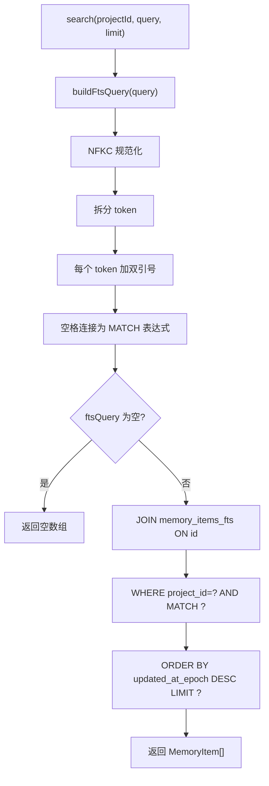
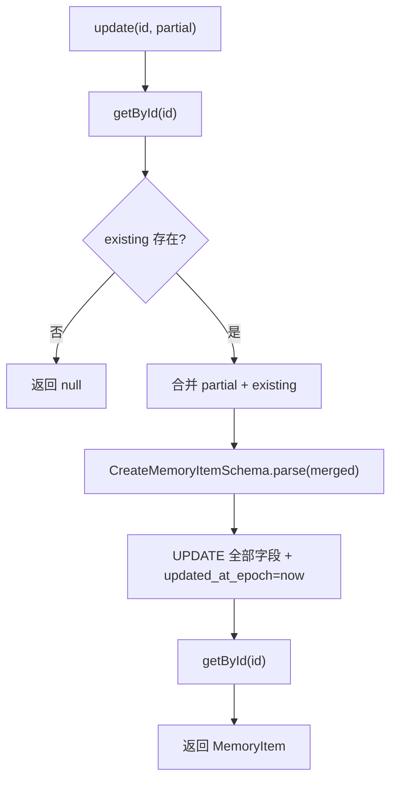

# memory-items.ts（SQLite）需求说明

> 源文件：`src/storage/sqlite/memory-items.ts` ｜ 类型：源码 ｜ 行数：276 ｜ 所属模块：storage/sqlite ｜ 分析日期：2026-07-23

## 1. 文件定位总述

本文件是 SQLite 存储层中记忆条目（MemoryItem）和记忆来源（MemorySource）实体的 Repository 实现，提供记忆的创建、更新、全文搜索、来源管理和多种查询能力。它是 Claude-mem 持久化记忆系统的核心数据端，通过 FTS5 全文搜索引擎支持语义化记忆检索。MemoryItem 是记忆的最终存储形态，可关联历史 observation（legacy_observation_id）以保持向后兼容。

## 2. 功能需求

| 编号 | 需求描述（系统应当…） | 触发条件 / 输入 | 处理规则与输出 | 证据 |
|------|----------------------|----------------|---------------|------|
| FR-mem-create-01 | 系统应当创建记忆条目 | 调用 `create(input: CreateMemoryItem)` | 通过 Zod Schema 验证；自动生成 UUID；多个数组字段（facts/concepts/filesRead/filesModified）序列化为 JSON 字符串；返回完整 MemoryItem | `src/storage/sqlite/memory-items.ts:102-135` |
| FR-mem-source-add-01 | 系统应当为记忆条目添加来源 | 调用 `addSource(input: CreateMemorySource)` | 创建 MemorySource 记录关联到 memory_item_id；支持 legacy 来源追溯（legacy_table/legacy_id）和现代 source_uri | `src/storage/sqlite/memory-items.ts:137-160` |
| FR-mem-get-01 | 系统应当按 ID 查询记忆条目 | 调用 `getById(id)` | 返回 MemoryItem 或 null | `src/storage/sqlite/memory-items.ts:162-165` |
| FR-mem-legacy-01 | 系统应当按历史 observation ID 查询记忆条目 | 调用 `getByLegacyObservationId(legacyObservationId)` | 利用唯一索引 `ux_memory_items_legacy_observation` 查询；返回 MemoryItem 或 null | `src/storage/sqlite/memory-items.ts:167-170` |
| FR-mem-update-01 | 系统应当更新记忆条目 | 调用 `update(id, input: Partial<CreateMemoryItem>)` | 先查询现有记录，合并 partial 输入后再通过 Schema 验证，最后全量更新所有字段；不存在返回 null | `src/storage/sqlite/memory-items.ts:172-234` |
| FR-mem-list-01 | 系统应当按项目列出记忆条目 | 调用 `listByProject(projectId, limit)` | 按 `created_at_epoch DESC` 排序，默认 limit=100 | `src/storage/sqlite/memory-items.ts:241-249` |
| FR-mem-search-01 | 系统应当通过全文搜索查找记忆条目 | 调用 `search(projectId, query, limit)` | 将查询文本经 `buildFtsQuery` 转换为 FTS5 MATCH 表达式；JOIN memory_items_fts 执行全文搜索；默认 limit=20 | `src/storage/sqlite/memory-items.ts:251-265` |
| FR-mem-source-list-01 | 系统应当列出记忆条目的所有来源 | 调用 `listSources(memoryItemId)` | 按 `created_at_epoch ASC` 排序返回 | `src/storage/sqlite/memory-items.ts:267-274` |

## 3. 业务规则与约束

1. **kind 约束**：数据库 CHECK 限定为 `'observation' | 'summary' | 'prompt' | 'manual'`。`src/storage/sqlite/schema.ts:90`
2. **source_type 约束**：memory_sources 的 CHECK 限定为 `'observation' | 'session_summary' | 'user_prompt' | 'manual' | 'import'`。`src/storage/sqlite/schema.ts:110`
3. **legacy 兼容**：`legacy_observation_id` 为可选字段，通过部分唯一索引 `WHERE legacy_observation_id IS NOT NULL` 确保一对一映射。`src/storage/sqlite/schema.ts:165-168`
4. **FTS5 同步**：schema.ts 中通过 `AFTER INSERT/UPDATE/DELETE` 触发器自动维护 `memory_items_fts` 虚拟表，应用层无需手动同步。`src/storage/sqlite/schema.ts:273-302`
5. **全文查询构建**：`buildFtsQuery` 将输入做 NFKC 规范化，按空白/非字母数字拆分为 token，每个 token 用双引号包裹（短语匹配），空格连接。`src/storage/sqlite/memory-items.ts:86-95`
6. **更新策略**：`update` 方法采用"先读后写全量更新"模式，partial 字段与现有值合并后重新写入全部列。`src/storage/sqlite/memory-items.ts:172-234`

## 4. 对外暴露

| 名称 | 类型 | 签名 | 说明 |
|------|------|------|------|
| `MemoryItemsRepository` | exported class | 构造函数接收 `Database` | 记忆条目 Repository |
| `create()` | public method | `(input: CreateMemoryItem) => MemoryItem` | 创建记忆 |
| `addSource()` | public method | `(input: CreateMemorySource) => MemorySource` | 添加来源 |
| `getById()` | public method | `(id: string) => MemoryItem \| null` | 按 ID 查询 |
| `getByLegacyObservationId()` | public method | `(legacyObservationId: number) => MemoryItem \| null` | 按历史 ID 查询 |
| `update()` | public method | `(id, partial) => MemoryItem \| null` | 更新 |
| `listByProject()` | public method | `(projectId, limit?) => MemoryItem[]` | 按项目列出 |
| `search()` | public method | `(projectId, query, limit?) => MemoryItem[]` | 全文搜索 |
| `getSourceById()` | public method | `(id: string) => MemorySource \| null` | 查询来源 |
| `listSources()` | public method | `(memoryItemId: string) => MemorySource[]` | 列出来源 |

## 5. 依赖关系

- **上游依赖**：`crypto`（randomUUID）、`bun:sqlite`（Database）、`../../core/schemas/memory-item.js`、`./schema.js`、`./serde.js`
- **下游调用方**：推断为 worker-service 的记忆写入/检索管道

## 6. 数据结构

### MemoryItemRow（数据库行）

| 字段 | 类型 | 说明 |
|------|------|------|
| id | string | UUID |
| project_id | string | 所属项目 |
| server_session_id | string \| null | 关联会话 |
| legacy_observation_id | number \| null | 历史 observation ID（部分唯一） |
| kind | MemoryItemKind | 类型（observation/summary/prompt/manual） |
| type | string | 细分类型 |
| title / subtitle | string \| null | 标题/副标题 |
| text | string \| null | 正文文本 |
| narrative | string \| null | 叙述文本 |
| facts / concepts | string | JSON 数组（事实/概念列表） |
| files_read / files_modified | string | JSON 数组（文件列表） |
| metadata | string | JSON 对象 |
| created_at_epoch / updated_at_epoch | number | 时间戳 |

### MemorySourceRow（数据库行）

| 字段 | 类型 | 说明 |
|------|------|------|
| id | string | UUID |
| memory_item_id | string | 关联记忆条目 |
| source_type | MemorySourceType | 来源类型 |
| legacy_table | string \| null | 历史表名 |
| legacy_id | number \| null | 历史 ID |
| source_uri | string \| null | 来源 URI |
| metadata | string | JSON 对象 |

## 7. 复杂逻辑图示

## 8. 逆向备注

1. **FTS5 分词器**：使用 `porter unicode61` 分词器（Porter 词干提取 + Unicode 6.1 支持），支持多语言词干还原。`src/storage/sqlite/schema.ts:180`
