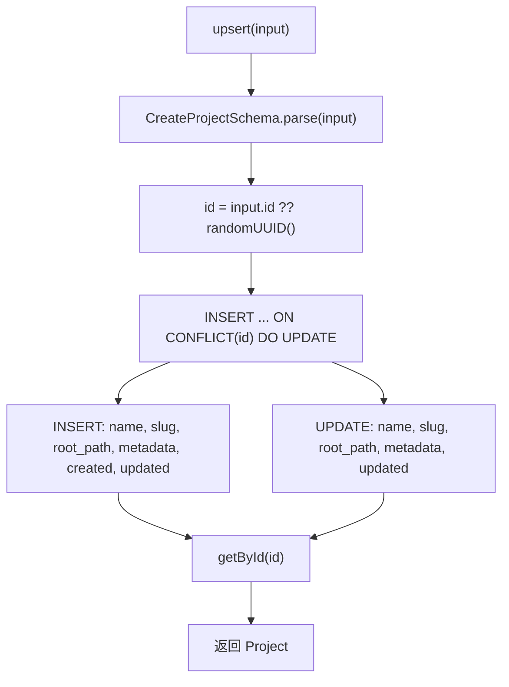

# projects.ts（SQLite）需求说明

> 源文件：`src/storage/sqlite/projects.ts` ｜ 类型：源码 ｜ 行数：91 ｜ 所属模块：storage/sqlite ｜ 分析日期：2026-07-23

## 1. 文件定位总述

本文件是 SQLite 存储层中项目（Project）实体的 Repository 实现，提供项目的创建、upsert、按 ID 查询、按根路径查询和列表等完整 CRUD 能力。项目是 Claude-mem 数据模型中的核心聚合根，session、agent-event、memory-item 等实体均通过 `project_id` 外键关联。本文件是单用户（local）模式下的项目存储核心。

## 2. 功能需求

| 编号 | 需求描述（系统应当…） | 触发条件 / 输入 | 处理规则与输出 | 证据 |
|------|----------------------|----------------|---------------|------|
| FR-proj-create-01 | 系统应当创建新项目 | 调用 `create(input: CreateProject)` | 通过 Zod Schema 验证输入；自动生成 UUID；slug、rootPath 可选，缺失时存 null；metadata 用 `stringifyJson` 序列化；created_at_epoch 和 updated_at_epoch 均为当前时间；插入后立即查询返回完整对象 | `src/storage/sqlite/projects.ts:36-55` |
| FR-proj-upsert-01 | 系统应当支持项目 upsert（创建或更新） | 调用 `upsert(input: CreateProject & { id?: string })` | 若 input.id 已存在则更新 name、slug、root_path、metadata、updated_at_epoch；不存在则新建；通过 `ON CONFLICT(id) DO UPDATE` 实现 | `src/storage/sqlite/projects.ts:57-74` |
| FR-proj-get-01 | 系统应当按 ID 查询项目 | 调用 `getById(id)` | 返回匹配的 `Project` 或 null | `src/storage/sqlite/projects.ts:76-79` |
| FR-proj-root-01 | 系统应当按根路径查询项目 | 调用 `getByRootPath(rootPath)` | 利用 `idx_projects_root_path` 索引查询，返回匹配项目或 null | `src/storage/sqlite/projects.ts:81-84` |
| FR-proj-list-01 | 系统应当列出所有项目 | 调用 `list()` | 按 `updated_at_epoch DESC, name ASC` 排序返回全部项目 | `src/storage/sqlite/projects.ts:86-89` |

## 3. 业务规则与约束

1. **Schema 双重验证**：创建/upsert 时用 `CreateProjectSchema.parse` 验证输入，查询映射时用 `ProjectSchema.parse` 验证输出。`src/storage/sqlite/projects.ts:37,58,19-29`
2. **metadata 序列化**：入库使用 `stringifyJson`（null→`{}`），出库使用 `parseJsonObject`（空值→`{}`）。`src/storage/sqlite/projects.ts:49,25`
3. **slug 和 root_path 唯一约束**：数据库 schema 中两者均有 `UNIQUE` 约束，同一值不能重复。`src/storage/sqlite/schema.ts:28-29`
4. **upsert 时间戳处理**：upsert 时 `created_at_epoch` 始终为 `now`（即使更新场景也重新写入），仅 `updated_at_epoch` 语义上正确。推断：这可能是有意简化，因为 upsert 的更新 SQL 中未设置 created_at_epoch（使用 `excluded` 语义）。实际上 `created_at_epoch` 在 INSERT 时写入 `now`，UPDATE 时不包含在 DO UPDATE SET 中，所以保持原值不变。`src/storage/sqlite/projects.ts:62-71`

## 4. 对外暴露

| 名称 | 类型 | 签名 | 说明 |
|------|------|------|------|
| `ProjectsRepository` | exported class | 构造函数接收 `Database` | 项目 Repository |
| `create()` | public method | `(input: CreateProject) => Project` | 创建项目 |
| `upsert()` | public method | `(input: CreateProject & { id?: string }) => Project` | 创建或更新 |
| `getById()` | public method | `(id: string) => Project \| null` | 按 ID 查询 |
| `getByRootPath()` | public method | `(rootPath: string) => Project \| null` | 按根路径查询 |
| `list()` | public method | `() => Project[]` | 列出全部 |

## 5. 依赖关系

- **上游依赖**：`crypto`（randomUUID）、`bun:sqlite`（Database）、`../../core/schemas/project.js`（Schema 定义）、`./schema.js`（ensureServerStorageSchema）、`./serde.js`（序列化工具）
- **下游调用方**：推断为 worker-service 或 API 路由层

## 6. 数据结构

### ProjectRow（数据库行）

| 字段 | 类型 | 说明 |
|------|------|------|
| id | string | UUID |
| name | string | 项目名称 |
| slug | string \| null | URL 友好标识（UNIQUE） |
| root_path | string \| null | 项目根路径（UNIQUE） |
| metadata | string | JSON 字符串 |
| created_at_epoch | number | 创建时间 |
| updated_at_epoch | number | 更新时间 |

## 7. 复杂逻辑图示

## 8. 逆向备注

1. **upsert 与 create 的区别**：`create` 仅做 INSERT（若 ID 冲突会报错），`upsert` 使用 `ON CONFLICT` 实现幂等写入。两者均返回插入/更新后的完整对象。
