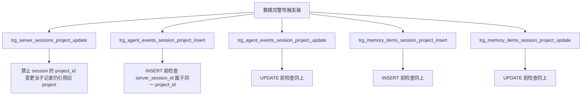

# schema.ts（SQLite）需求说明

> 源文件：`src/storage/sqlite/schema.ts` ｜ 类型：源码 ｜ 行数：306 ｜ 所属模块：storage/sqlite ｜ 分析日期：2026-07-23

## 1. 文件定位总述

本文件是 SQLite 存储层的数据库 Schema 定义与初始化模块，负责以"惰性单次"策略创建全部 9 张业务表、20+ 个索引、3 个数据完整性触发器和 3 个 FTS5 同步触发器。它处于存储层的最底层，被所有 Repository 的构造函数调用以确保表结构就绪。通过 `WeakSet` 追踪已初始化的 Database 实例，保证同一连接对象不会重复执行建表语句。

## 2. 功能需求

总述：系统应当在首次使用 SQLite Database 实例时自动创建全部业务表、索引、触发器和全文搜索虚拟表，确保存储层零配置启动。具体需求如下：

| 编号 | 需求描述（系统应当…） | 触发条件 / 输入 | 处理规则与输出 | 证据 |
|------|----------------------|----------------|---------------|------|
| FR-schema-ensure-01 | 系统应当惰性创建全部表结构 | 首次对某 Database 实例调用 `ensureServerStorageSchema(db)` | 使用 `WeakSet` 防止同一 Database 实例重复初始化；`CREATE TABLE IF NOT EXISTS` 保证幂等；执行完毕后将 db 加入已初始化集合 | `src/storage/sqlite/schema.ts:21-304` |
| FR-schema-tables-01 | 系统应当创建 9 张业务表 | Schema 初始化时 | projects、teams、team_members、server_sessions、agent_events、memory_items、memory_sources、api_keys、audit_log | `src/storage/sqlite/schema.ts:25-151` |
| FR-schema-index-01 | 系统应当创建全部查询索引 | Schema 初始化时 | 创建 17 个普通索引和 2 个部分唯一索引，覆盖常用查询路径 | `src/storage/sqlite/schema.ts:153-211` |
| FR-schema-fts-01 | 系统应当创建 FTS5 全文搜索虚拟表并保证数据同步 | Schema 初始化时 | 创建 `memory_items_fts` 虚拟表（porter unicode61 分词器）；比较 memory_items 和 fts 的行数，不一致时事务性重建；通过 AFTER INSERT/UPDATE/DELETE 触发器自动同步 | `src/storage/sqlite/schema.ts:171-302` |
| FR-schema-trigger-01 | 系统应当创建数据完整性触发器 | Schema 初始化时 | 5 个 BEFORE 触发器：禁止 session 的 project_id 在有子记录时变更；强制 agent_events/memory_items 的 server_session_id 必须属于同一 project_id | `src/storage/sqlite/schema.ts:213-271` |
| FR-schema-fts-trigger-01 | 系统应当创建 FTS 自动同步触发器 | Schema 初始化时 | 3 个 AFTER 触发器：INSERT 时插入 FTS、UPDATE 时先删后插 FTS、DELETE 时删除 FTS | `src/storage/sqlite/schema.ts:273-302` |

## 3. 业务规则与约束

1. **表清单**：`SERVER_OWNED_TABLES` 常量定义了 9 张表名，用于外部识别或迁移场景。`src/storage/sqlite/schema.ts:7-17`
2. **Schema 版本**：`SERVER_STORAGE_SCHEMA_VERSION = 33`，当前未在建表逻辑中引用（推断为预留或供迁移系统使用）。`src/storage/sqlite/schema.ts:5`
3. **WeakSet 惰性初始化**：使用 `WeakSet<Database>` 追踪已初始化的连接实例，db 被垃圾回收后 WeakSet 自动清除引用，不会内存泄漏。`src/storage/sqlite/schema.ts:19,21,304`
4. **物理外键使用**：本 Schema 使用了物理外键（`FOREIGN KEY ... REFERENCES ... ON DELETE CASCADE/SET NULL`），这与项目全局规范"禁用物理外键"存在冲突。推断 SQLite 本地模式仍使用物理外键，Server 模式的 Postgres 层遵循应用层逻辑控制。`src/storage/sqlite/schema.ts:51,67,82,103,116,133-134,148-149`
5. **CASCADE 策略**：
   - teams → team_members：`ON DELETE CASCADE`
   - projects → server_sessions：`ON DELETE CASCADE`
   - projects → agent_events：`ON DELETE CASCADE`
   - projects → memory_items：`ON DELETE CASCADE`
   - server_sessions → agent_events：`ON DELETE SET NULL`
   - server_sessions → memory_items：`ON DELETE SET NULL`
   - teams → api_keys：`ON DELETE CASCADE`
   - projects → api_keys：`ON DELETE CASCADE`
   - teams → audit_log：`ON DELETE SET NULL`
   - projects → audit_log：`ON DELETE SET NULL`
   - memory_items → memory_sources：`ON DELETE CASCADE`
6. **CHECK 约束**：
   - team_members.role：`IN ('owner', 'admin', 'member', 'viewer')` `src/storage/sqlite/schema.ts:48`
   - server_sessions.status：`IN ('active', 'completed', 'failed')` `src/storage/sqlite/schema.ts:62`
   - agent_events.source_type：`IN ('hook', 'worker', 'provider', 'server', 'api')` `src/storage/sqlite/schema.ts:74`
   - memory_items.kind：`IN ('observation', 'summary', 'prompt', 'manual')` `src/storage/sqlite/schema.ts:90`
   - memory_sources.source_type：`IN ('observation', 'session_summary', 'user_prompt', 'manual', 'import')` `src/storage/sqlite/schema.ts:110`
   - api_keys.status：`IN ('active', 'revoked')` `src/storage/sqlite/schema.ts:127`
   - audit_log.actor_type：`IN ('user', 'api_key', 'system')` `src/storage/sqlite/schema.ts:141`

## 4. 对外暴露

| 名称 | 类型 | 说明 |
|------|------|------|
| `SERVER_STORAGE_SCHEMA_VERSION` | exported const | Schema 版本号（33） |
| `SERVER_OWNED_TABLES` | exported const | 9 张业务表名数组 |
| `ensureServerStorageSchema` | exported function | `(db: Database) => void` | 惰性初始化全部表结构 |

## 5. 依赖关系

- **上游依赖**：`bun:sqlite`（Database 类型）
- **下游调用方**：所有 SQLite Repository 构造函数（agent-events、auth、memory-items、projects、server-sessions、teams）

## 6. 数据结构

### 9 张业务表及其关键字段

| 表名 | 主键 | 关键字段 | 外键关系 |
|------|------|---------|---------|
| projects | id TEXT PK | name, slug UNIQUE, root_path UNIQUE, metadata | 被 server_sessions/agent_events/memory_items/api_keys/audit_log 引用 |
| teams | id TEXT PK | name, slug UNIQUE, metadata | → team_members CASCADE, → api_keys CASCADE, → audit_log SET NULL |
| team_members | id TEXT PK | team_id, user_id, role CHECK, UNIQUE(team_id, user_id) | → teams CASCADE |
| server_sessions | id TEXT PK | project_id, content_session_id, memory_session_id, status CHECK, platform_source | → projects CASCADE, → agent_events SET NULL, → memory_items SET NULL |
| agent_events | id TEXT PK | project_id, server_session_id, source_type CHECK, event_type, payload | → projects CASCADE, → server_sessions SET NULL |
| memory_items | id TEXT PK | project_id, server_session_id, legacy_observation_id 部分唯一, kind CHECK, 多个文本字段 | → projects CASCADE, → server_sessions SET NULL, → memory_sources CASCADE |
| memory_sources | id TEXT PK | memory_item_id, source_type CHECK, legacy_table/legacy_id 部分唯一 | → memory_items CASCADE |
| api_keys | id TEXT PK | team_id, project_id, name, key_hash UNIQUE, status CHECK, scopes, expires_at | → teams CASCADE, → projects CASCADE |
| audit_log | id TEXT PK | team_id, project_id, actor_type CHECK, action, target_type/target_id | → teams SET NULL, → projects SET NULL |

### FTS5 虚拟表

`memory_items_fts`：列包括 `memory_item_id UNINDEXED, project_id UNINDEXED, title, subtitle, text, narrative, facts, concepts`，使用 `porter unicode61` 分词器。

### 索引清单（20 个）

| 索引名 | 表.列 | 类型 |
|--------|--------|------|
| idx_projects_root_path | projects(root_path) | 普通 |
| idx_server_sessions_project | server_sessions(project_id) | 普通 |
| idx_server_sessions_content | server_sessions(content_session_id) | 普通 |
| idx_server_sessions_memory | server_sessions(memory_session_id) | 普通 |
| idx_server_sessions_status | server_sessions(status) | 普通 |
| idx_agent_events_project_time | agent_events(project_id, occurred_at_epoch DESC) | 复合 |
| idx_agent_events_session_time | agent_events(server_session_id, occurred_at_epoch DESC) | 复合 |
| idx_agent_events_type | agent_events(event_type) | 普通 |
| idx_memory_items_project_time | memory_items(project_id, created_at_epoch DESC) | 复合 |
| idx_memory_items_session_time | memory_items(server_session_id, created_at_epoch DESC) | 复合 |
| idx_memory_items_legacy_observation | memory_items(legacy_observation_id) | 普通 |
| ux_memory_items_legacy_observation | memory_items(legacy_observation_id) WHERE NOT NULL | 部分唯一 |
| idx_memory_items_kind_type | memory_items(kind, type) | 复合 |
| idx_memory_sources_item | memory_sources(memory_item_id) | 普通 |
| idx_memory_sources_legacy | memory_sources(legacy_table, legacy_id) | 复合 |
| ux_memory_sources_legacy_source | memory_sources(source_type, legacy_table, legacy_id) WHERE NOT NULL AND NOT NULL | 部分唯一 |
| idx_team_members_team | team_members(team_id) | 普通 |
| idx_api_keys_team | api_keys(team_id) | 普通 |
| idx_api_keys_project | api_keys(project_id) | 普通 |
| idx_api_keys_prefix | api_keys(prefix) | 普通 |
| idx_audit_log_team_time | audit_log(team_id, created_at_epoch DESC) | 复合 |
| idx_audit_log_project_time | audit_log(project_id, created_at_epoch DESC) | 复合 |
| idx_audit_log_actor | audit_log(actor_type, actor_id) | 复合 |

## 7. 复杂逻辑图示

```mermaid
flowchart TB
    A["ensureServerStorageSchema(db)"] --> B{initializedDatabases.has(db)?}
    B -- 是 --> C["跳过"]
    B -- 否 --> D["CREATE TABLE IF NOT EXISTS x9"]
    D --> E["CREATE INDEX IF NOT EXISTS x20+"]
    E --> F["CREATE VIRTUAL TABLE IF NOT EXISTS memory_items_fts"]
    F --> G{memory_items 行数 == fts 行数?}
    G -- 是 --> H["跳过重建"]
    G -- 否 --> I["事务性重建 FTS: DELETE + INSERT"]
    I --> H
    H --> J["CREATE TRIGGER IF NOT EXISTS x5 完整性触发器"]
    J --> K["CREATE TRIGGER IF NOT EXISTS x3 FTS 同步触发器"]
    K --> L["initializedDatabases.add(db)"]
```



## 8. 逆向备注

1. **与项目规范冲突**：CLAUDE.md 全局规则要求"禁用物理外键，通过应用层逻辑控制依赖"，但本 Schema 大量使用物理外键和 CASCADE/SET NULL 策略。以代码为准，记录此差异。
2. **FTS 事务性重建**：在 Schema 初始化时比较行数并按需重建，这是一个较重的操作（全表 DELETE+INSERT）。推断首次运行或数据迁移后需要此重建，正常启动后行数一致则跳过。`src/storage/sqlite/schema.ts:183-197`
3. **trigger 命名约定**：完整性触发器使用 `trg_<表>_<条件>` 命名，FTS 触发器使用 `trg_<表>_fts_<操作>` 命名。`src/storage/sqlite/schema.ts:214,274`
